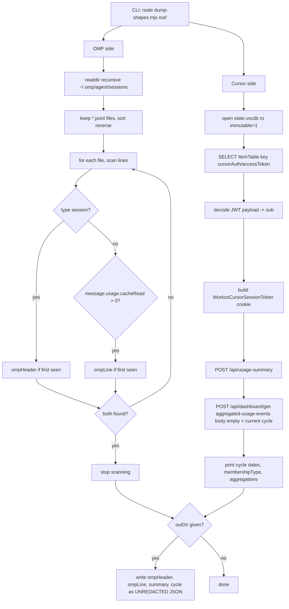

# Data-shape spike (OMP and Cursor)

> **Plain English:** [The probe](../plain-english/03-the-probe.md)

## 1. Purpose

Before `packages/core` types were frozen (commit 4), one script had to answer a single
question: do the two data sources really carry the fields the dashboard design assumes? It
does. Over time, that initial probe grew into a broader investigation of actual data shapes
across all supported tools and quota meters. The findings confirmed core viability, uncovered
API quirks, and overturned a locked product decision.

- Script: [`scripts/spike/dump-shapes.mjs`](../../scripts/spike/dump-shapes.mjs) — 69 lines,
  zero dependencies (`node:sqlite` + `fetch`), Node 24+.
- Findings: [`docs/data-shapes.md`](../data-shapes.md) — the authoritative record of observed
  shapes, field mappings, dedupe keys, and quota APIs across OMP, Cursor Pro, Gemini, Ollama
  Cloud, Claude Code, and Antigravity.
- Sanitized fixtures: seven committed files in `docs/fixtures/` preserving concrete outputs
  from these spikes and probes (OMP Claude assistant turn, OMP Gemini turn, Cursor cycle
  aggregates, Cursor single-day window aggregates, Cursor usage summary, Ollama Cloud usage, and
  Antigravity quota summary). Claude Code was documented from published specifications rather
  than a local transcript, so it deliberately carries no fixture.

## 2. Inventory

| File | Kind | Role |
| --- | --- | --- |
| `scripts/spike/dump-shapes.mjs` | Script | Samples both sources; prints shapes, dumps raw JSON |
| `docs/data-shapes.md` | Document | Findings: mappings, dedupe key, quota APIs |
| `docs/fixtures/omp-session-line.json` | Fixture | One OMP assistant line, redacted |
| `docs/fixtures/omp-gemini-session-line.json` | Fixture | One OMP Gemini line, redacted |
| `docs/fixtures/cursor-cycle-aggregates.json` | Fixture | Per-model aggregate response, one cycle |
| `docs/fixtures/cursor-window-aggregates.json` | Fixture | Aggregate for one-day window |
| `docs/fixtures/cursor-usage-summary.json` | Fixture | Cycle dates + membership type + quotas |
| `docs/fixtures/ollama-usage.json` | Fixture | Undocumented `/api/usage` quota response |
| `docs/fixtures/antigravity-quota-summary.json` | Fixture | Antigravity quota response |
| `out/` | Runtime | Gitignored UNREDACTED dumps when given out-dir |

## 3. Public surface

The spike script has two CLI forms, stated in its header comment:

```
node scripts/spike/dump-shapes.mjs            # prints shapes to stdout
node scripts/spike/dump-shapes.mjs out/       # also writes raw JSON there (gitignored)
```

Stdout prints: the OMP session header, the OMP usage object + model, the Cursor cycle dates +
membership type, and the Cursor per-model aggregations. The Cursor access token is never
printed (§5).

The seven committed fixture files under `docs/fixtures/` form the permanent public contract
derived from these investigations. They are cited throughout `docs/data-shapes.md` and ingested
directly as golden inputs by unit and integration tests across `packages/collectors`,
`packages/reader`, and `packages/core`.

## 4. Flow



Both requests to `cursor.com` always send `Origin: https://cursor.com`; without it the server
returns 403 "Invalid origin for state-changing request". The aggregate call with body `{}` is
the current cycle; the date-window variant is what a calendar filter now sends (§9).

The diagram illustrates the original automated script. Subsequent data-shape probes were
conducted manually or codified directly into collectors:
- **Gemini scan**: full recursive sweep over all OMP transcripts, finding all assistant triples.
- **Cursor date windows**: POST requests with epoch millisecond bounds.
- **Limit clocks**: querying `usage_history` in `~/.omp/agent/agent.db`.
- **Ollama Cloud**: GET request to `https://ollama.com/api/usage` using OMP's saved key.
- **Antigravity quota**: reading macOS keychain, extracting desktop OAuth client credentials
  from the `agy` binary, and calling Google's internal quota RPC.

## 5. Contracts and invariants

**OMP session logs.**

- Session format is `version: 3` on the `type: "session"` header. No compatibility guarantee
  across OMP updates.
- Usage comes from `type: "message"` lines with `message.role === "assistant"`. Fields used:
  `input` / `output` / `cacheRead` / `cacheWrite` (JSON numbers, always present, `0` when
  unused), `message.model` (no provider prefix), top-level `timestamp` (ISO 8601 UTC).
- Dedupe id: `omp:<session.id>:<message.id>`. `message.id` is unique per file only, so the
  session uuid — read from the header line — is required. The parser must see the header
  before the messages it scopes; the script's `??=` pattern mirrors this by taking the first
  header and first usage-bearing line per file. Fallback: hash of `filePath + byteOffset`.
- Subagent transcripts live in `<timestamp>_<uuid>/` subfolders and carry their own usage.
  File discovery must be recursive or helper sessions are silently dropped.
- The script filters on `cacheRead > 0` (not `usage` presence) to guarantee a line with a
  non-trivial read to show.
- Deliberately unused: `message.usage.cost` (recomputed from price entries), `totalTokens`,
  `cttl.ephemeral5m`, `provider`/`api`, `contextSnapshot.promptTokens`.

**Gemini through Antigravity in OMP (2026-09-04 scan).**

- Observed triple: `(gemini-3.8-flash, google-antigravity, google-gemini-cli)` across 374 lines.
- Origin remains `source: "omp"`: records live in OMP transcripts and use the OMP dedupe key.
- `message.usage.reasoningTokens` was present on 368 lines, but `totalTokens === input + output
  + cacheRead + cacheWrite` on all lines, `reasoningTokens < output`, and Google's output price
  includes thinking tokens. Thus, reasoning tokens are not billed as a separate token kind.
- `cacheWrite` was `0` across all 374 lines; Google prices cache storage per hour, not per write.

**Cursor Pro.**

- Auth is a key-only read: `ItemTable`, key `cursorAuth/accessToken`, opened read-only with
  `immutable=1` (the file is ~90 MB and Cursor may hold a WAL). Missing key throws.
- The value is a JWT; its payload's `sub` (WorkOS user id) builds the cookie
  `WorkosCursorSessionToken=<encodeURIComponent(sub)>%3A%3A<jwt>`.
- Cycle dates (`billingCycleStart`/`billingCycleEnd`) and `membershipType` come **only** from
  `/api/usage-summary` — never from the aggregate response.
- Field mapping: `modelIntent` → model; `inputTokens`/`outputTokens`/`cacheReadTokens`/
  `cacheWriteTokens` are **decimal strings** and must be parsed; the cache keys are **absent
  when zero** rather than `0`.
- `modelIntent` is the only model identifier (no display name). Observed values carry
  effort/speed suffixes (`-thinking-high`, `-high-fast`) that collapse onto the base model;
  `default` is Auto model selection — real tokens, no resolvable public rate.
- `totalCents` / `totalCostCents` are Cursor's own billing numbers as fractional-cent floats;
  deliberately ignored — our estimate is priced from `price_entries`, never mixed into
  `estimatedCents`. `tier` is not modelled.
- Window queries: accepts `{ teamId: 0, startDate: "<ms>", endDate: "<ms>" }`. Empty windows
  return `200 {}` without an `aggregations` key, which maps to zero usage rather than an error.

**Provider quota clocks and limits.**

- **OMP `usage_history` (2026-09-05)**: SQLite table in `~/.omp/agent/agent.db`. Opened `mode=ro`
  without `immutable=1` (live database). Time-series where only the newest row per limit is
  current; rows older than 7 days are discarded.
- **Ollama Cloud `/api/usage` (2026-09-05)**: Undocumented GET endpoint authenticated with the API
  key from OMP's `auth_credentials`. Returns `limits.session.usage` and `limits.weekly.usage` as
  0–1 fractions (e.g. 0.037). No reset timestamps are provided.
- **Antigravity direct quota RPC (2026-09-11)**: Internal endpoint `POST
  https://cloudcode-pa.googleapis.com/v1internal:retrieveUserQuotaSummary`. Requires `User-Agent`
  containing `antigravity`; fails if `x-goog-user-project` is sent. Token read from macOS keychain
  (`service: "gemini", account: "antigravity"`), refreshed using desktop OAuth client credentials
  scraped from `~/.gemini/bin/agy` at runtime. Inverts `remainingFraction` to `usedFraction`.

**Claude Code (documented format).**

- Transcripts live at `~/.claude/projects/<slugified-cwd>/<session-uuid>.jsonl`.
- Assistant lines only; token keys use Anthropic API names (`input_tokens`, `output_tokens`,
  `cache_read_input_tokens`, `cache_creation_input_tokens`).
- No session header; `sessionId` and `cwd` are present on every line.
- Dedupe key: `claude-code:${message.id}:${requestId}`.
- Model snapshot dates (`-YYYYMMDD`) are stripped by `canonicalModelId`.

## 6. Configuration

The spike script takes one optional `argv[2]`: an output directory. No env vars, no config files,
no flags. Paths are hard-coded home-relative: `~/.omp/agent/sessions` and
`~/Library/Application Support/Cursor/User/globalStorage/state.vscdb`. The out-dir relies on
the repo's `.gitignore` (`out/`).

Subsequent probes read from their standard locations: `~/.omp/agent/agent.db` for provider limits,
macOS keychain (`gemini`/`antigravity`) plus `~/.gemini/bin/agy` for Antigravity, and
`~/.claude/projects` for Claude Code.

## 7. Boundaries and dependencies

- Runtime: Node 24+ (matches `.nvmrc`) for `node:sqlite`; `fetch` is global.
- Zero npm dependencies in `dump-shapes.mjs` — the spike script requires no `node_modules`.
- Local reads: OMP session logs (`.jsonl`), Cursor auth database (`state.vscdb`), OMP agent
  database (`agent.db`), macOS keychain credentials, `agy` binary, and Claude Code transcripts.
- Network endpoints probed across investigations:
  - `POST https://cursor.com/api/usage-summary`
  - `POST https://cursor.com/api/dashboard/get-aggregated-usage-events`
  - `GET https://ollama.com/api/usage`
  - `POST https://cloudcode-pa.googleapis.com/v1internal:retrieveUserQuotaSummary`
  - `POST https://oauth2.googleapis.com/token`

## 8. Tests

The spike script itself has no automated test runner or test files; it was run manually on one
machine (macOS, 2026-09-02) and verified against live services.

However, the seven sanitized fixtures in `docs/fixtures/` serve as the test baseline across the
entire repository. Downstream test suites rely directly on them:
- `omp-session-line.json`: `packages/collectors/src/omp.test.ts`, `sync.test.ts`,
  `collect.test.ts`, and `packages/reader/src/reader.test.ts`.
- `omp-gemini-session-line.json`: `packages/collectors/src/omp-gemini.test.ts`.
- `cursor-cycle-aggregates.json` and `cursor-usage-summary.json`:
  `packages/collectors/src/cursor.test.ts`, `collect.test.ts`, and
  `packages/reader/src/reader.test.ts`.
- `cursor-window-aggregates.json`: verifies windowed aggregate mapping.
- `ollama-usage.json`: `packages/collectors/src/ollama.test.ts`.
- `antigravity-quota-summary.json`: `packages/collectors/src/antigravity.test.ts` and
  `collect.test.ts`.
- `packages/reader/src/golden.test.ts` reads fixtures dynamically.
- `packages/core/src/aggregate.test.ts` models test data on `cursor-cycle-aggregates.json`.

Claude Code has no local fixture; its tests (`packages/collectors/src/claude-code.test.ts`) use
synthetic transcripts constructed from documented specifications.

## 9. Debt and traps

- **The out-dir mode writes UNREDACTED dumps.** `ompLine` carries raw message content, `cwd`,
  and `responseId`; the Cursor dump carries account data; quota endpoints return tokens and emails.
  The gitignore keeps them out of the repo. Redact all sensitive fields before committing any dump
  as a fixture.
- **Sampling vs verification.** `dump-shapes.mjs` inspects only the newest OMP file with usage and
  one Cursor billing cycle. It does not prove all historical or future files match these shapes.
- **`default` is the first guaranteed unknown-price row.** Auto model selection burns real tokens
  without a public rate, so `estimatedCents: null` is expected behaviour, not a failure.
- **The date-window finding is acted on (2026-09-07).** The API accepts `startDate`/`endDate`,
  disproving the old "Pro = cycle only" decision, and Today / This month / Date range send their
  own bounds. The backend constraint survives: queries spanning both 2025-08-01 and 2026-05-14 fail
  with `ERROR_BAD_REQUEST`, so all-time falls back to the billing cycle.
- **Empty Cursor windows return `200 {}` (2026-09-08).** A window with no usage returns bare `{}`
  without an `aggregations` key. It must map to zero rows, not be treated as an error that falls
  back to the cycle.
- **Antigravity RPC traps (2026-09-11).** The undocumented `retrieveUserQuotaSummary` endpoint
  requires a `User-Agent` containing `antigravity` (otherwise 403 `SUBSCRIPTION_REQUIRED #3501`)
  and rejects requests containing `x-goog-user-project`. OAuth client credentials must be scraped
  from the `agy` binary dynamically rather than committed. Returned fractions represent remaining
  quota and must be inverted (`1 - remainingFraction`).
- **Ollama Cloud `/api/usage` is undocumented.** Returns fractions without reset timestamps and may
  change without warning.
- **Claude Code is unverified locally.** Documented from specifications and collector code; needs
  verification against real transcripts once available on-machine.
- **`modelIntent` alias mapping is unverified.** Suffix collapsing and `cursor-` prefixes are
  inferences awaiting wider real-world sampling.

## 10. Change guide

- **Fixing or extending the spike:** edit `scripts/spike/dump-shapes.mjs`; it is self-contained,
  and its header comment documents the CLI. Re-run it, reduce the output, and update
  `docs/data-shapes.md` plus the fixtures together.
- **Redacting a new dump:** replace `cwd`, `responseId`, message `content` text, account emails,
  and credential tokens with `REDACTED` before committing under `docs/fixtures/`.
- **Adding new sources or probe findings:** record field mappings, dedupe strategies, and quirks
  in `docs/data-shapes.md`. Add corresponding sanitized fixtures to `docs/fixtures/` and wire
  them into package test suites.
- **When core types freeze (commit 4):** the mapping tables in `docs/data-shapes.md` are the
  source of truth for field names. The spike script is throwaway, but `docs/data-shapes.md` and
  its fixtures survive as living references.
- **Re-checking findings:** note dates of re-confirmations in `docs/data-shapes.md` (e.g. 2026-09-07
  for Cursor date windows, 2026-09-08 for empty windows, 2026-09-11 for Antigravity).
