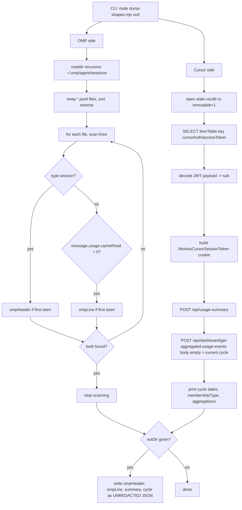

# Data-shape spike (OMP and Cursor)

> **Plain English:** [The probe](../plain-english/03-the-probe.md)

## 1. Purpose

Before `packages/core` types were frozen (commit 4), one script had to answer a single
question: do the two data sources really carry the fields the dashboard design assumes? It
does. It also recorded one finding that contradicts a locked product decision. The spike is
the only executable code in the repo at this commit; everything else is scaffold and planning
documents.

- Script: [`scripts/spike/dump-shapes.mjs`](../../scripts/spike/dump-shapes.mjs) — 68 lines,
  zero dependencies (`node:sqlite` + `fetch`), Node 24+.
- Findings: [`docs/data-shapes.md`](../data-shapes.md) — the authoritative record of what was
  observed on one machine, 2026-09-02.
- Redacted fixtures the script's output was cleaned into: `docs/fixtures/omp-session-line.json`,
  `docs/fixtures/cursor-cycle-aggregates.json`, `docs/fixtures/cursor-usage-summary.json`.

## 2. Inventory

| File | Kind | Role |
|------|------|------|
| `scripts/spike/dump-shapes.mjs` | Script | Samples both sources; prints shapes, dumps raw JSON |
| `docs/data-shapes.md` | Document | Findings: field mappings, dedupe key, the date-window finding |
| `docs/fixtures/omp-session-line.json` | Fixture | One OMP assistant line, redacted |
| `docs/fixtures/cursor-cycle-aggregates.json` | Fixture | Per-model aggregate response, one cycle |
| `docs/fixtures/cursor-usage-summary.json` | Fixture | Cycle dates + membership type + quotas |
| `out/` | Runtime output | Gitignored; UNREDACTED dumps when the script gets a directory |

## 3. Public surface

The spike has two CLI forms, stated in the script's header comment:

```
node scripts/spike/dump-shapes.mjs            # prints shapes to stdout
node scripts/spike/dump-shapes.mjs out/       # also writes raw JSON there (gitignored)
```

Stdout prints: the OMP session header, the OMP usage object + model, the Cursor cycle dates +
membership type, and the Cursor per-model aggregations. The Cursor access token is never
printed (§5). The fixture files under `docs/fixtures/` are the second surface: they are the
redacted, committed form of what the script observed, and `docs/data-shapes.md` cites them.

## 4. Flow



Both requests to `cursor.com` always send `Origin: https://cursor.com`; without it the server
returns 403 "Invalid origin for state-changing request". The aggregate call with body `{}` is
the current cycle; the date-window variant exists in the API but is deliberately not used
(§9).

## 5. Contracts and invariants

**OMP side.**

- Session format is `version: 3` on the `type: "session"` header. No compatibility guarantee
  across OMP updates.
- Usage comes from `type: "message"` lines with `message.role === "assistant"`. Fields used:
  `input` / `output` / `cacheRead` / `cacheWrite` (JSON numbers, always present, `0` when
  unused), `message.model` (no provider prefix), top-level `timestamp` (ISO 8601 UTC).
- Dedupe id: `omp:<session.id>:<message.id>`. `message.id` is unique per file only, so the
  session uuid — read from the header line — is required. The parser must see the header
  before the messages it scopes; the script's `??=` pattern mirrors this by taking the first
  header and first usage-bearing line per file.
- The script filters on `cacheRead > 0` (not `usage` presence) to guarantee a line with a
  non-trivial read to show.
- Deliberately unused: `message.usage.cost` (OMP's own estimate; we recompute from price
  entries), `totalTokens` (derivable), `cttl.ephemeral5m` (already inside `cacheWrite`),
  `provider`/`api`, `contextSnapshot.promptTokens` (context gauge, not billable input).

**Cursor side.**

- Auth is a key-only read: `ItemTable`, key `cursorAuth/accessToken`, opened read-only with
  `immutable=1` (the file is ~90 MB and Cursor may hold a WAL). Missing key throws.
- The value is a JWT; its payload's `sub` (WorkOS user id) builds the cookie
  `WorkosCursorSessionToken=<encodeURIComponent(sub)>%3A%3A<jwt>`.
- Cycle dates (`billingCycleStart`/`billingCycleEnd`) and `membershipType` come **only** from
  `/api/usage-summary` — never from the aggregate response.
- Field mapping: `modelIntent` → model; `inputTokens`/`outputTokens`/`cacheReadTokens`/
  `cacheWriteTokens` are **decimal strings** and must be parsed; the cache keys are **absent
  when zero** rather than `0`.
- `modelIntent` is the only model identifier (no display name). Observed values carry
  effort/speed suffixes (`-thinking-high`, `-high-fast`) that must collapse onto the base
  model to match an OMP row or a price entry; `default` is Auto model selection — real tokens,
  no resolvable public rate.
- `totalCents` / `totalCostCents` are Cursor's own billing numbers as fractional-cent floats;
  deliberately ignored — our estimate is priced from `price_entries`, never mixed into
  `estimatedCents`. `tier` is not modelled.

## 6. Configuration

The script takes one optional `argv[2]`: an output directory. No env vars, no config files, no
flags. Paths are hard-coded home-relative: `~/.omp/agent/sessions` and
`~/Library/Application Support/Cursor/User/globalStorage/state.vscdb`. The out-dir relies on
the repo's `.gitignore` (`out/`).

## 7. Boundaries and dependencies

- Runtime: Node 24+ (matches `.nvmrc`) for `node:sqlite`; `fetch` is global.
- No npm dependencies at all — the repo has no `node_modules` yet, and the spike must not
  require one.
- Reads: OMP session logs (user files), the Cursor auth database (user file), nothing in-repo
  except writing to the optional out-dir.
- Network: `POST https://cursor.com/api/usage-summary` and
  `POST https://cursor.com/api/dashboard/get-aggregated-usage-events`. `Authorization: Bearer`
  and `api2.cursor.sh` both fail (404 / no route) — the cookie is the only working auth.

## 8. Tests

There are no tests anywhere in the repo — no test runner, no CI, no test files. The spike was
run once, by hand, on one machine (macOS, 2026-09-02); its output was reduced into
`docs/data-shapes.md` and the three fixtures. That run is the verification. Nothing here is
covered by an automated test: not the OMP line mapping, not the Cursor field mapping, not the
cookie construction, not the 403-without-Origin behaviour. The fixtures are the only
machine-checked record, and even they are a single sample, not a corpus.

## 9. Debt and traps

- **The out-dir mode writes UNREDACTED dumps.** `ompLine` carries raw message content, `cwd`,
  and `responseId`; the dump is the live API response plus a real session line. The
  gitignore is the only thing keeping it out of the repo. Redact `cwd`, `responseId`, and
  message content before any raw dump becomes a fixture — the committed fixtures already did
  this; do not regress them.
- **It samples; it does not verify.** The OMP loop inspects only the newest file that has a
  usage-bearing line. The Cursor call fetches only the current cycle. Nothing in the spike
  proves every session file, every model, or every historical cycle matches these shapes.
- **`default` is the first guaranteed unknown-price row.** It has real tokens (3.2 M input on
  this account) and no public rate, so `estimatedCents: null` is a normal state, not an edge
  case. The dashboard must render it, not drop it.
- **The date-window finding is recorded, not acted on.** The API accepts
  `startDate`/`endDate`, contradicting the locked "Pro = cycle only" decision — but a window
  may not span both 2025-08-01 and 2026-05-14 (backend constraint), so all-time needs up to
  three merged calls. This changes product behaviour (mixed-period labelling, cycle banner,
  whether "Today" applies to Cursor) and is deliberately deferred; the product and
  implementation-plan docs carry a pointer.
- **The `modelIntent` → canonical alias map is unverified.** Only 6 values were seen, on one
  account. Suffix collapsing and `cursor-` prefix handling are guesses waiting for more data.
- **The token is read at runtime by design.** The script pulls the access token straight from
  Cursor's own storage so it is never pasted into a shell, a file, or the repo — and never
  printed. That is the invariant; the read itself is intentional.
- Cursor cache-token semantics (TTL tiers, read vs write pricing) were not verified against
  any rate table.

## 10. Change guide

- **Fixing or extending the spike:** edit `scripts/spike/dump-shapes.mjs`; it is
  self-contained, and its header comment documents the CLI. Re-run it, reduce the output, and
  update `docs/data-shapes.md` plus the fixtures together — they are one record.
- **Redacting a new dump:** replace `cwd`, `responseId`, message `content` text, and any
  account identifiers with `REDACTED` before committing under `docs/fixtures/`.
- **When core types freeze (commit 4):** the mapping tables in `docs/data-shapes.md` §OMP and
  §Cursor are the source of truth for field names; the spike script itself is throwaway and
  may be deleted or kept as a manual probe — either is fine, but `docs/data-shapes.md`
  survives it.
- **Acting on the date-window finding:** requires a product decision first; see the pointer
  in `docs/product.md` and `docs/implementation-plan.md`.