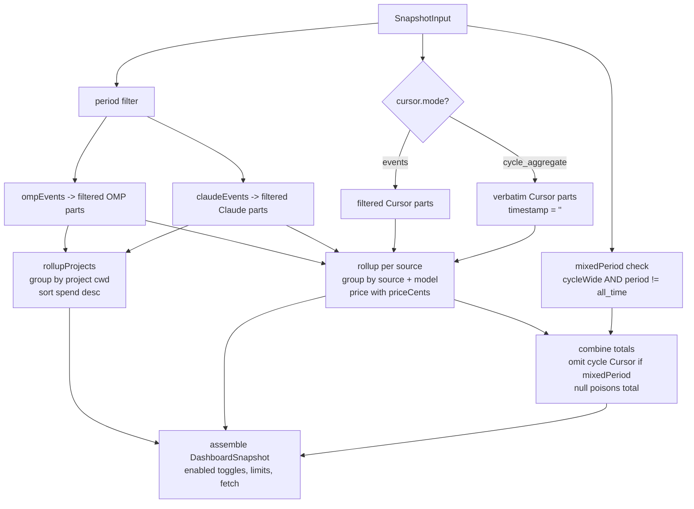

# Core domain (types, period filter, aggregation)

> **Plain English:** [The ledger](../plain-english/04-the-ledger.md)

## 1. Purpose

`packages/core` (`@prompt-burn/core`) is the shared vocabulary of the project: the TypeScript
types every collector writes and the dashboard renders, plus the pure functions that turn raw
usage into a view model. It holds no I/O of its own — no filesystem, no network, no database.
Everything here takes data in and returns data out, which is what makes the timestamp math and
the aggregation testable to the millisecond.

The package covers three usage sources: OMP, Cursor, and Claude Code. It filters timestamped
events by calendar periods using device-local midnight boundaries, normalizes raw model identifiers
to canonical forms (stripping dated snapshot suffixes and collapsing effort tags), groups
transcript events by project working directory, computes dynamic token costs via a host-supplied
pricer callback, scopes combined estimates when Cursor aggregates are cycle-wide (`mixedPeriod`),
and passes through provider usage limit meters and source enablement toggles.

## 2. Inventory

| File                                  | Kind   | Role                                           |
| ------------------------------------- | ------ | ---------------------------------------------- |
| `packages/core/src/index.ts`          | Source | Domain types + package public re-exports       |
| `packages/core/src/period.ts`         | Source | Calendar period filtering, device timezone     |
| `packages/core/src/model.ts`          | Source | Model id normalization to canonical ids        |
| `packages/core/src/aggregate.ts`      | Source | Rollup multi-source into `DashboardSnapshot`   |
| `packages/core/src/period.test.ts`    | Test   | Local-midnight boundary behaviour (IST-pinned) |
| `packages/core/src/model.test.ts`     | Test   | Suffix collapse and passthrough rules          |
| `packages/core/src/aggregate.test.ts` | Test   | Aggregation, pricing, mixed period, projects   |
| `packages/core/vitest.config.ts`      | Config | Pins test timezone to `Asia/Kolkata`           |
| `packages/core/package.json`          | Config | `@prompt-burn/core`, ESM, exports, vitest      |
| `packages/core/tsconfig.json`         | Config | TypeScript project for `typecheck`             |

## 3. Public surface

Single entry point: `@prompt-burn/core` → `packages/core/src/index.ts` (both `types` and
`default` point at the source file — no build step, consumers compile it themselves).

Types (all exported from `index.ts`):

```ts
type Source = "omp" | "cursor" | "claude-code";

interface TokenCounts {
  input: number;
  output: number;
  // optional: Cursor omits when zero; OMP always reports
  cacheRead?: number;
  cacheWrite?: number;
}

interface UsageEvent {
  // stable per-source id, e.g. `omp:${sessionId}:${line.id}`
  id: string;
  source: Source;
  timestamp: string; // ISO 8601, UTC
  model: string; // canonical id after normalization
  rawModel: string; // id exactly as the source reported it
  tokens: TokenCounts;
  sessionId?: string;
  // absolute working directory off session header (cwd); absent for Cursor
  project?: string;
}

type PeriodFilter =
  | { kind: "today" }
  | { kind: "this_month" }
  | { kind: "all_time" }
  // YYYY-MM-DD; end day inclusive
  | { kind: "range"; start: string; end: string };

interface ModelAggregate {
  model: string;
  tokens: TokenCounts;
}

interface ProjectUsage {
  project: string | null;
  tokens: TokenCounts;
  estimatedCents: number | null;
  // same row shape as DashboardSnapshot.models, always source: "omp" or "claude-code"
  models: Array<ModelAggregate & { source: Source; estimatedCents: number | null }>;
}

interface SourceTotals {
  // null = at least one price unknown
  estimatedCents: number | null;
  tokens: TokenCounts;
}

type PriceCents = (
  model: string,
  tokens: TokenCounts,
  timestamp: string,
) => number | null;

interface CursorIncludedUsage {
  autoPercentUsed: number;
  apiPercentUsed: number;
}

interface UsageLimit {
  id: string;
  label: string;
  windowLabel?: string;
  usedFraction: number | null;
  resetsAt: string | null;
}

interface ProviderLimits {
  provider: string;
  account?: string;
  observedAt: string;
  limits: UsageLimit[];
}

interface CursorWindow {
  start: string;
  end: string;
}

type CursorSnapshot =
  | {
      mode: "cycle_aggregate";
      cycleStart: string;
      cycleEnd: string;
      // present when the rows were narrowed to a period rather than the cycle
      window?: CursorWindow;
      models: ModelAggregate[];
      included?: CursorIncludedUsage;
    }
  // Enterprise path, unimplemented
  | { mode: "events"; events: UsageEvent[] };

interface FetchState {
  status: "idle" | "fetching" | "error";
  lastSuccessAt: Date | null;
  error?: string;
}

interface DashboardSnapshot {
  period: PeriodFilter;
  projects: ProjectUsage[];
  estimatedCents: number | null;
  enabled: Record<Source, boolean>;
  omp: SourceTotals;
  claudeCode: SourceTotals;
  cursor: SourceTotals & {
    mode: CursorSnapshot["mode"];
    /** e.g. "Cycle to date" — set only while rows are cycle-wide. */
    cycleLabel?: string;
    cycleStart?: string;
    cycleEnd?: string;
    /** The window Cursor answered for, when the period was askable. */
    window?: CursorWindow;
    included?: CursorIncludedUsage;
  };
  /** Rows keyed (source, model); same model twice is expected. */
  models: Array<
    ModelAggregate & {
      source: Source;
      estimatedCents: number | null;
    }
  >;
  /** Cursor cycle stands against narrower period; excluded from estimatedCents. */
  mixedPeriod: boolean;
  limits: ProviderLimits[];
  fetch: {
    lastSuccessAt: string | null;
    status: FetchState["status"];
    error?: string;
  };
}

interface SnapshotInput {
  period: PeriodFilter;
  ompEvents: readonly UsageEvent[];
  claudeEvents?: readonly UsageEvent[];
  cursor: CursorSnapshot;
  enabled?: Partial<Record<Source, boolean>>;
  limits?: readonly ProviderLimits[];
  now?: Date;
  fetch?: DashboardSnapshot["fetch"];
  priceCents?: PriceCents;
}
```

Functions and constants (re-exported from `index.ts`):

```ts
// period.ts
function periodBounds(
  period: PeriodFilter,
  now?: Date,
): { start: number | null; end: number | null };
function filterEventsByPeriod(
  events: readonly UsageEvent[],
  period: PeriodFilter,
  now?: Date,
): UsageEvent[];

// model.ts
function canonicalModelId(rawModel: string): string;

// aggregate.ts
const CURSOR_CYCLE_LABEL: "Cycle to date";
function buildDashboardSnapshot(input: SnapshotInput): DashboardSnapshot;
```

`now` is injectable everywhere so `today` / `this_month` are testable; it defaults to the wall
clock. `periodBounds` returns a half-open `[start, end)` in epoch ms, `null` meaning unbounded.
`priceCents` is host-injected for dynamic rate resolution.

## 4. Flow



Four processing steps inside the package:

1. **Period filter** (`period.ts`). `periodBounds` turns a `PeriodFilter` into half-open epoch-ms
   bounds built from _local_ midnights — `new Date(y, m, d)` — with the day/month field rolled
   past its end (`d + 1`, `m + 1`) so the runtime resolves month length, leap years and DST.
   `all_time` returns `{ null, null }` and the filter returns a shallow copy untouched.
   `filterEventsByPeriod` keeps events with `start <= t < end`; events with unparsable
   timestamps survive only `all_time`. Applied to `ompEvents`, `claudeEvents`, and Cursor events
   (in `events` mode).
2. **Model normalization** (`model.ts`). `canonicalModelId` runs two normalization stages:
   first, Anthropic dated snapshot suffixes matching `-\d{8}$` (e.g. `claude-sonnet-4-5-20250929`
   written by Claude Code) are stripped to match OMP and price catalog ids; second, named
   effort/speed suffixes (`-thinking-high` → `""`, `-high-fast` → `"-high"`) are collapsed. A
   bare date or bare suffix with no base model is preserved verbatim. Unknown strings, OMP ids,
   the `cursor-` prefix, and `default` (Auto) pass through unchanged.
3. **Per-source rollups and pricing** (`aggregate.ts`). `partsOf` wraps events into priced parts
   retaining `timestamp` and optional `project`. `rollup` groups parts by `${source}\0${model}`,
   sums tokens, and queries the host-supplied `priceCents(model, tokens, timestamp)`. Events price
   at their individual timestamps; Cursor cycle aggregates pass `""` as their timestamp. An
   unpriced row (`null`) poisons every enclosing total via `addCents`.
4. **Project breakdown and snapshot assembly** (`aggregate.ts`). `rollupProjects` groups
   timestamped parts (OMP and Claude Code) by `project ?? ""`, rolls up tokens and spend per
   project, and sorts biggest spenders first (unpriced projects sink to the bottom, tie-broken by
   token count). Cursor is excluded (no project directory). For `cycle_aggregate`, absence of
   `window` flags `mixedPeriod = true` on all bounded periods, footnotes `cycleLabel: "Cycle to
   date"`, and excludes Cursor from the headline `estimatedCents`. Sources missing from `enabled`
   default to `true`, and `limits` pass through untouched.

## 5. Contracts and invariants

- **`DashboardSnapshot` is a frozen contract for the UI.** Consumers render it; nothing outside
  the package may alter its shape casually.
- **Timestamps are UTC ISO 8601; period bounds are device-local.** The boundary is always the
  local wall-clock midnight, never UTC midnight — `Date.parse` on the UTC timestamp vs `new
  Date(y, m, d)` on the local wall clock. In IST, local midnight 1 Jan is 18:30 UTC the day
  before, so a UTC-midnight bug visibly shifts the split.
- **`all_time` is the pass-through filter.** Bounds `{ null, null }`; every event survives,
  including ones with unparsable timestamps.
- **Range end is inclusive in UI terms.** `{ kind: "range", start: D, end: D }` is that one
  local day; code converts the inclusive end day to the exclusive next-day 00:00 via
  `localMidnight(end, 1)`.
- **`localMidnight` accepts only `YYYY-MM-DD`** (`^(\d{4})-(\d{2})-(\d{2})$`) and throws
  `RangeError` otherwise, or when the constructed date is invalid.
- **Three usage sources are recognized:** `"omp"`, `"cursor"`, and `"claude-code"`.
- **Rows are keyed `(source, model)` and never merged across sources.** The same model on OMP,
  Claude Code, and Cursor is deliberately separate rows; rows keep first-seen order. Map keys use
  `${part.source}\u0000${part.model}`. Unknown ids and `default` (Auto) remain visible as rows.
- **Costs are derived dynamically per part, never stored.** `priceCents` is injected by the
  caller; without it, every `estimatedCents` is `null`. Events are priced at their own timestamp,
  allowing retroactive rate changes and tiered pricing over time.
- **`null` cost poisons enclosing totals.** If any row within a source or period has `null` cost,
  that subtotal and the combined `estimatedCents` become `null`. The UI renders `null` as `—`,
  never `$0`. An empty period with an active pricer reports `0` cents, not `null`.
- **Projects breakdown is scoped to period and transcript sources.** Only sources recording a
  working directory (`cwd`) enter `projects` (OMP and Claude Code). Headerless transcripts group
  under `project: null`. Cursor never enters `projects`. Projects sort by spend descending;
  unpriced projects sink to the bottom, tie-broken by token volume.
- **Cursor scope and mixed-period isolation.** `cycle_aggregate` rows are used as fetched:
  `window` present means server-side period narrowing, so `mixedPeriod` is false and Cursor cost
  enters `estimatedCents`. `window` absent means cycle-wide spend; for any period other than
  `all_time`, `mixedPeriod = true`, `cycleLabel` is set to `"Cycle to date"`, and Cursor cost is
  excluded from combined `estimatedCents`.
- **Enabled toggles default to on.** `enabled` in `SnapshotInput` defaults unnamed sources to
  `true`: `{ omp: true, "claude-code": true, cursor: true, ...input.enabled }`.
- **Provider limits pass through uncalculated.** `limits` carry provider-reported fractions and
  clocks (`UsageLimit`); they are never filtered by `period` and never priced.
- **`canonicalModelId` is total and idempotent.** Dated snapshot suffix (`-\d{8}$`) is stripped
  first, then suffix rules are checked in array order. A bare date or bare suffix is kept
  verbatim (`""` maps to `""`).

## 6. Configuration

None. The package is pure — no env vars, no config files, no runtime options. Two pieces of
configuration exist and both are about _tests_, not runtime:

- `vitest.config.ts` pins `TZ=Asia/Kolkata` for the whole test run. Period bounds are
  device-local, so boundary tests must exercise real local-midnight math; IST (UTC+5:30, no
  DST) is chosen because its half-hourly offset means a UTC-midnight bug cannot pass by
  accident. `period.test.ts` asserts the pin took effect (accepting Node's `Asia/Calcutta`
  alias).
- `package.json` is source-only: `exports` points at `./src/index.ts`, so there is no build
  output to configure; scripts are `typecheck` (`tsc -p .`) and `test` (`vitest run`).

## 7. Boundaries and dependencies

- **Zero runtime dependencies.** Only dev dependency is `vitest ^4.0.18`. Nothing in
  `packages/core/src` imports anything outside its own directory.
- **No I/O.** No `node:fs`, no network requests, no sqlite — callers supply arrays and objects.
- **Consumed by:**
  - `packages/collectors` — imports `canonicalModelId`, `UsageEvent`, and `Source`; normalizes
    models and emits events for OMP, Claude Code, and Cursor.
  - `packages/db` — stores prices matching canonical ids, transcripts, and limits; supplies the
    `priceCents` lookup function.
  - UI / apps — renders `DashboardSnapshot`, displaying the Projects route via `projects`,
    toggling sources via `enabled`, showing clocks via `limits`, and rendering `models`.
- **Upstream contracts encoded:**
  - OMP: session `cwd` as `project`, UTC ISO timestamps, complete token counts, provider usage
    clocks (`ProviderLimits`).
  - Claude Code: `~/.claude/projects` JSONL transcripts, dated model names
    (`claude-sonnet-4-5-20250929`), session `cwd`.
  - Cursor: Pro cycle aggregates (with or without `window`), plan percentages (`autoPercentUsed`,
    `apiPercentUsed`), cycleStart/cycleEnd, optional zero-cache token keys.

## 8. Tests

`vitest run` executes 3 test files (33 tests total), all pinned to `TZ=Asia/Kolkata`:

- **`period.test.ts`** (9 tests) — timezone setup guard asserts IST (+05:30) pin and midnight
  conversion. Tests `this_month` local midnight boundary on the 1st and across year boundary;
  `today` spanning local midnights and rolling into the new year; `range` handling `start === end`
  as a single day, inclusive end day conversion, and non-`YYYY-MM-DD` rejection with `RangeError`;
  `all_time` passing all events through regardless of timestamp.
- **`model.test.ts`** (5 tests) — collapsing named suffixes (`-thinking-high`, `-high-fast`);
  leaving untouched Cursor-hosted prefixes, `-medium`, and `default` (Auto); passing through OMP
  ids and unknown strings; preserving bare suffixes verbatim; idempotence.
- **`aggregate.test.ts`** (19 tests) — with fixed injected `now` (2 Sep 2026, 18:00 IST):
  - Cycle aggregates: OMP period filtering while Cursor cycle remains identical; combining
    subtotals without deduplication; `mixedPeriod` flag across periods with `cycleLabel`;
    `(source, model)` row keying; null costs without a pricer; idle fetch default.
  - Injected pricer: per-event timestamped pricing; null poisoning when any row is unpriced;
    source pricing independence when cycle is excluded in mixed period; cycle unpriced row
    poisoning all-time total; zero cost for empty usage with pricer.
  - Cursor window: windowed Cursor counted in total (`mixedPeriod: false`), window passed through,
    cycle label dropped while cycle window persists.
  - Edge cases: zero usage reporting zeros and empty rows with `mixedPeriod: true`; Cursor
    `events` mode filtered like OMP with no cycle label; Pro cycle window preserved for labelling;
    fetch state passthrough.
  - Per-project rollups: grouping models by project `cwd` and bucketing unattributed usage under
    `null`; Cursor excluded from project rows; period scoping of projects; unpriced projects
    sinking below priced projects.

**Not covered:**
- `DATED_SNAPSHOT` regex (`/-\d{8}$/`) in `model.ts` has no dedicated test assertion in
  `model.test.ts` [INFERENCE].
- Claude Code events (`claudeEvents`) and the `claudeCode` subtotal are not explicitly exercised in
  `aggregate.test.ts` test cases [INFERENCE].
- `enabled` toggles defaulting and overrides in `SnapshotInput` are not directly asserted in
  `aggregate.test.ts` [INFERENCE].
- `limits` passthrough is not directly asserted in `aggregate.test.ts` [INFERENCE].
- DST transitions (IST has no DST, so day rollover across DST shifts is code-reviewed only).
- Bounded filtering behavior on unparsable timestamps (only tested under `all_time`).

## 9. Debt and traps

- **Device-local timezone is the real runtime.** Tests pin IST, but production runs in the user's
  local timezone where DST may occur. Local-midnight math handles this via standard `Date` rollover,
  but DST transitions are not machine-tested.
- **`canonicalModelId` assumptions:**
  - Suffix rules stem from six observed Cursor strings from one account. Unmapped strings pass
    through unchanged to avoid losing visibility.
  - `DATED_SNAPSHOT` (`/-\d{8}$/`) assumes an 8-digit date suffix at the end of the string. Other
    date or revision formats are not stripped.
  - Array order in `SUFFIX_RULES` matters if suffixes ever overlap.
- **Cost null poisoning:** `addCents` propagates `null`. A single unpriced model in a period turns
  the entire period's total to `null`. This is intentional (honest `—` rather than inaccurate sum),
  but requires collectors and price catalogs to stay up to date.
- **Cursor `events` mode is an unimplemented union arm.** Kept for future Enterprise support,
  tested only with synthetic fixtures.
- **Cursor cycle vs window scoping:** Narrowing relies on collector querying server-side
  `startDate`/`endDate`. If the collector cannot narrow, `mixedPeriod` excludes Cursor from the
  headline total to prevent adding a 30-day cycle to a single day's spend.
- **Projects route excludes Cursor by design.** Cursor Pro aggregates have no directory context.
  Any future attempt to assign Cursor usage to projects would be fabrication.
- **Provider limits are unpriced account-level meters.** They do not align with calendar periods
  or token counts; they must never be folded into period spend.

## 10. Change guide

- **Adding a usage source:** extend `Source` (`"omp" | "cursor" | "claude-code"`), update
  `DashboardSnapshot` subtotals, update `SnapshotInput` to accept events/snapshots, update
  `enabled` defaults, and incorporate the source into `rollup` and `models` concatenation.
- **Adding a period kind:** extend `PeriodFilter`, add a branch to `periodBounds`'s switch, and
  add boundary test cases in `period.test.ts`. Keep bounds half-open `[start, end)`.
- **Adding a normalization rule:** update `DATED_SNAPSHOT` or append to `SUFFIX_RULES` in
  `model.ts` with observed raw strings, then add test cases to `model.test.ts`. Verify suffix order.
- **Changing `DashboardSnapshot`:** it is the frozen UI contract — modify it in tandem with the
  dashboard UI that renders it. Update test fixtures in `aggregate.test.ts` in the same change.
- **Updating project attribution:** changes to project grouping belong in `rollupProjects`;
  remember that only sources with directory metadata (`cwd`) can be grouped.
- **Changing test timezone:** update `vitest.config.ts` and the timezone guard in `period.test.ts`
  together. Pinned timezone must have a non-hourly UTC offset.
