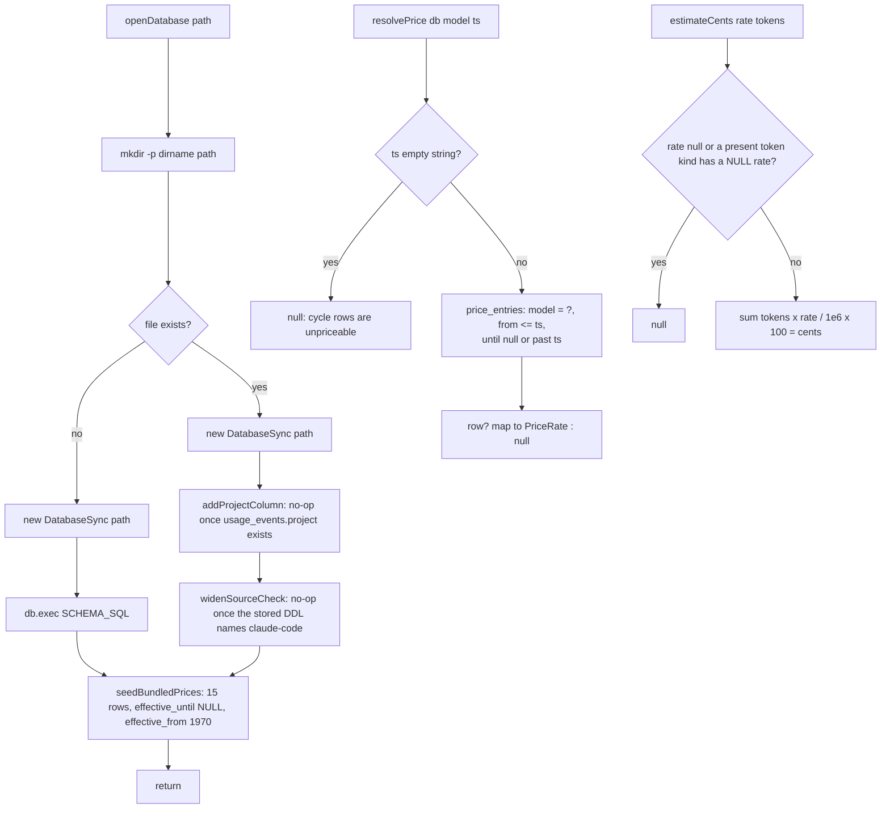

# The database (`packages/db`)

> **Plain English:** [The file cabinet](../plain-english/05-the-file-cabinet.md)

## 1. Purpose

One SQLite file holds every spending record Prompt Burn keeps: `~/.prompt-burn/db.sqlite`,
created by commit bea998d (`@prompt-burn/db` — schema, bundled prices, open/create logic) and
given its pricing brain by commit aa69c87 (point-in-time price resolution and cost estimation).
The package exists so that the desktop app, the VS Code extension, and the collectors all open
the _same_ file through the _same_ code — there is no second location and no per-app database.

Two decisions define it:

- **Home-relative on purpose.** The file sits outside every install directory so an app
  update, a reinstall, or a VS Code extension upgrade cannot delete it.
- **`node:sqlite`, not `better-sqlite3`.** The implementation plan sketches
  `better-sqlite3`; the code deliberately diverges and uses Node 24's built-in
  `node:sqlite` `DatabaseSync` instead, keeping the workspace dependency-free exactly as
  the spike did. This divergence is deliberate — keep it.

## 2. Inventory

| File                              | Kind     | Role                                                    |
| --------------------------------- | -------- | ------------------------------------------------------- |
| `packages/db/src/index.ts`        | Module   | open/create logic; re-exports the pricing surface       |
| `packages/db/src/schema.ts`       | Module   | `SCHEMA_SQL`, applied once on file creation             |
| `packages/db/src/prices.ts`       | Module   | `BUNDLED_PRICES`, `SEED_EFFECTIVE_FROM`, `BundledPrice` |
| `packages/db/src/pricing.ts`      | Module   | `resolvePrice`, `estimateCents`, pricing types          |
| `packages/db/src/settings.ts`     | Module   | `AppSettings` over the `settings` table (source toggles, paths) |
| `packages/db/src/events.ts`       | Module   | `loadUsageEvents` — stored rows back out as `UsageEvent`s |
| `packages/db/src/index.test.ts`   | Tests    | Paths, create/reopen, schema shape, seed rows           |
| `packages/db/src/pricing.test.ts` | Tests    | Windows, boundaries, retroactive pricing                |
| `packages/db/package.json`        | Manifest | `@prompt-burn/db`; `typecheck` / `test`; devDeps only   |

## 3. Public surface

Exports of `@prompt-burn/db` (all from `src/index.ts`, which re-exports `prices.ts`,
`pricing.ts`, `settings.ts` and `events.ts`):

| Export                | Signature                                     | Notes                                         |
| --------------------- | --------------------------------------------- | --------------------------------------------- |
| `appDirectory`        | `(home = homedir()) => string`                | `<home>/.prompt-burn`                         |
| `databasePath`        | `(home = homedir()) => string`                | the db path; `home` injectable for tests      |
| `openDatabase`        | `(path = databasePath()) => DatabaseSync`     | See §4                                        |
| `seedBundledPrices`   | `(db: DatabaseSync) => void`                  | Inserts `BUNDLED_PRICES`; runs on every open   |
| `BUNDLED_PRICES`      | `readonly BundledPrice[]`                     | 15 vendor rows (4 Anthropic, 11 Ollama Cloud) |
| `SEED_EFFECTIVE_FROM` | `"1970-01-01T00:00:00Z"`                      | Backdates bundled rows; old logs price        |
| `resolvePrice`        | `(db, model, timestamp) => PriceRate \| null` | Rate valid at that moment                     |
| `estimateCents`       | `(rate, tokens) => number \| null`            | Cents; UI does the rounding                   |
| types                 | `BundledPrice`, `PriceRate`, `TokenCounts`    | cache keys optional, absent at zero           |
| `readSettings`        | `(db) => AppSettings`                         | Toggles + paths; defaults for unwritten keys  |
| `writeSettings`       | `(db, patch: Partial<AppSettings>) => void`   | Upserts only the keys `patch` names           |
| `loadUsageEvents`     | `(db, source?: Source) => UsageEvent[]`       | Stored rows as domain events, oldest first    |
| settings types        | `AppSettings`, `DEFAULT_SETTINGS`             | `omp`/`cursor`/`claude` toggles + two paths   |

## 4. Flow

`openDatabase` does the mkdir, checks existence _before_ opening, and only on a brand-new file
applies `SCHEMA_SQL`. Prices are topped up on **every** open (§5, Seeding). An existing file
runs the two hand-written migrations first: `addProjectColumn` and `widenSourceCheck`, both
no-ops once applied. There is still **no migration runner** — those two are hand-rolled and
idempotent, and deleting the file remains the reset path for anything they do not cover.

## 5. Contracts and invariants

**The schema** (`SCHEMA_SQL` in `schema.ts`) has exactly four tables, applied once at creation:

- `usage_events` — one row per usage item. `id` TEXT PK; `source` CHECK
  `'omp' | 'cursor' | 'claude-code'`; `period` CHECK `'event' | 'cycle'`; `timestamp` ISO 8601
  UTC for `'event'`, **empty string** for `'cycle'` — never a fake time
  (`CHECK ((period = 'cycle') = (timestamp = ''))`), verified by a test that asserts a faked
  cycle timestamp throws. Stores `model` (canonical id) + `raw_model`, token columns (`input`,
  `output`, `cache_read`, `cache_write`, default 0), nullable `session_id`, and nullable
  `project` — the absolute cwd of the OMP or Claude Code session, NULL for Cursor rows and for
  headerless OMP transcripts. Indexes: `usage_events_timestamp`, `usage_events_source_model`,
  `usage_events_project`.
- `price_entries` — rates in USD per million tokens, versioned by validity window. `id`
  INTEGER AUTOINCREMENT; `model`, `provider`, `effective_from` NOT NULL, `effective_until`
  nullable; the four rate columns, with cache columns nullable where the vendor publishes no
  rate (unknown, not free). Index: `price_entries_model (model, effective_from)`.
- `omp_sync_state` — incremental transcript sync: `path` PK, `mtime`, `offset`. **Both**
  transcript collectors share it — OMP's and Claude Code's — keyed by absolute path, so the
  two trees cannot collide in it. The table keeps its OMP-era name deliberately: renaming it
  would cost a migration that buys nothing. A file whose mtime and size are unchanged is
  skipped.
- `settings` — key/value TEXT. Today's keys are the source toggles and path overrides
  (`omp_enabled`, `omp_path`, `cursor_enabled`, `claude_enabled`, `claude_path`), plus the
  fetch bookkeeping (`last_success_at`, `last_error`, …). Booleans are stored as `1` / `0`; an
  empty or unwritten value falls back to `DEFAULT_SETTINGS` (every source on, no path
  override), and an empty path means "the collector default". Never Cursor tokens: those are
  read from Cursor's own database at fetch time and never persisted. The model-alias map lives
  in `@prompt-burn/core` code, not here (asserted by a test that requires `model_aliases` and
  `fetch_metadata` tables _not_ to exist).

**Point-in-time pricing.** The row that prices an event satisfies `effective_from <= timestamp
AND (effective_until IS NULL OR effective_until > timestamp)` — `effective_from` inclusive,
`effective_until` exclusive (an event exactly at the boundary belongs to the _next_ row).
Overlapping windows resolve to the latest `effective_from`; past the last window's end the
result is `null`, not the most recent rate. A rate change is a new row with the previous row
closed by `effective_until` — never an UPDATE — so old events keep the rate that was valid
then. Windows are compared as ISO text, which is only ordered if every value is written the
same way (`Z`, not `+05:30`).

**Cost is derived, never stored.** `usage_events` rows hold tokens only; cost is always a join
against `price_entries`. That is what makes pricing retroactive: inserting a rate prices every
old event on the next lookup, with no rewrite of `usage_events` (tested: the row is
byte-identical before and after a rate lands).

**Unknown pricing.** No rate at all, or a token kind present while its rate column is `NULL`,
yields `null` — the UI shows `—`, never `$0`. Cursor's own `totalCents` never enters the
calculation. Zero-or-absent cache tokens never poison an otherwise known price.

**Seeding.** `seedBundledPrices` runs on *every* open, not only on create: a release that adds
a model has to reach databases that already exist, and there is no migration runner to carry
it. Each row is inserted only when `(model, provider, effective_from)` is absent, so a rate
added in Settings, or a later row closing a seed, is never touched or duplicated — the cost is
that deleting a bundled row does not stick (close it with `effective_until` instead). Bundled
rows carry no `effective_until` and are backdated to 1970 because they are the
currently published rates with no history; a future rate change closes the row and inserts a
new one with a real date. Ollama Cloud rows use the standard (non-peak) rates, and their cache
_write_ rate is `0` because Ollama publishes no such category at all (the first pass is billed
as plain input); `qwen3.5:397b`'s cached-input rate is `null` because Ollama lists none —
unknown, never guessed.

**Migrations are hand-written and idempotent.** Two of them, both in `index.ts`, both skipped
on a brand-new file:

- `addProjectColumn` — reads `pragma_table_info('usage_events')` and returns if `project` is
  already there; otherwise `ALTER TABLE … ADD COLUMN project TEXT`, create
  `usage_events_project`, and `DELETE FROM omp_sync_state` so the next fetch re-reads every
  transcript and the sync's upsert backfills the column from each session's `cwd`. Nothing is
  deleted from `usage_events`, so a project whose transcripts have since been pruned keeps its
  history — it just stays unattributed.
- `widenSourceCheck` — lets a file created before Claude Code was a source hold
  `source = 'claude-code'` at all. SQLite cannot alter a CHECK constraint, so this is the
  documented **table rebuild**: create `usage_events_new` carrying the three-value CHECK,
  `INSERT … SELECT` all twelve columns across, `DROP TABLE usage_events`, rename the new table
  into place, and recreate all three indexes — one `BEGIN`/`COMMIT`, with
  `PRAGMA foreign_keys = OFF` around it because the rebuild recipe asks for it (there are no
  foreign keys here). The guard is a `sqlite_schema` DDL read: if the stored `sql` for
  `usage_events` already contains `claude-code`, it returns, so after the first open the whole
  migration costs one `SELECT sql FROM sqlite_schema`. Rows survive and `omp_sync_state` is
  left alone, so unlike the column migration nothing is re-read afterwards.

## 6. Configuration

No config. The one path is home-relative and derived, not set: `~/.prompt-burn/db.sqlite`
(overridable only by passing `path`/`home` arguments, which tests use). The schema is a
string in `schema.ts`, not a file read at runtime — both shells bundle this package, and a
bundle's `import.meta.url` points at the bundle, where no `.sql` file exists. No env vars, no
flags, no settings rows participate in opening the database.

## 7. Boundaries and dependencies

- **Zero npm dependencies.** `package.json` declares only devDependencies (`@types/node`,
  `vitest`). The runtime surface is `node:fs`, `node:os`, `node:path`, and `node:sqlite` —
  Node 24+, already required by `.nvmrc`.
- **Consumed by:** `packages/collectors` (devDependency; `syncOmpSessions` and
  `syncClaudeSessions` write `usage_events` / `omp_sync_state` in tests), `packages/reader`
  (settings, stored events) and `apps/desktop`'s Node sidecar
  (`apps/desktop/sidecar/index.ts`), which opens the database on startup for the Tauri window.
  The VS Code extension is intended to open the same file through this package.
- **Not in scope here:** reading Cursor's `state.vscdb` is a separate decision, made elsewhere.
- Reads/writes: exactly the one SQLite file and its parent directory.

## 8. Tests

Vitest (`pnpm --filter @prompt-burn/db test`), four files, all against throwaway temp-dir homes
(`mkdtempSync`) — tests never touch a real `~/.prompt-burn`:

- `index.test.ts`: `databasePath` resolves under the home and contains no install dir;
  first open creates the four tables, seeds exactly `BUNDLED_PRICES.length` rows, and
  spot-checks Anthropic, Ollama, deepseek-standard-rate, and the `qwen3.5` NULL rate;
  reopening an existing file keeps its data, does not re-apply the schema, and tops the
  bundled prices back up without duplicating a hand-added rate; the cycle/event timestamp
  CHECK rejects faked timestamps in both directions. Both migrations have a case of their own,
  each built by rewinding a fresh file to an older shape: `addProjectColumn` adds the column,
  keeps every row with a NULL project, empties `omp_sync_state`, and is a no-op on the next
  two opens; `widenSourceCheck` starts from the two-value CHECK (which really does refuse a
  `claude-code` row), then proves the reopened file accepts one while keeping the pre-existing
  rows, the `project` column and the indexes.
- `pricing.test.ts`: window selection across boundaries (`effective_from` inclusive,
  `effective_until` exclusive), bundled seeds resolve — including the Cursor-side ids at their
  vendors' public rates — `default` (Auto) and unobserved variants return `null`, an empty
  timestamp is refused, overlapping windows prefer the latest `effective_from` and then the
  newest row, retroactive pricing inserts a rate without touching the event row, a rate change
  keeps old events on the old rate, and `estimateCents` converts tokens at published rates —
  `null` never `$0` for unknown models or unpriced cache kinds, zero cache tokens never poison
  the estimate.
- `settings.test.ts`: defaults when nothing is written, a written path and toggle surviving a
  reopen, a repeated write updating in place rather than stacking rows, and a partial patch
  leaving unmentioned keys alone.
- `events.test.ts`: an empty database returns nothing for either source, and stored columns map
  onto the domain `UsageEvent` shape with `source` filtering honoured.

## 9. Debt and traps

- **No migration runner is deliberate, and there are now two hand-written migrations.**
  `addProjectColumn` and `widenSourceCheck` in `index.ts` run on every open of an existing
  file and each guard themselves (a `pragma_table_info` read, a `sqlite_schema` DDL read). Two
  is the point at which the runner `schema.ts`'s header asks for starts to look cheap: a third
  hand-rolled one, especially another CHECK-widening rebuild, should be the trigger.
- **`widenSourceCheck` rebuilds a table.** New table, copy, drop, rename — the documented
  SQLite recipe, but a rebuild all the same: any object the recipe forgets to recreate is
  silently lost, which is why the test asserts the rows, the `project` column, the sync state
  and all three indexes after it runs. Adding a trigger or view over `usage_events` without
  adding it to that block would drop it on the next open of an old file.
- **A fourth source means touching the CHECK twice.** `SCHEMA_SQL` and the rebuild's inline
  DDL in `widenSourceCheck` both spell out `source IN ('omp', 'cursor', 'claude-code')`. They
  have to agree, and nothing enforces that they do.
- **Schema shape carries product invariants.** The `period`/`timestamp` CHECK encodes
  "cycle aggregates have no moment in time"; the `raw_model` column preserves pre-canonical
  names; `session_id` is nullable because Cursor cycle rows have no session. Dropping any of
  these silently breaks the dashboard's assumptions.
- **Text-compared ISO windows are a convention, not an enforcement.** Any code that writes a
  timestamp with a non-`Z` offset (or non-UTC precision) breaks ordering silently — nothing in
  the schema enforces the format.
- **Ollama's peak-window pricing is not modelled.** deepseek's doubled 12:00–18:00 UTC
  Mon–Fri rate is not in the table, so peak-hour usage under-estimates by 2x. Recorded in
  `prices.ts`, accepted for now.
- **Seeding is idempotent by `(model, provider, effective_from)`, not by intent.** It runs on
  every open, so a bundled row deleted by hand comes back; closing it with `effective_until`
  is the way to retire one. Calling `seedBundledPrices` directly is safe.
- **Cursor-side rates are the vendors' public list prices, not Cursor's bill.** Grok, Composer
  and GPT rows price at xAI / Cursor / OpenAI published rates; Cursor's own pool bills
  differently, and xAI's over-200K-context surcharge (every rate doubles) is not modelled.
- **The bundled rows have no vendor-verified history.** They are the 2026-09-04 published
  rates backdated to 1970; pricing "before 1970 plus" with today's rate is an approximation,
  not a record.
- **`raw_model` aliases are still unpriced territory.** Models like Cursor's `default` (Auto)
  have real tokens and no public rate; `null` estimates are a normal state the UI must render.

## 10. Change guide

- **Adding a bundled price:** append a `price(...)` row in `src/prices.ts`, keyed by the
  canonical model id (`canonicalModelId` in `@prompt-burn/core`), with the vendor's price-page
  URL and read date in the comment above it. Existing databases pick it up on the next open.
- **Changing a rate:** never UPDATE the rate columns of an old row in production data; close
  it with `effective_until` and insert a new row with a new `effective_from`. That is the
  invariant retroactive pricing is built on.
- **Changing the schema:** edit `SCHEMA_SQL` in `schema.ts` knowing it only applies to new
  files. There is still no migration runner; the two hand-written migrations in `index.ts` are
  the pattern to copy. `addProjectColumn` is the additive-column shape — add the column, keep
  every row, clear `omp_sync_state` so the next fetch re-reads the transcripts and the sync's
  upsert backfills it. `widenSourceCheck` is the constraint-change shape — a guarded,
  transactional table rebuild that copies every row and recreates every index, because SQLite
  cannot alter a CHECK. Follow whichever fits, keep it idempotent and lossless, or write the
  runner the `schema.ts` header asks for.
- **Keeping the divergence:** `node:sqlite` over `better-sqlite3` is deliberate; do not add
  the dependency "for features". If a `node:sqlite` limitation ever forces the change, it
  should be a visible decision, not a quiet one.
- **Consumers to keep in sync:** the desktop sidecar (`apps/desktop/sidecar/index.ts`) and the
  collectors both go through `databasePath`/`openDatabase`; a change to open semantics lands in
  both through this package.
