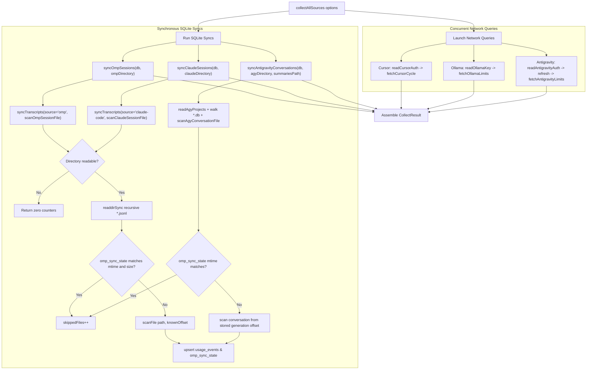

# OMP collector (`packages/collectors`)

> **Plain English:** [The harvester](../plain-english/06-the-harvester.md)

## 1. Purpose

`packages/collectors` is Prompt Burn's data ingestion engine. It turns raw local and remote usage
sources into uniform `UsageEvent` rows in SQLite, aggregates provider-side billing snapshots, and
retrieves real-time subscription limit clocks. The planning pipeline is collect → store → price
→ aggregate, and this package owns the collect step.

The file retains its `06-omp-collector` name because documentation area numbers and slugs are
append-only; the OMP-only scope in the title is historical. `packages/collectors` implements all
sources across four operational categories:

1. **Local transcript collectors (disk JSONL and SQLite):**
   - **OMP transcripts** (`src/omp.ts`): parses `~/.omp/agent/sessions/` into `UsageEvent`s.
   - **Claude Code transcripts** (`src/claude-code.ts`): parses `~/.claude/projects/` into
     `UsageEvent`s (covering both terminal sessions and the VS Code extension).
   - **Antigravity CLI conversations** (`src/antigravity-cli.ts`): reads the `agy` CLI's
     per-conversation SQLite databases under `~/.gemini/antigravity-cli/`, decoding unframed
     protobuf generation records into `UsageEvent`s — the missing cost half behind the
     Antigravity quota clocks, since `agy`'s turns never land in an OMP or Claude Code
     transcript.
   - **Shared incremental sync** (`src/sync.ts`): drives all three trees via SQLite
     bookkeeping in `omp_sync_state` and idempotent upserts into `usage_events`.
2. **Network usage aggregates:**
   - **Cursor Pro** (`src/cursor.ts`): queries cursor.com for cycle-to-date and custom calendar
     window usage aggregates by model.
   - **Cursor auth** (`src/cursor-auth.ts`): extracts the session JWT in memory from Cursor's
     local `state.vscdb` without persisting it.
3. **Provider quota and limit clocks:**
   - **Ollama Cloud** (`src/ollama.ts`): queries the undocumented `GET https://ollama.com/api/usage`
     endpoint using the API key stored in OMP's `agent.db`.
   - **Google Antigravity** (`src/antigravity.ts`): queries internal Google endpoint
     `POST /v1internal:retrieveUserQuotaSummary` using `agy`'s macOS keychain secret, refreshing
     OAuth access tokens on the fly by scanning client pairs from the installed `agy` binary.
   - **OMP Limits** (`src/omp-limits.ts`): reads recent provider limit observations recorded in
     OMP's own SQLite database (`~/.omp/agent/agent.db`).
4. **Orchestrator** (`src/collect.ts`):
   - `collectAllSources` coordinates concurrent network calls alongside synchronous SQLite
     transcript syncs. Partial success is standard: failures are isolated per source and never
     throw.

**Double counting in one line:** OMP, Claude Code, and the `agy` CLI write separate local records
even when billed against the same provider subscription. Their events are tracked independently
and never deduped against each other; account-level limit cards display the shared provider pool.
The Antigravity quota clock (`src/antigravity.ts`) and the `agy` transcript collector
(`src/antigravity-cli.ts`) are deliberately separate surfaces — one is a provider gauge, the
other is cost — and they fail independently.

## 2. Inventory

| File                     | Kind   | Role                                                      |
| ------------------------ | ------ | --------------------------------------------------------- |
| `src/omp.ts`             | Module | OMP transcript → `UsageEvent` parser; recursive walk      |
| `src/claude-code.ts`     | Module | Claude Code transcript → `UsageEvent` parser; walk        |
| `src/antigravity-cli.ts` | Module | `agy` conversation SQLite + protobuf → `UsageEvent` reader |
| `src/sync.ts`            | Module | Incremental sync engine shared by all transcript sources |
| `src/cursor-auth.ts`     | Module | Cursor session JWT extraction from `state.vscdb` (SQLite) |
| `src/cursor.ts`          | Module | Cursor cycle and calendar window aggregate HTTP client    |
| `src/ollama.ts`          | Module | Ollama Cloud limits reader (`readOllamaKey` + fetch)      |
| `src/antigravity.ts`     | Module | Antigravity quota reader (`readAntigravityAuth` + fetch)  |
| `src/omp-limits.ts`      | Module | Provider limits reader from OMP's `agent.db` table        |
| `src/collect.ts`         | Module | `collectAllSources` orchestrator for fetches and syncs    |
| `src/index.ts`           | Module | Package's only public export surface                      |
| `src/omp.test.ts`        | Tests  | OMP parser coverage, built on the spike fixture           |
| `src/omp-gemini.test.ts` | Tests  | Gemini turn pricing lock via OMP parser                   |
| `src/claude-code.test.ts`| Tests  | Claude Code parser coverage on synthetic transcripts      |
| `src/sync.test.ts`       | Tests  | All three transcript syncs against temp database + schema |
| `src/antigravity-cli.test.ts` | Tests | Synthetic `agy` DBs: field map, mirror, resume |
| `src/cursor-auth.test.ts`| Tests  | Cursor token read, expiration, sign-out, DB exclusion     |
| `src/cursor.test.ts`     | Tests  | Cursor cycle and window aggregates, shape and error tests |
| `src/ollama.test.ts`     | Tests  | Ollama key extraction from synthetic `agent.db` & clocks  |
| `src/antigravity.test.ts`| Tests  | Keychain auth, binary scan, refresh, and quota inversion  |
| `src/omp-limits.test.ts` | Tests  | Query tests against synthetic `usage_history` in DB       |
| `src/collect.test.ts`    | Tests  | Orchestrator pass over all sources, isolation, toggles    |
| `package.json`           | Config | `@prompt-burn/collectors`, private workspace package      |
| `tsconfig.json`          | Config | TypeScript project configuration                          |

## 3. Public surface

All public entry points are re-exported from `src/index.ts`; there is no deep import path.

```ts
// omp.ts
defaultSessionsDirectory(home?: string): string
collectOmpEvents(directory?: string): UsageEvent[]
parseOmpSessionFile(filePath: string): UsageEvent[]
scanOmpSessionFile(filePath: string, fromOffset?: number): OmpFileScan
interface OmpFileScan { events: UsageEvent[]; offset: number }

// claude-code.ts
defaultClaudeDirectory(home?: string, env?: NodeJS.ProcessEnv): string
collectClaudeEvents(directory?: string): UsageEvent[]
parseClaudeSessionFile(filePath: string): UsageEvent[]
scanClaudeSessionFile(filePath: string, fromOffset?: number): ClaudeFileScan
interface ClaudeFileScan { events: UsageEvent[]; offset: number }

// sync.ts
syncOmpSessions(db: DatabaseSync, directory?: string): OmpSyncResult
syncClaudeSessions(db: DatabaseSync, directory?: string): OmpSyncResult
syncAntigravityConversations(
  db: DatabaseSync,
  directory?: string,
  summariesPath?: string,
): OmpSyncResult
interface OmpSyncResult { scannedFiles: number; skippedFiles: number; insertedEvents: number }

// antigravity-cli.ts
defaultAgyConversationsDirectory(home?: string): string
defaultAgySummariesPath(home?: string): string
readAgyProjects(summariesPath?: string): Map<string, string>
scanAgyConversation(dbPath: string, project?: string): UsageEvent[]
scanAgyConversationFile(dbPath: string, project?: string, fromIdx?: number): AgyConversationScan
decodeProtobufFields(buffer: Uint8Array): Map<string, number | string>
interface AgyConversationScan { events: UsageEvent[]; offset: number }

// cursor-auth.ts
defaultCursorStatePath(home?: string): string
readCursorAuth(statePath?: string): CursorAuth
interface CursorToken { ok: true; token: string; userId: string; expiresAt: Date }
interface CursorAuthUnavailable {
  ok: false;
  reason: "not_installed" | "signed_out" | "expired" | "unreadable";
  detail: string;
}
type CursorAuth = CursorToken | CursorAuthUnavailable

// cursor.ts
fetchCursorCycle(token: CursorToken, fetchImpl?: typeof fetch): Promise<CursorSnapshot>
fetchCursorWindowAggregate(
  token: CursorToken,
  range: { start: number; end: number },
  fetchImpl?: typeof fetch,
): Promise<CursorWindowAggregate>
interface CursorWindowAggregate { window: CursorWindow; models: ModelAggregate[] }

// ollama.ts
readOllamaKey(databaseFile?: string): string | undefined
fetchOllamaLimits(key: string, fetchImpl?: typeof fetch): Promise<ProviderLimits>

// antigravity.ts
readAntigravityAuth(read?: () => string): AntigravityAuth
fetchAntigravityLimits(
  auth: AntigravityCredential,
  fetchImpl?: typeof fetch,
  now?: Date,
  agyBinary?: string,
): Promise<ProviderLimits>
interface AntigravityCredential {
  ok: true;
  accessToken: string;
  refreshToken: string;
  expiresAt: Date;
  account?: string;
}
interface AntigravityUnavailable { ok: false; reason: "signed_out" | "unreadable"; detail: string }
type AntigravityAuth = AntigravityCredential | AntigravityUnavailable

// omp-limits.ts
ompAgentDatabase(sessionsDirectory?: string): string
readOmpLimits(databaseFile?: string, now?: Date): ProviderLimits[]

// collect.ts
collectAllSources(options: CollectOptions): Promise<CollectResult>
interface CollectOptions {
  db: DatabaseSync;
  ompDirectory?: string;
  claudeDirectory?: string;
  cursorStatePath?: string;
  fetchImpl?: typeof fetch;
  antigravitySecret?: () => string;
  agyConversationsDirectory?: string;
  agySummariesPath?: string;
  ompEnabled?: boolean;
  cursorEnabled?: boolean;
  claudeEnabled?: boolean;
  antigravityUsageEnabled?: boolean;
}
interface CollectResult {
  omp: { ok: boolean; error?: string; sync: OmpSyncResult };
  claudeCode: { ok: boolean; error?: string; sync: OmpSyncResult };
  cursor: {
    ok: boolean;
    reason?: CursorAuthUnavailable["reason"] | "fetch_failed" | "disabled";
    error?: string;
    cycle?: CursorSnapshot;
  };
  ollama: {
    ok: boolean;
    reason?: "signed_out" | "fetch_failed" | "disabled";
    error?: string;
    limits?: ProviderLimits;
  };
  antigravity: {
    ok: boolean;
    reason?: "signed_out" | "unreadable" | "fetch_failed";
    error?: string;
    limits?: ProviderLimits;
  };
  antigravityUsage: {
    ok: boolean;
    reason?: "disabled" | "sync_failed";
    error?: string;
    sync?: OmpSyncResult;
  };
}
```

Internal utilities such as `readKeychainSecret` and `defaultAgyBinary` are exported directly from
`src/antigravity.ts` for test injection but are kept off the package export surface. `UsageEvent`,
`Source`, `ProviderLimits`, `CursorSnapshot`, and `canonicalModelId` come from `@prompt-burn/core`.
`DatabaseSync` is Node's built-in SQLite handle.

## 4. Flow



### Orchestration Sequence (`collect.ts`)

`collectAllSources` is what a shell or reader calls. It executes:
1. **Overlapped Network Fetches:** Network calls start before SQLite transactions so HTTP round
   trips overlap disk I/O.
   - Cursor: `cursorEnabled` controls `collectCursor(cursorStatePath, fetchImpl)`.
     `readCursorAuth` reads `state.vscdb`. If valid, `fetchCursorCycle` queries cursor.com.
   - Ollama Cloud: `ompEnabled` controls `collectOllama(ompDirectory, fetchImpl)`.
     `readOllamaKey` reads OMP's `agent.db`. If present, `fetchOllamaLimits` queries ollama.com.
   - Google Antigravity: `collectAntigravity(antigravitySecret, fetchImpl)` runs independently of
     `ompEnabled` because `agy`'s keychain item survives unlinking the provider from OMP.
     `readAntigravityAuth` reads the keychain, refreshes expired tokens via client pairs extracted
     from the `agy` binary, and queries Google's quota API.
2. **Synchronous Transcript Syncs:** `syncOmpSessions`, `syncClaudeSessions`, and
   `syncAntigravityConversations` run sequentially, each in its own `BEGIN`/`COMMIT` transaction.
   If disabled, a source returns clean zeros without reading disk. If an individual sync throws,
   it rolls back and returns `{ ok: false, error, sync: zeros }`, leaving other sources untouched.
   The `agy` sync is the exception in shape only: disabled or failed, it returns
   `{ ok: false, reason }` with no `sync` counters at all — the absent `sync` says nothing was
   scanned rather than claiming a clean empty pass.
3. **Result Assembly:** All network promises are awaited and returned in `CollectResult`:
   ```ts
   { omp, claudeCode, cursor, ollama, antigravity, antigravityUsage }
   ```
   Nothing in `collectAllSources` throws; partial success is the normal operating state.

### Transcript Collection (`sync.ts`, `omp.ts`, `claude-code.ts`, `antigravity-cli.ts`)

The two JSONL transcript syncs run through `syncTranscripts(db, directory, source, scanFile)`:
- If `directory` is missing, returns `{ scannedFiles: 0, skippedFiles: 0, insertedEvents: 0 }`.
- Scans `*.jsonl` files recursively via `readdirSync(directory, { recursive: true, ... })`.
- For each file, checks `omp_sync_state` by absolute path: if `mtime` matches
  `Math.floor(stats.mtimeMs)` and stored `offset === stats.size`, the file is skipped untouched.
- If changed, calls `scanFile(path, fromOffset)`. Grown files resume at `offset`; shrunk files
  restart at byte 0.
- OMP scan parses `type: "session"` for `sessionId` and `cwd` (reading from line 0 even on resume),
  emitting `toUsageEvent` for `type: "message"` assistant turns past `fromOffset`.
- Claude Code scan has no session header (`cwd` and `sessionId` are on each line), so lines before
  `fromOffset` are skipped without parsing.
- Events are upserted into `usage_events`, and `omp_sync_state` is updated with the new offset.
- `collectOmpEvents` and `collectClaudeEvents` are one-shot whole-tree scans from byte 0 returning
  `UsageEvent[]` without database writes.

The `agy` CLI sync (`syncAntigravityConversations`) is its own walk, not a `syncTranscripts`
variant — its files are SQLite databases, not line streams:
- Reads `readAgyProjects(summariesPath)` once per sync: a conversation id → project map built
  from `conversation_summaries.workspace_uris[0]`. A missing or unreadable index is an empty map;
  attribution degrades to "no project" but tokens are still priced.
- Walks `*.db` files under `directory` (default `~/.gemini/antigravity-cli/conversations`).
- Skip test is `mtime` alone: the stored `offset` counts generations (`MAX(idx) + 1`), not bytes,
  so it cannot be compared against a file size that also moves with SQLite page allocation.
- Changed files are rescanned via `scanAgyConversationFile(path, project, storedOffset)`; a
  database holding fewer generations than the offset claims was rebuilt in place and restarts
  from zero by itself.
- Events land in `usage_events` under source `antigravity`, and `omp_sync_state` stores the new
  generation offset with the file's `mtime`.

## 5. Contracts and invariants

### OMP Transcripts (`src/omp.ts`)
- **What a line carries:** Evaluates `type: "session"` for `id` (session UUID) and `cwd` (project).
  Evaluates `type: "message"` lines where `message.role === "assistant"` and `message.usage` is
  present. `timestamp` and `message.model` must be strings; `input`, `output`, `cacheRead`,
  `cacheWrite` are coerced via `count()` (defaulting non-numbers to `0`). Deliberately ignored:
  `message.usage.cost` (pricing is calculated downstream from `price_entries`), `totalTokens`,
  `cttl`, `contextSnapshot`, and non-message types (`custom`, `title_change`, `service_tier_change`,
  `credential_pin`, user turns).
- **Event ID:** `omp:${sessionId}:${line.id}` when header and line ID exist; fallback is `omp:` plus
  the first 16 hex characters of `sha256(filePath:byteOffset)`. Stable across re-reads; never hashes
  `timestamp + model + tokens` (which would collide on identical tiny turns).

### Claude Code Transcripts (`src/claude-code.ts`)
- **Layout & context:** `~/.claude/projects/<slugified-cwd>/<session-uuid>.jsonl`.
  No session header: `cwd` and `sessionId` are present on every line, so resumed scans skip
  pre-offset lines outright without reading for context.
- **Token mapping:** Anthropic API names (`input_tokens`, `output_tokens`, etc.) map onto
  `input`, `output`, `cacheRead`, and `cacheWrite` via `count()`.
- **Synthetic turns:** `message.model === "<synthetic>"` (interrupts, local errors) are skipped
  outright since no provider ran and there are no tokens to price.
- **Model canonicalization:** Trailing `-YYYYMMDD` date suffixes are stripped by `canonicalModelId`
  (`claude-sonnet-4-5-20250929` → `claude-sonnet-4-5`); `rawModel` preserves the dated string.
- **Event ID:** `claude-code:${message.id}:${requestId}` when both exist. Resuming or branching
  copies previous turns into a new transcript with fresh line UUIDs but identical response IDs;
  keying on response IDs prevents double counting across files. Fallbacks:
  `claude-code:${sessionId ?? "unknown"}:${uuid}`, then `claude-code:` + 16 hex chars of
  `sha256(filePath:byteOffset)`.

### Antigravity CLI Conversations (`src/antigravity-cli.ts`)
- **Layout:** One SQLite database per conversation at
  `~/.gemini/antigravity-cli/conversations/<conversation-id>.db`, with
  `~/.gemini/antigravity-cli/conversation_summaries.db` mapping conversation id → workspace
  (the event's `project`). Every database is opened read-only with `immutable=1` — a live
  conversation is mid-write — and `agy`'s files are never written to.
- **Storage format:** `gen_metadata(idx, data, size)` holds one *unframed protobuf message* per
  model generation, with no descriptor shipped anywhere readable. `decodeProtobufFields` walks the
  wire format generically and keys every scalar by dotted field path. The field map was derived
  over 49 real conversations (1,713 priceable generations), not guessed:
  `1.19` = model id string, `1.4.2` = prompt/input tokens, `1.4.3` = total output tokens
  (thinking `1.4.9` + emitted text `1.4.10`, verified equal on all rows carrying all three;
  taken whole, never summed on top). Timestamps come from the joined `steps.metadata` field `1.1`
  (epoch seconds); the join is total in the sample, but a row resolving no timestamp is skipped,
  never given "now".
- **Deliberately unpriced:** `1.4.5` (unidentified, larger than the prompt on early rows —
  pricing it would invent cost) and the `1.17.2.*` mirror of the counts (read by exact path, so
  it cannot double a total).
- **Priceability:** A row with no model, no input count, or no resolvable timestamp yields no
  event. A conversation database that will not open, or lacks either table, yields no events
  (`agy` may not be installed or may have changed its schema) — never a throw mid-sync.
- **Cache caveat:** Input is priced at the full input rate with `cacheRead`/`cacheWrite` left at 0,
  because no cached-token count was identifiable. Where Google served part of a prompt from its
  context cache, this over-estimates — the same documented class of bias as the Ollama
  peak-window under-estimate recorded in `packages/db/src/prices.ts`.
- **Event ID:** `agy:${conversationId}:${idx}` — stable, since a rebuilt conversation restarts
  from zero and re-upserts under the same keys.
- **Non-Gemini models:** The same rows carry `claude-sonnet-4-6` and `claude-opus-4-6-thinking`
  generations; only `gemini-3.8-flash` has a `price_entries` row today, so the rest surface as
  unknown-price rows rather than free tokens.

### Incremental Sync Engine (`src/sync.ts`)
- **Shared state table:** `omp_sync_state` (`path`, `mtime`, `offset`) tracks OMP, Claude Code,
  and `agy` conversation files, keyed by absolute path.
- **Skip check:** For JSONL transcripts, if a file's `mtime` matches `Math.floor(stats.mtimeMs)`
  and stored `offset === stats.size`, the file is skipped without opening. For `agy` conversation
  databases the skip test is `mtime` alone — the offset counts generations, not bytes, so it
  cannot be compared against a file size that also moves with SQLite's page allocation.
- **Append vs rewrite:** Grown JSONL files resume at `offset`; shrunk files restart from byte 0.
  A `agy` database holding fewer generations than the offset claims was rebuilt in place and is
  rescanned from generation 0 by `scanAgyConversationFile` itself.
- **Offset semantics:** For JSONL, `offset` covers bytes up to the last line ending in `\n`. Torn
  final lines remain outside the consumed byte range and are re-read on the next sync pass. For
  `agy`, `offset` is `MAX(idx) + 1` — generations already consumed.
- **Upsert semantics:** Insert uses an upsert on `id`:
  `ON CONFLICT(id) DO UPDATE SET project = excluded.project`
  `WHERE usage_events.project IS NULL AND excluded.project IS NOT NULL`.
  Replays cause 0 changes; `insertedEvents` reflects actual rows written.
- **Timestamp requirement:** Events with empty timestamps are skipped to prevent schema violations.
- **Missing directory:** Returns `{ scannedFiles: 0, skippedFiles: 0, insertedEvents: 0 }` cleanly.

### Cursor Auth & Usage Aggregates (`src/cursor-auth.ts`, `src/cursor.ts`)
- **Token read:** Reads `cursorAuth/accessToken` from Cursor's `state.vscdb` using read-only,
  immutable mode (`file:...mode=ro&immutable=1`). The token is decoded as an unverified base64url
  JWT to extract `sub` (WorkOS user ID) and `exp` (expiration timestamp).
- **In-memory token hygiene:** Cursor's JWT is kept in memory only; it is never written to
  Prompt Burn's database, logs, or fixtures.
- **Cycle aggregate:** `fetchCursorCycle` POSTs to `/api/usage-summary` (cycle dates and plan pool
  percentages) and `/api/dashboard/get-aggregated-usage-events` (per-model totals for body `{}`).
- **Window aggregate:** `fetchCursorWindowAggregate` queries the dashboard aggregate endpoint
  with `teamId: 0` and epoch millisecond string bounds `[startDate, endDate)`.
- **Empty window is zero, not a failure:** A window Cursor has no events for answers
  `200 {}` — no `aggregations` key at all. That is zero usage, not a broken payload; the
  window must survive or the caller falls back to the cycle and the day's total silently
  turns into a month's. Only a present-but-not-array `aggregations` is a shape failure.
- **Plan pool percentages:** `individualUsage.plan.autoPercentUsed` and `apiPercentUsed` are the
  only numbers taken from Cursor about Cursor's own plan; a team account answering
  `teamUsage` gets nothing here.
- **Date boundary constraint:** Cursor's backend forbids windows spanning both `2025-08-01` and
  `2026-05-14`; unbounded (all-time) queries are not permitted.
- **Headers:** Mandatory `Origin: https://cursor.com` (omitting triggers 403) and cookie
  `WorkosCursorSessionToken=${encodeURIComponent(userId)}::${token}`.
- **Omitted cache counts:** Omitted cache fields remain undefined; fake zeros are never inserted.
  Cursor's own cent estimates (`totalCents`, `totalCostCents`) are ignored.

### Ollama Cloud Usage Clocks (`src/ollama.ts`)
- **Key read:** Reads active key from `auth_credentials` in OMP's `agent.db`
  (`provider = 'ollama-cloud'`).
- **Endpoint:** Undocumented `GET https://ollama.com/api/usage` with `Authorization: Bearer <key>`.
- **Clocks:** Maps `session` and `weekly` usage fractions (clamped to 0..1). `resetsAt` is always
  `null` because Ollama does not provide rollover timestamps, and Prompt Burn never invents them.
- **Key hygiene:** The key is read at fetch time and never persisted or logged.

### Google Antigravity Quota Clocks (`src/antigravity.ts`)
- **Keychain read:** Reads service `gemini`, account `antigravity` via macOS `security` CLI
  (written by `go-keyring`).
- **Endpoint:** Internal `POST /v1internal:retrieveUserQuotaSummary` on
  `https://cloudcode-pa.googleapis.com`.
- **Header constraints:** `User-Agent` **must** contain `antigravity` (case-insensitively); anything
  else triggers `403 SUBSCRIPTION_REQUIRED (#3501)`. Must **not** include `x-goog-user-project`
  (causes permission errors on Google's billing project).
- **Token refresh:** When `accessToken` is within 60s of expiring (`SKEW_MS`), refreshes against
  `https://oauth2.googleapis.com/token`. OAuth client pairs are parsed dynamically from
  the installed `agy` binary using memory-mapped chunk searches around anchors
  (`.apps.googleusercontent.com` and `GOCSPX-`), ensuring automated adaptation to Google client
  rotations.
- **Quota inversion:** Google reports `remainingFraction`. Prompt Burn cards display consumed
  fraction, so `usedFraction = Math.min(Math.max(1 - remaining, 0), 1)`.

### OMP Agent Database Limits (`src/omp-limits.ts`)
- **Database read:** Opens OMP's live `agent.db` in read-only mode (`mode=ro`, without immutable).
- **Query:** `SELECT ... MAX(recorded_at) AS recorded_at FROM usage_history GROUP BY provider, ...`.
- **Age filter:** Rows older than 7 days (`MAX_AGE_MS = 604_800_000`) are dropped as stale.
- **Account grouping:** Groups limits by `(provider, account_key)` and surfaces the recorded
  `email` as the account name — a UUID `account_id` identifies nothing to a human and stays
  behind, while `account_key` never leaves the reader function.

### Zero-Leak Credential Invariant
No credential (Cursor JWT, Ollama key, Antigravity OAuth tokens, keychain secret) is ever written to
Prompt Burn's SQLite database, saved to disk, or logged. Credentials exist in memory only for the
lifespan of a single fetch.

## 6. Configuration

Collectors contain no internal configuration files; callers pass directories, toggles, and
injected helpers into entry points or via `CollectOptions`:

- `db`: `@prompt-burn/db` database handle for transcript event insertion.
- `ompDirectory`: transcript root; defaults to `defaultSessionsDirectory()`
  (`~/.omp/agent/sessions`).
- `claudeDirectory`: transcript root; defaults to `defaultClaudeDirectory()`
  (`~/.claude/projects` or `$CLAUDE_CONFIG_DIR/projects`).
- `cursorStatePath`: Cursor state database; defaults to `defaultCursorStatePath()`
  (`~/Library/Application Support/Cursor/User/globalStorage/state.vscdb` on macOS).
- `fetchImpl`: injectable fetch implementation; allows tests to run fully offline.
- `antigravitySecret`: injectable function returning raw keychain secret; tests use this to avoid
  reading host credentials.
- `agyConversationsDirectory`, `agySummariesPath`: the `agy` CLI's per-conversation records and
  workspace map; default `~/.gemini/antigravity-cli/conversations` and the
  `conversation_summaries.db` beside it. Injectable so a test never reads the developer's
  own `~/.gemini`.
- `ompEnabled`, `cursorEnabled`, `claudeEnabled`, `antigravityUsageEnabled`: boolean toggles; all
  default to `true`. `antigravityUsageEnabled` governs the `agy` CLI as a usage source only —
  the Antigravity quota card has no toggle.

Environment variables:
- `CLAUDE_CONFIG_DIR`: relocates Claude Code's config directory; if a comma-separated list is
  provided, only the first entry is read.

Default paths resolve dynamically against `os.homedir()`. Stored settings rows (`omp_path`,
`claude_path`, `omp_enabled`, `claude_enabled`, `cursor_enabled`, `antigravity_enabled`,
`agy_path`) are loaded by `packages/reader` and forwarded here (the reader derives
`agySummariesPath` as the summaries database beside the configured conversations directory).

## 7. Boundaries and dependencies

- **Runtime dependencies:** `@prompt-burn/core` (types: `UsageEvent`, `Source`, `ProviderLimits`,
  `CursorSnapshot`, `TokenCounts`, `ModelAggregate`, `CursorWindow`; helper: `canonicalModelId`).
- **Node built-ins:** `node:fs`, `node:path`, `node:os`, `node:crypto`, `node:child_process`
  (for `security find-generic-password`), `node:sqlite` (`DatabaseSync` in `cursor-auth.ts`,
  `ollama.ts`, `omp-limits.ts`, `antigravity-cli.ts`, and `sync.ts`).
- **Dev dependencies:** `@prompt-burn/db` (used in tests for database creation, paths, and pricing
  verification) and `vitest`.
- **Database coupling:** SQL statements in `src/sync.ts` mirror `packages/db/src/schema.ts`. The
  collectors package does not run migrations or construct tables; tests couple against
  `@prompt-burn/db` to verify schema alignment.
- **Consumer:** Driven by `packages/reader` (`createUsageReader`), which executes
  `collectAllSources` on refresh. The package contains no scheduler or persistent daemon.
- **Credential isolation boundary:** Tokens, API keys, and keychain secrets remain strictly
  ephemeral in memory and never cross into storage or logs.

## 8. Tests

Vitest suites run offline using synthetic files, temp directories, and stubbed HTTP fetches:

- `omp.test.ts`: fixture parsing (`omp-session-line.json`), skipping headers and non-usage line
  types, fallback SHA-256 event IDs, model canonicalization, and recursive directory traversal.
- `omp-gemini.test.ts`: regression lock pricing a real Gemini-through-Antigravity turn from fixture
  against bundled `price_entries`, verifying reasoning tokens are not double-counted.
- `claude-code.test.ts`: synthetic Claude Code assistant turns mapped to `UsageEvent`, synthetic
  model filtering, dated model canonicalization, response ID deduplication, and torn line offsets.
- `sync.test.ts`: incremental sync for both OMP and Claude Code against `@prompt-burn/db`, verifying
  unchanged file skipping, append resumption, shrunk file resets, and shared `omp_sync_state`.
- `antigravity-cli.test.ts`: synthetic `agy` conversation databases built byte by byte by a test
  encoder (no real conversation content ever enters the repo) — the protobuf field map, the
  `1.17.2.*` mirror not doubling counts, `1.4.3` taken whole rather than summing thinking and
  emitted text, `1.4.5` left unpriced, rows with no model/input/timestamp skipped, damaged
  blobs decoded without throwing, non-database files walked past, resume bookkeeping
  (0-based `idx`), and workspace attribution from `workspace_uris`.
- `cursor-auth.test.ts`: synthetic `state.vscdb` verification of `not_installed`, `signed_out`,
  `expired`, unreadable conditions, valid JWT decoding, and credential exclusion from DB.
- `cursor.test.ts`: cycle snapshot and calendar window aggregation from captured fixtures, omission
  of unreturned cache counts, a bare `{}` aggregate read as zero usage (not a failure), plan pool
  percentage carriage, origin/cookie header enforcement, and HTTP error handling.
- `ollama.test.ts`: reading API keys from synthetic `agent.db` instances, bearer auth requests,
  session/weekly clock parsing, and rejection of malformed payloads.
- `antigravity.test.ts`: parsing `go-keyring` keychain payloads, scanning synthetic binaries for
  OAuth pairs, token refresh loops, `User-Agent` enforcement, and quota fraction inversion.
- `omp-limits.test.ts`: `usage_history` query validation, 7-day staleness filtering, account email
  grouping, and missing database tolerance.
- `collect.test.ts`: parallel orchestrator execution across all sources, source isolation on error,
  credential exclusion from DB, disabled source handling (including `antigravityUsageEnabled:
  false`), the `agy` directory override being walked, the `agy` sync throwing without touching
  other sources, a missing `agy` session as a missing card, and independent Antigravity quota
  execution when OMP is disabled.

Not covered here: the golden snapshot and reader integration over every source
(`packages/reader`), the price list and pricing engine (`packages/db`), and the UI shells.
No test touches a live cursor.com, ollama.com, or Google endpoint; no test reads the
developer's real keychain, `~/.claude`, or `~/.gemini` — everything is synthetic or injected.

## 9. Debt and traps

- **Undocumented APIs:** Ollama's `/api/usage` and Google's `/v1internal:retrieveUserQuotaSummary`
  are internal endpoints. If their path or response schema changes, their cards disappear without
  compiler or runtime warnings.
- **Antigravity User-Agent gate:** Requests without `antigravity` in the `User-Agent` fail with
  `403 SUBSCRIPTION_REQUIRED (#3501)`, mimicking a subscription lapse. Sending `x-goog-user-project`
  causes immediate permission errors.
- **Binary scanning for OAuth client:** Extracting OAuth pairs from the ~170 MB `agy` binary via
  chunked memory search avoids hardcoded secrets, but is vulnerable if Google changes packaging,
  compilation, or credential patterns.
- **Cursor query date ceiling:** The Cursor backend rejects windows spanning `2025-08-01` and
  `2026-05-14`. Unbounded historical queries fail and must be avoided.
- **Keychain OS dependency:** `readAntigravityAuth` relies on macOS `security`. On Linux or CI
  environments, it cleanly reports `signed_out`.
- **Claude Code transcript shape unverified on disk:** Claude Code parsers were built against
  documented schemas without captured local production fixtures.
- **Antigravity protobuf is reverse-engineered, not documented:** The `agy` field map
  (`1.19` model, `1.4.2` input, `1.4.3` output, `1.1` timestamp) was derived from 49 real
  conversations on one machine. No descriptor ships with `agy`; if Google renumbers field
  paths, the decoder keeps walking but reads nothing priceable, and usage silently drops to
  zero.
- **`1.4.5` is unidentified on purpose:** It exceeds the prompt count on early rows, so it is not
  a cached subset; pricing it would invent cost. If it ever turns out to be billed input,
  `agy` rows are under-counted until mapped.
- **Antigravity cache over-estimate:** Input is priced at the full rate because no cached-token
  count is identifiable. Where Google served a prompt from its context cache, cost is
  over-estimated — same documented bias class as the Ollama peak-window under-estimate in
  `packages/db/src/prices.ts`.
- **Non-Gemini `agy` models unpriced:** `agy` runs `claude-sonnet-4-6` and
  `claude-opus-4-6-thinking` turns too; without `price_entries` rows they surface as
  unknown-price rows. Adding the rates is a price decision, not a parsing one.
- **Fallback ID path dependence:** When session headers or request IDs are absent, fallback IDs
  hash the file path and byte offset. Moving a transcript causes re-insertion under a new ID.
- **Whole file read into memory:** Both JSONL transcript scans perform `readFileSync` over whole
  files, which is manageable for ordinary session logs but expensive for pathological files.
- **Silent error swallowing:** Unparsable lines, vanished files, unreadable directories, and
  `agy` databases that will not open are swallowed by design. Debugging missing data requires
  inspecting directories directly.
- **No internal scheduling:** Collector passes run only when an external caller invokes
  `collectAllSources`.

## 10. Change guide

- **Adding a field to OMP or Claude Code line parsing:** Update `OmpLine` in `src/omp.ts` or
  `ClaudeLine` in `src/claude-code.ts`, map the field in `toUsageEvent`, and add test cases to
  `omp.test.ts` or `claude-code.test.ts`. Avoid changing event ID generation algorithms, as changed
  IDs result in duplicate rows in `usage_events`.
- **Adding a new transcript source:**
  1. Add the source identifier to `Source` in `@prompt-burn/core`.
  2. Update the `usage_events.source` CHECK constraint in `packages/db`.
  3. Create the transcript parser and scanner module. JSONL sources implement the `ScanFile`
     shape and delegate to `syncTranscripts`; non-JSONL stores (like `agy`'s SQLite
     conversations) write their own walk in `src/sync.ts`, reusing `omp_sync_state` and the
     `INSERT_EVENT`/`UPSERT_STATE` statements.
  4. Add an entry point in `src/sync.ts`.
  5. Wire options, directory defaults, toggles, and result handling into `src/collect.ts`.
- **Adding or modifying a remote aggregate source:** Implement HTTP queries using injectable
  `fetchImpl`, decode payloads defensively with runtime guards, and wire credentials into
  `collect.ts` without persisting them.
- **Adding or modifying a provider limit source:** Add clock mappings conforming to `ProviderLimits`
  in `@prompt-burn/core`. Ensure `resetsAt` is only populated when an explicit timestamp exists.
- **Coordinating schema changes:** If `usage_events` or `omp_sync_state` DDL changes in
  `packages/db/src/schema.ts`, update the SQL statements in `src/sync.ts` and verify with
  `src/sync.test.ts`.
