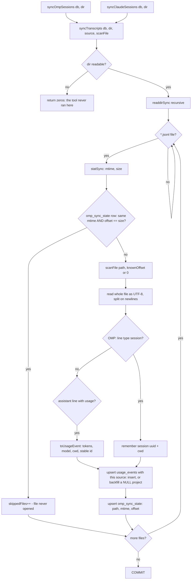

# OMP collector (`packages/collectors`)

> **Plain English:** [The harvester](../plain-english/06-the-harvester.md)

## 1. Purpose

`packages/collectors` turns raw usage sources into `UsageEvent` rows for the database. This is
the **transcript-collector** document: it covers the two collectors that read `.jsonl`
conversation logs off the local disk — OMP's, landed in e630bf0 (parse) and cbafc07
(incremental sync), and **Claude Code's**, added later beside it — plus the shared sync core
they run on and the fetch pass that drives them. (The file keeps its `06-omp-collector` name
because area numbers and their slugs are append-only; the OMP-only scope in the title is
historical.)

The planning docs' pipeline is collect → store → price → aggregate, and this package is the
collect step. The same package also holds the non-transcript sources — Cursor's token read and
HTTP client, Ollama Cloud's usage clocks, OMP's `usage_history` limits. Those are outside this
document's scope and have no pair of their own yet; their field mappings live in
[`docs/data-shapes.md`](../data-shapes.md).

**Claude Code in one line:** the CLI that the VS Code extension drives, whose transcripts live
under `~/.claude/projects`. Editor panel and terminal session write the same files, so one
collector covers both. Its tokens are a different tool's from OMP's even when the same Claude
subscription pays for them, which is why it is a `Source` of its own and never deduped against
OMP — see [spec.md § Double counting](../spec.md#double-counting-omp-claude-code-and-the-limit-cards).

## 2. Inventory

| File                     | Kind   | Role                                                                    |
| ------------------------ | ------ | ----------------------------------------------------------------------- |
| `src/omp.ts`             | Module | OMP transcript → `UsageEvent` parsing; recursive walk; default path     |
| `src/claude-code.ts`     | Module | Claude Code transcript → `UsageEvent` parsing; walk; default path       |
| `src/sync.ts`            | Module | Shared incremental sync core + both entry points                        |
| `src/collect.ts`         | Module | One fetch pass over every source, with per-source results               |
| `src/index.ts`           | Module | Package's only export surface                                           |
| `src/omp.test.ts`        | Tests  | OMP parser coverage, built on the spike fixture                         |
| `src/omp-gemini.test.ts` | Tests  | Gemini-through-Antigravity lines through the same parser                 |
| `src/claude-code.test.ts`| Tests  | Claude Code parser coverage, built on synthetic transcripts             |
| `src/sync.test.ts`       | Tests  | Both syncs against a temp database                                      |
| `src/collect.test.ts`    | Tests  | Fetch-pass coverage — OMP + Cursor only, see §8                         |
| `package.json`           | Config | `@prompt-burn/collectors`, private, workspace package                   |

Outside this document, in the same package: `src/cursor-auth.ts`, `src/cursor.ts`,
`src/ollama.ts`, `src/omp-limits.ts`, `src/antigravity.ts` and their suites.
`src/antigravity.ts` is the odd one: it reads `agy`'s macOS keychain session and asks Google for
the Antigravity quota directly, because unlinking that provider from OMP stops `usage_history`
recording it — see
[data-shapes.md § Antigravity quota](../data-shapes.md#antigravity-quota--v1internalretrieveuserquotasummary-2026-09-11).

## 3. Public surface

All of it re-exported from `src/index.ts`; there is no deep import path.

```ts
// omp.ts
defaultSessionsDirectory(home?: string): string            // ~/.omp/agent/sessions
collectOmpEvents(directory?: string): UsageEvent[]          // whole-tree walk, one-shot
parseOmpSessionFile(filePath: string): UsageEvent[]         // one transcript, full read
scanOmpSessionFile(filePath: string, fromOffset?: number): OmpFileScan
interface OmpFileScan { events: UsageEvent[]; offset: number }

// claude-code.ts — same five shapes, one tool over
defaultClaudeDirectory(home?: string, env?: NodeJS.ProcessEnv): string  // ~/.claude/projects
collectClaudeEvents(directory?: string): UsageEvent[]
parseClaudeSessionFile(filePath: string): UsageEvent[]
scanClaudeSessionFile(filePath: string, fromOffset?: number): ClaudeFileScan
interface ClaudeFileScan { events: UsageEvent[]; offset: number }

// sync.ts
syncOmpSessions(db: DatabaseSync, directory?: string): OmpSyncResult
syncClaudeSessions(db: DatabaseSync, directory?: string): OmpSyncResult
interface OmpSyncResult { scannedFiles: number; skippedFiles: number; insertedEvents: number }

// collect.ts
collectAllSources(options: CollectOptions): Promise<CollectResult>
```

Each `parse…SessionFile` is `scan…SessionFile(path).events`; the scan form exists so sync can
pass an offset. `UsageEvent`, `Source` and `canonicalModelId` come from `@prompt-burn/core`.
`OmpSyncResult` is shared by both syncs and keeps its OMP-era name, like the table it writes.

## 4. Flow



Claude Code takes the same path with the `session` branch absent: every line carries its own
`cwd` and `sessionId`, so a resumed file skips everything before `fromOffset` outright instead
of parsing it for a header.

`collectOmpEvents` / `collectClaudeEvents` are the same walks without state: every `.jsonl`
file parsed from byte 0, events concatenated, nothing written. They predate the sync and are
the "read everything" path.

`collectAllSources` (in `collect.ts`) is what a shell calls. It starts the two network fetches
(Cursor's cycle, Ollama's clocks) **before** the synchronous syncs so their round trips overlap
the SQLite work, then runs `syncOmpSessions` and `syncClaudeSessions` — each its own
transaction, each rolling itself back — and returns one result per source:

```ts
{ omp: { ok, error?, sync }, claudeCode: { ok, error?, sync }, cursor: {…}, ollama: {…} }
```

Wiring per source: `ompDirectory` / `claudeDirectory` (empty or absent → the collector
default), `ompEnabled` / `cursorEnabled` / `claudeEnabled` (all default `true`). A **disabled
transcript source is clean and empty, never an error**: `{ ok: true, sync: { scannedFiles: 0,
skippedFiles: 0, insertedEvents: 0 } }`, and its directory is not walked at all. Nothing in
`collectAllSources` throws; a failed sync comes back as `{ ok: false, error, sync: zeros }` and
the other sources keep their numbers.

## 5. Contracts and invariants

**What an OMP transcript line carries** (cross-checked against
[`docs/data-shapes.md`](../data-shapes.md) § OMP — the code agrees). The parser reads:
`type` (a `type: "session"` header first-ish in the file carries `id`, the session uuid, and
`cwd`, the project the usage belongs to),
and `type: "message"` lines where `message.role === "assistant"` and `message.usage`
exists. From a usage line: top-level `timestamp` (ISO 8601 UTC) and `message.model` (no
provider prefix) must be strings, `message.usage.input` / `output` / `cacheRead` /
`cacheWrite` are JSON numbers (re-checked at runtime via `count`, defaulting to `0`), and
top-level `id` is the per-file line id. Deliberately ignored: `message.usage.cost` (OMP's
own estimate — pricing comes from `price_entries`), `totalTokens`, `cttl`,
`contextSnapshot`, `provider`/`api`, and every other line type (`custom`, `title_change`,
`service_tier_change`, `credential_pin`, user turns).

**Event id** — `omp:${sessionId}:${line.id}`. `line.id` is unique per file only, so the
header line must be read before the messages it scopes (the scan always keeps reading from
byte 0; lines before `fromOffset` are parsed for the header but emit no events). Without a
header the fallback is `omp:` + first 16 hex of `sha256(filePath:byteOffset)` — stable
across re-reads, and never `timestamp + model + tokens` (two identical tiny turns would
collide). This id is the `usage_events` primary key, which is what makes re-reads idempotent.

**What a Claude Code transcript line carries.** Layout
`~/.claude/projects/<slugified-cwd>/<session-uuid>.jsonl`, one JSON object per line, walked
recursively. A line counts only when `message.role === "assistant"` and `message.usage`
exists, and `timestamp` plus `message.model` must both be strings. **No session header**:
`cwd` (the project) and `sessionId` are on every line, so nothing before `fromOffset` is ever
re-read for context. Token keys are Anthropic's API names — `input_tokens`, `output_tokens`,
`cache_read_input_tokens`, `cache_creation_input_tokens` — mapped onto
`tokens.input` / `output` / `cacheRead` / `cacheWrite` through the same `count` guard, so a
missing or non-finite value becomes `0`. `message.model === "<synthetic>"` is skipped
outright: that is Claude Code's stand-in on locally generated messages (interrupts, API
errors), where no provider ran and there is nothing to price. Any cost field the tool wrote is
ignored, like OMP's. Field-level detail, and the honest note that none of it has been checked
against a real local transcript, live in
[`docs/data-shapes.md`](../data-shapes.md#claude-code).

**Claude Code event id** — `claude-code:${message.id}:${requestId}` when both are strings,
else `claude-code:${sessionId ?? "unknown"}:${uuid}`, else `claude-code:` + first 16 hex of
`sha256(filePath:byteOffset)`. The response ids come first because resuming or branching a
session copies earlier turns into a new transcript with fresh per-line uuids but the original
`message.id` / `requestId` — keying on those is what stops one API response being counted
twice across files. Never `timestamp + model + tokens`.

**Dated model ids collapse.** Claude Code writes Anthropic's dated snapshots;
`canonicalModelId` strips a trailing `-YYYYMMDD`, so `claude-sonnet-4-5-20250929` prices as
`claude-sonnet-4-5` — the id OMP writes and the id `price_entries` keys on — while `rawModel`
keeps the dated string.

**Events with no timestamp never reach the database.** `usage_events` forbids an empty
timestamp, and `insert()` skips such an event instead of aborting the whole sync.

**Offset semantics** — `OmpFileScan.offset` / `ClaudeFileScan.offset` count only bytes up to
the last line that ended in `\n`. A torn final line stays unconsumed so the next sync re-reads
it; blank and unparsable lines inside that range are skipped silently. A live transcript is
mid-write by definition, so one unreadable last line must never cost the whole file.

**Sync decisions** — one shared core, `syncTranscripts(db, directory, source, scanFile)`, all
inside one `BEGIN`/`COMMIT`. `syncOmpSessions` and `syncClaudeSessions` are two thin entry
points over it, passing their own default directory, their own `Source` and their own
`ScanFile` (`(filePath, fromOffset) => { events, offset }`); the walk, the resume bookkeeping,
the insert and the transaction are written once:

- A row in `omp_sync_state` (path → mtime, offset) whose mtime matches and whose offset
  equals the file size means the file is unchanged: not opened at all. This is what makes the
  second sync cheap. **Both sources share that table**, keyed by absolute path, so their trees
  cannot collide in it; the OMP-era name is kept deliberately rather than migrated.
- A grown file resumes at its stored offset; a file that shrank was rewritten, not
  appended to, so it restarts from byte 0.
- Rows go in with an upsert on the stable id, so replays (rewritten file, torn tail re-read,
  two files sharing an id) cannot duplicate. The `ON CONFLICT` clause only fires where the
  stored row's `project` is NULL and the parsed one is not — the backfill path after the
  `project` migration cleared `omp_sync_state`. Everything else is left alone, so
  `OmpSyncResult.insertedEvents` still counts rows actually written and a plain re-read
  counts zero.
- Rows land with `period = 'event'` and the caller's `source`, so an OMP row and a Claude Code
  row for the same model are two rows by construction. `omp_sync_state` is upserted after each
  file. A file deleted between `readdirSync` and `statSync` is skipped.
- The transaction is per call: a throw rolls that source's whole pass back and leaves the other
  source's rows, and its own last consistent state, untouched.

**Missing directory is not an error** for any entry point: the tool simply has not run on this
machine, and every one of them returns an empty result.

## 6. Configuration

No config *inside* the collectors; the shell hands paths and toggles in.
`defaultSessionsDirectory()` resolves `~/.omp/agent/sessions` and `defaultClaudeDirectory()`
resolves `~/.claude/projects`, both via `os.homedir()` (the `home` parameter exists for
tests). `defaultClaudeDirectory` is the one place an env var is read: `CLAUDE_CONFIG_DIR`
relocates Claude Code's whole config directory, and the collector then reads
`<CLAUDE_CONFIG_DIR>/projects`. Newer Claude Code builds accept a comma-separated list there
and only the first entry is honoured — a `ponytail:` shortcut marked in the code.

Everything else arrives as `CollectOptions`: `ompDirectory`, `claudeDirectory`,
`cursorStatePath`, `fetchImpl` (injectable so tests never reach the network), and the
`ompEnabled` / `cursorEnabled` / `claudeEnabled` toggles, all defaulting to `true`. The
settings rows behind them (`omp_path`, `claude_path`, `omp_enabled`, `claude_enabled`,
`cursor_enabled`) are read by `packages/reader`, not here; an empty stored path falls through
to the defaults above. Any caller may pass any directory — every suite passes temp
directories.

## 7. Boundaries and dependencies

- Runtime dependency: `@prompt-burn/core` only (`UsageEvent`, `canonicalModelId`). Node
  built-ins: `node:fs`, `node:path`, `node:os`, `node:crypto`, plus the `node:sqlite`
  _types_ (`DatabaseSync`, `StatementSync` — type-only, so the package never links the
  database code at runtime).
- Dev dependency: `@prompt-burn/db` for tests (real `openDatabase` + `databasePath` against
  a temp file) and `vitest`.
- The boundary is deliberate: collectors produce events; the db package owns the schema.
  sync.ts hard-codes the `usage_events` / `omp_sync_state` SQL, so a schema change in
  `packages/db` can break it — the test suite is the coupling check.
- Called by `packages/reader` (`createUsageReader` runs `collectAllSources` on every fetch),
  which the desktop sidecar and the VS Code host both drive. There is still no scheduler:
  a pass happens when a shell asks for one.

## 8. Tests

Vitest suites over synthetic transcripts in temp directories. OMP's are built from
[`docs/fixtures/omp-session-line.json`](../../docs/fixtures/omp-session-line.json), the one
redacted assistant line the spike captured; **Claude Code's are hand-written from the
documented line shape, because there was no Claude Code data on the machine** (see
[`docs/data-shapes.md § Claude Code`](../data-shapes.md#claude-code)). No suite touches a real
`~/.omp`, `~/.claude` or `~/.prompt-burn`.

`omp.test.ts` covers: the fixture mapping onto a full `UsageEvent`; skipping header, user
turns and every non-usage line type; the headerless fallback id (stable across re-reads,
two identical lines distinct); surviving blank, torn and non-object lines; model
canonicalization (`rawModel` kept verbatim, `model` collapsed); missing file → empty;
recursive walk including a subagent transcript in a directory named after the parent file
and a non-`.jsonl` file ignored; `defaultSessionsDirectory` layout.

`claude-code.test.ts` covers: an assistant turn mapped onto a full `UsageEvent` while every
other line type is skipped — including the `<synthetic>` model — with the dated model id
collapsed and `rawModel` kept; one API response keeping one id however many transcripts copy
it (the branched-session case); the per-line uuid fallback when `requestId` is missing; a
half-written last line left unconsumed and the resume past the rest; the recursive walk and a
missing directory; `defaultClaudeDirectory` with and without `CLAUDE_CONFIG_DIR`.

`sync.test.ts` covers both entry points against the real `@prompt-burn/db` schema on a temp
database file. For OMP: full row shape in `usage_events` (including `period: "event"`); second
sync skips unchanged files and opens nothing; appended file resumes from the offset without
duplicating; rewritten-shorter file re-reads with zero duplicates; an id shared by two files
inserts once; the `project` backfill on rows stored before attribution existed; a torn final
line left unconsumed then completed on the next sync; missing directory → zero result. For
Claude Code: rows landing under `source: 'claude-code'` and the second pass skipping;
`omp_sync_state` shared with OMP without the two colliding; missing directory → zero result.

`collect.test.ts` covers the fetch pass for **OMP and Cursor only** — both sources collected
with the Cursor token kept out of our database, OMP syncing with no local Cursor session, each
source surviving the other's failure, and the expired-session path. It has **no Claude Code
case**: the `claudeEnabled: false` branch (clean, empty, `ok: true`) and the `claudeCode`
result shape are unexercised. That is the one real coverage gap this source opened.

## 9. Debt and traps

- **Transcript shape is trusted, not versioned.** OMP's `type: "session"` header is expected
  before the messages it scopes, and its log format is `version: 3` with no compatibility
  guarantee across OMP updates (docs/data-shapes.md). Claude Code's shape is trusted harder
  still: **no line of it has been checked against a real transcript on this machine**, so a
  wrong key name would show up as a permanently empty source rather than an error. Either
  parser answers a renamed field by silently yielding nothing — `count()` defaults and
  `typeof` guards swallow the change instead of throwing.
- **Claude Code's dedupe leans on ids we have not seen.** `message.id` + `requestId` is what
  keeps a branched or resumed transcript from double counting. If a build stops writing
  `requestId`, the parser drops to the per-line uuid — which a branch copy *changes*, so the
  same response would land twice under two ids. Nothing detects that; it would look like real
  extra usage.
- **The fallback id is path-dependent.** `sha256(filePath:byteOffset)` is stable across
  re-reads on the same machine, but a file moved or opened under a different path gets a
  different id — and `omp_sync_state` keys on `path` too, so a moved transcript re-syncs
  from byte 0. Harmless (idempotent insert) but it re-reads.
- **Whole file is read into memory** even when resuming: both scans do one `readFileSync` and
  split, then skip pre-offset lines. Fine for session logs; a pathological transcript is read
  in full on every pass that touches it.
- **The offset-before-header subtlety is OMP-only, and is handled by re-reading.**
  `omp_sync_state` caches mtime + offset only, so a resumed OMP file re-parses from line 1 to
  recover its session uuid. Cheap today; a per-path session-uuid cache would be the upgrade.
  Claude Code needs none of this — `cwd` and `sessionId` are on every line, so its resume
  skips the pre-offset lines outright.
- **`mtime` granularity.** The skip test is `mtime` equal AND offset equals size. A file
  rewritten in place with the same size and an identical `mtimeMs` floor (both floor to
  whole milliseconds here, so this is tight) plus identical content would be skipped —
  but identical content would also be idempotent to re-read. Not exploitable in practice.
- **Error handling is swallow-by-design.** Missing directory, missing file, unparsable
  line, mid-walk deletion — all return silently. Nothing logs. If sync starts reporting
  "nothing new" on a machine that should have data, there is no breadcrumb; debugging
  means hand-inspecting the directory.
- **Everything is on the fetch path now, but nothing is scheduled.** A pass runs only when a
  shell asks for one, and a transcript-sync failure is a per-source result rather than a
  throw, so a source that quietly stops finding files looks the same as an idle one.

## 10. Change guide

- **Adding a field to the OMP mapping:** extend `OmpLine` in `src/omp.ts`, map it in
  `toUsageEvent`, and add a case to `omp.test.ts`. If it changes an event id, the id is the
  `usage_events` primary key — a changed id means re-inserted rows; do not do it lightly.
- **Adding a field to the Claude Code mapping:** extend `ClaudeLine` in `src/claude-code.ts`,
  map it in `toUsageEvent`, add a case to `claude-code.test.ts`, and update
  `docs/data-shapes.md § Claude Code` — that section is the field-mapping record, and it is
  still marked unverified against a real transcript, so anything confirmed on a machine with
  Claude Code data should be moved out of "assumed" while you are there.
- **Adding a third transcript source:** it is `syncTranscripts` plus a `ScanFile` and a new
  `Source` value, not a new sync. Widen `Source` in `@prompt-burn/core`, widen the
  `usage_events.source` CHECK in `packages/db` (`SCHEMA_SQL` **and** the rebuild DDL in
  `widenSourceCheck`), add the parse module, add a two-line entry point in `src/sync.ts`, then
  wire a toggle, a directory and a result branch through `collect.ts`, the settings table and
  the reader.
- **Non-transcript sources** (Cursor, provider limits) are a different shape: Cursor yields
  aggregates, not events, so its rows go in with `period = 'cycle'` and an empty timestamp
  (the schema's `CHECK` encodes exactly this), and the limit clocks are never events at all.
  `docs/data-shapes.md` § Cursor is the field-mapping source of truth for those.
- **Schema coupling:** the two SQL strings in `src/sync.ts` mirror `packages/db/src/schema.ts`.
  If that schema changes, change both together and let `sync.test.ts` catch the mismatch.
