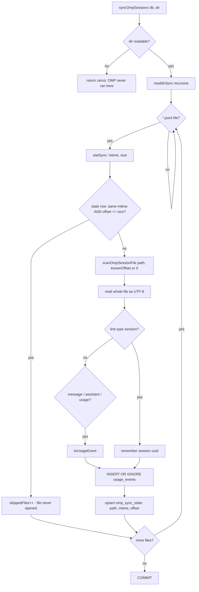

# OMP collector (`packages/collectors`)

> **Plain English:** [The harvester](../plain-english/06-the-harvester.md)

## 1. Purpose

`packages/collectors` turns raw usage sources into `UsageEvent` rows for the database. At
commit 325b156 it contains exactly one collector: the OMP session reader, landed in two
commits — e630bf0 (parse OMP transcripts into usage events) and cbafc07 (incremental sync
into `usage_events`). It is the first piece of the "fetch" half of the dashboard: the
planning docs' pipeline is collect → store → price → aggregate, and this package is the
collect step for OMP.

Nothing else calls it yet. The desktop sidecar opens the database only (commit 13 wires
`fetch`), the VS Code host does not exist, and Cursor has no collector at all — its data
still lives only in [`docs/data-shapes.md`](../data-shapes.md) § Cursor.

## 2. Inventory

| File               | Kind   | Role                                                            |
| ------------------ | ------ | --------------------------------------------------------------- |
| `src/omp.ts`       | Module | Transcript → `UsageEvent` parsing; recursive walk; default path |
| `src/sync.ts`      | Module | Incremental sync of transcripts into `usage_events`             |
| `src/index.ts`     | Module | Package's only export surface (both modules)                    |
| `src/omp.test.ts`  | Tests  | Parser coverage, built on the spike fixture                     |
| `src/sync.test.ts` | Tests  | Incremental sync coverage against a temp database               |
| `package.json`     | Config | `@prompt-burn/collectors`, private, workspace package           |

## 3. Public surface

All of it re-exported from `src/index.ts`; there is no deep import path.

```ts
// omp.ts
defaultSessionsDirectory(home?: string): string            // ~/.omp/agent/sessions
collectOmpEvents(directory?: string): UsageEvent[]          // whole-tree walk, one-shot
parseOmpSessionFile(filePath: string): UsageEvent[]         // one transcript, full read
scanOmpSessionFile(filePath: string, fromOffset?: number): OmpFileScan
interface OmpFileScan { events: UsageEvent[]; offset: number }

// sync.ts
syncOmpSessions(db: DatabaseSync, directory?: string): OmpSyncResult
interface OmpSyncResult { scannedFiles: number; skippedFiles: number; insertedEvents: number }
```

`parseOmpSessionFile` is `scanOmpSessionFile(path).events`; the scan form exists so sync
can pass an offset. `UsageEvent` and `canonicalModelId` come from `@prompt-burn/core`.

## 4. Flow



`collectOmpEvents` is the same walk without state: every `.jsonl` file parsed from byte 0,
events concatenated. It predates the sync and is the "read everything" path.

## 5. Contracts and invariants

**What an OMP transcript line carries** (cross-checked against
[`docs/data-shapes.md`](../data-shapes.md) § OMP — the code agrees). The parser reads:
`type` (a `type: "session"` header first-ish in the file carries `id`, the session uuid),
and `type: "message"` lines where `message.role === "assistant"` and `message.usage`
exists. From a usage line: top-level `timestamp` (ISO 8601 UTC) and `message.model` (no
provider prefix) must be strings, `message.usage.input` / `output` / `cacheRead` /
`cacheWrite` are JSON numbers (re-checked at runtime via `count`, defaulting to `0`), and
top-level `id` is the per-file line id. Deliberately ignored: `message.usage.cost` (OMP's
own estimate — pricing comes from `price_entries`), `totalTokens`, `cttl`,
`contextSnapshot`, `provider`/`api`, and every other line type (`custom`, `title_change`,
`service_tier_change`, `credential_pin`, user turns).

**Event id** — `omp:${sessionId}:${line.id}`. `line.id` is unique per file only, so the
header line must be read before the messages it scopes (the scan always keeps reading from
byte 0; lines before `fromOffset` are parsed for the header but emit no events). Without a
header the fallback is `omp:` + first 16 hex of `sha256(filePath:byteOffset)` — stable
across re-reads, and never `timestamp + model + tokens` (two identical tiny turns would
collide). This id is the `usage_events` primary key, which is what makes re-reads idempotent.

**Events with no timestamp never reach the database.** `usage_events` forbids an empty
timestamp, and `insert()` skips such an event instead of aborting the whole sync.

**Offset semantics** — `OmpFileScan.offset` counts only bytes up to the last line that
ended in `\n`. A torn final line stays unconsumed so the next sync re-reads it; blank and
unparsable lines inside that range are skipped silently.

**Sync decisions** (`syncOmpSessions`, all inside one `BEGIN`/`COMMIT`):

- A `type: "session"` row in `omp_sync_state` (path → mtime, offset) whose mtime matches
  and whose offset equals the file size means the file is unchanged: not opened at all.
  This is what makes the second sync cheap.
- A grown file resumes at its stored offset; a file that shrank was rewritten, not
  appended to, so it restarts from byte 0.
- Rows go in with `INSERT OR IGNORE` on the stable id, so replays (rewritten file, torn
  tail re-read, two files sharing an id) cannot duplicate. `OmpSyncResult.insertedEvents`
  counts actual rows written; duplicates count zero.
- `INSERT OR IGNORE` on `usage_events` with `period = 'event'`; `omp_sync_state` is upserted
  after each file. A file deleted between `readdirSync` and `statSync` is skipped.

**Missing directory is not an error** for either entry point: OMP simply has not run on
this machine, and both return empty results.

## 6. Configuration

None. `defaultSessionsDirectory()` resolves `~/.omp/agent/sessions` via `os.homedir()`
(the `home` parameter exists for tests). There is no env var, no settings lookup, no config
file; a caller may pass any `directory` (both test suites pass temp directories).

## 7. Boundaries and dependencies

- Runtime dependency: `@prompt-burn/core` only (`UsageEvent`, `canonicalModelId`). Node
  built-ins: `node:fs`, `node:path`, `node:os`, `node:crypto`, plus the `node:sqlite`
  _types_ (`DatabaseSync`, `StatementSync` — type-only, so the package never links the
  database code at runtime).
- Dev dependency: `@prompt-burn/db` for tests (real `openDatabase` + `databasePath` against
  a temp file) and `vitest`.
- The boundary is deliberate: collectors produce events; the db package owns the schema.
  sync.ts hard-codes the `usage_events` / `omp_sync_state` SQL, so a schema change in
  `packages/db` can break it — the test suite is the coupling check.
- Not covered by anything yet: no caller in `apps/desktop` (the sidecar opens the database
  and nothing more), no Cursor collector, no scheduler. Sync runs only when someone calls it.

## 8. Tests

Two vitest suites, both driven by synthetic transcripts built from
[`docs/fixtures/omp-session-line.json`](../../docs/fixtures/omp-session-line.json) — the
one redacted assistant line the spike captured. Neither suite touches a real `~/.omp` or a
real `~/.prompt-burn`.

`omp.test.ts` covers: the fixture mapping onto a full `UsageEvent`; skipping header, user
turns and every non-usage line type; the headerless fallback id (stable across re-reads,
two identical lines distinct); surviving blank, torn and non-object lines; model
canonicalization (`rawModel` kept verbatim, `model` collapsed); missing file → empty;
recursive walk including a subagent transcript in a directory named after the parent file
and a non-`.jsonl` file ignored; `defaultSessionsDirectory` layout.

`sync.test.ts` covers: full row shape in `usage_events` (including `period: "event"`);
second sync skips unchanged files and opens nothing; appended file resumes from the offset
without duplicating; rewritten-shorter file re-reads with zero duplicates; an id shared by
two files inserts once; a torn final line left unconsumed then completed on the next sync;
missing directory → zero result. The sync tests exercise the real `@prompt-burn/db` schema
against a temp database file.

## 9. Debt and traps

- **Transcript shape is trusted, not versioned.** The `type: "session"` header is expected
  before the messages it scopes, and OMP's log format is `version: 3` with no
  compatibility guarantee across OMP updates (docs/data-shapes.md). If OMP renames a field
  or changes line types, the parser silently yields nothing — `count()` defaults and
  `typeof` guards swallow the change rather than throwing.
- **The fallback id is path-dependent.** `sha256(filePath:byteOffset)` is stable across
  re-reads on the same machine, but a file moved or opened under a different path gets a
  different id — and `omp_sync_state` keys on `path` too, so a moved transcript re-syncs
  from byte 0. Harmless (idempotent insert) but it re-reads.
- **Whole file is read into memory** even when resuming: `scanOmpSessionFile` does one
  `readFileSync` and splits, then skips pre-offset lines. Fine for session logs; a
  pathological transcript would be parsed twice for its header.
- **The offset-before-header subtlety is handled, but by re-reading.** `omp_sync_state`
  caches mtime + offset only, so a resumed file re-reads from line 1 to recover the session
  uuid. Cheap today; a per-path session-uuid cache would be the upgrade.
- **`mtime` granularity.** The skip test is `mtime` equal AND offset equals size. A file
  rewritten in place with the same size and an identical `mtimeMs` floor (both floor to
  whole milliseconds here, so this is tight) plus identical content would be skipped —
  but identical content would also be idempotent to re-read. Not exploitable in practice.
- **Error handling is swallow-by-design.** Missing directory, missing file, unparsable
  line, mid-walk deletion — all return silently. Nothing logs. If sync starts reporting
  "nothing new" on a machine that should have data, there is no breadcrumb; debugging
  means hand-inspecting the directory.
- **No caller.** Until commit 13, nothing in the repo invokes `syncOmpSessions`; the
  desktop sidecar only opens the database. Any real-world breakage is invisible to CI.

## 10. Change guide

- **Adding a field to the OMP mapping:** extend `OmpLine` in `src/omp.ts`, map it in
  `toUsageEvent`, and add a case to `omp.test.ts`. If it changes an event id, the id is the
  `usage_events` primary key — a changed id means re-inserted rows; do not do it lightly.
- **Adding a collector (Cursor):** sibling module in this package, same shape: parse
  function producing `UsageEvent`s plus a sync function writing into `usage_events`. The
  Cursor spike notes in `docs/data-shapes.md` § Cursor are the field-mapping source of
  truth; note that Cursor yields aggregates, not events, so its snapshot row goes in with
  `period = 'cycle'` and an empty timestamp (the schema's `CHECK` encodes exactly this).
- **Wiring sync up (commit 13):** the sidecar is the intended caller; the request protocol
  (`UsageReader`) lands there. Nothing in this package needs to change for that.
- **Schema coupling:** the two SQL strings in `src/sync.ts` mirror `packages/db/src/schema.ts`.
  If that schema changes, change both together and let `sync.test.ts` catch the mismatch.
