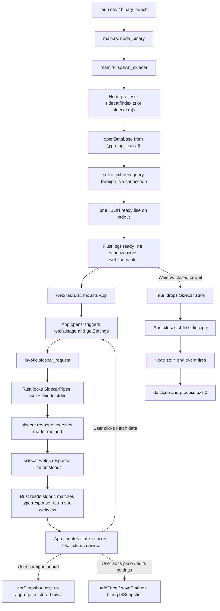

# Desktop shell (Tauri v2 + Node sidecar)

> **Plain English:** [The front door](../plain-english/07-the-front-door.md)

## 1. Purpose

`apps/desktop` is the desktop application for Prompt Burn. It pairs a native Tauri v2 shell hosting
a React 19 webview with a persistent Node sidecar child process running `@prompt-burn/reader` over
SQLite (`@prompt-burn/db`).

Rust deliberately owns only the native window, OS process lifecycle management, and a single-line
IPC relay. All data-handling logic — database access (`node:sqlite`), transcript collectors (OMP,
Claude Code, and the Antigravity CLI), provider APIs (Cursor, Ollama, Antigravity), pricing
lookups, and token aggregation — lives in TypeScript in `@prompt-burn/reader` and
`@prompt-burn/core`. This keeps data logic shared verbatim with the planned VS Code extension
host.

The webview mounts `@prompt-burn/ui`'s `AppShell`, displaying the estimated burn total, period
selectors (This month, Today, All time, and a custom Date range), source status indicators and
error banners, and a Settings drawer for toggling sources (OMP, Claude Code, Cursor, Antigravity),
overriding transcript paths, and defining custom model prices.

Data loading operates on a fetch-on-open and fetch-on-demand model ("Fetch data" button). There are
no polling timers or background sync intervals. In-flight and failed fetches never clear the screen:
existing snapshot totals stay displayed while spinners or error banners indicate state.

## 2. Inventory

| File                                | Kind   | Role                                          |
| ----------------------------------- | ------ | --------------------------------------------- |
| `src-tauri/src/main.rs`               | Rust   | Node discovery, sidecar spawn/hold, IPC relay |
| `src-tauri/tauri.conf.json`           | Config | Window (900×620), CSP, bundles `sidecar.mjs`  |
| `src-tauri/Cargo.toml` / `build.rs`   | Rust   | Tauri v2 and `tauri-build` dependencies       |
| `src-tauri/capabilities/default.json` | Config | `core:default` permissions for `main` window  |
| `sidecar/index.ts`                    | TS     | Node sidecar: DB, `UsageReader`, stdio        |
| `sidecar/ts-resolve.mjs`              | MJS    | ESM loader hook to run TS sources in dev      |
| `vite.config.sidecar.mts`             | Config | Bundles sidecar to ESM `sidecar.mjs`          |
| `vite.config.ts`                      | Config | Webview Vite config (React, Tailwind, :1420)  |
| `vitest.config.ts`                    | Config | Vitest root covering sidecar and web tests    |
| `web/index.html`                      | HTML   | Webview entry HTML page mounting `main.tsx`   |
| `web/main.tsx`                        | TSX    | React root mounting `App` (omits `StrictMode`)|
| `web/App.tsx`                         | TSX    | Shell state, mounts `AppShell`, fetch/periods |
| `web/sidecar.ts`                      | TS     | Webview IPC client: typed `sidecar_request`   |
| `web/styles.css`                      | CSS    | Imports UI package CSS and configures `@source`|
| `sidecar/index.test.ts`               | Test   | Smoke test: spawns sidecar in temporary `HOME`|
| `sidecar/reader.test.ts`              | Test   | Protocol suite: discover, fetch, snapshot     |
| `web/App.test.tsx`                    | Test   | Component tests with mocked IPC for UI/fetch  |
| `package.json` / `tsconfig.json`      | Config | Package manifest, workspace deps, TS config   |

## 3. Public surface

Three surfaces, one per layer:

- **The window UI** (`pnpm --filter @prompt-burn/desktop tauri dev`):
  Native desktop window (900×620) rendering `AppShell`:
  - Estimated burn total in USD (`$XX.YY` or `—` on initial load).
  - Period selector: "This month" (default), "Today", "All time", and custom "Date range" picker.
  - "Fetch data" button with in-flight spinner.
  - Fetch status indicator: idle, fetching, or error banner detailing per-source errors/successes.
  - Settings drawer: source toggles (OMP, Claude Code, Cursor, Antigravity), transcript paths,
    DB path, and custom pricing inputs.
- **The sidecar IPC protocol**: Newline-delimited JSON over stdio between Rust and Node:
  - Startup announcement (stdout):
    ```
    {"type":"ready","database":"/Users/you/.prompt-burn/db.sqlite","tables":5}
    ```
  - Request envelope (stdin):
    ```
    {"id": 1, "method": "getSnapshot", "period": {"kind": "this_month"}}
    ```
  - Response envelope (stdout):
    ```
    {"type":"response","id": 1,"ok": true,"result": { ... }}
    ```
    or
    ```
    {"type":"response","id": 1,"ok": false,"error": "..."}
    ```
  - Supported methods:
    - `discover`: calls `reader.discover()`, returns source availability array (`omp`,
      `claude-code`, `cursor`, `antigravity` — the last appended after the others).
    - `fetch`: calls `reader.fetch()`, syncs transcripts (OMP, Claude Code, `agy` conversations)
      and provider clocks (Cursor models, Ollama, Antigravity quotas), returns `FetchResult` with
      one verdict block per source: `omp`, `claudeCode`, `antigravityUsage`, `cursor`, `ollama`,
      `antigravity`.
    - `getSnapshot`: calls `reader.getSnapshot(period)`, aggregates rows, returns
      `DashboardSnapshot`.
    - `getSettings`: calls `reader.getSettings()`, returns persisted `AppSettings`.
    - `saveSettings`: calls `reader.saveSettings(settings)`, returns updated `AppSettings`.
    - `addPrice`: calls `reader.addPrice(price)`, persists custom rate, returns `null`.
- **Tauri IPC Command**:
  - `sidecar_request(request: String) -> Result<String, String>`: Tauri command invoked by the
    webview, serializing requests to the sidecar's stdin and awaiting the matching response line
    from stdout.
- **CLI and scripts**:
  - `pnpm --filter @prompt-burn/desktop dev`: starts Vite dev server (port 1420).
  - `pnpm --filter @prompt-burn/desktop tauri dev`: runs `beforeDevCommand` (`pnpm build:sidecar &&
    pnpm dev`) and launches Tauri app.
  - `pnpm --filter @prompt-burn/desktop test`: runs Vitest across sidecar and web tests without
    needing a Rust toolchain.
  - `pnpm --filter @prompt-burn/desktop build`: builds webview to `dist/` and bundles sidecar to
    `src-tauri/sidecar-dist/sidecar.mjs`.

## 4. Flow



The lifetime contract is enforced by `struct Sidecar` holding `Arc<Mutex<SidecarPipes>>` and
`Child` in Tauri's managed state: holding the child holds its stdin pipe open. When the Tauri app
exits, the state drops and the pipe closes; the sidecar's stdin `end` event fires and it closes the
database cleanly itself. There is no kill logic — the pipe closure *is* the shutdown signal.

## 5. Contracts and invariants

- **One database, shared across hosts.** The sidecar opens the same `databasePath()` as every
  other host: `~/.prompt-burn/db.sqlite`, created from the inlined `SCHEMA_SQL` on first run
  (`@prompt-burn/db`).
- **The ready line is the health check.** It is printed only after a `sqlite_schema` count runs
  *through the connection*, so `tables` proves a live database, not merely an existing file.
- **Line-delimited JSON with request matching.** The protocol is strictly newline-delimited JSON
  on stdin/stdout. Requests carry an integer `id`, and responses return with the matching `id`.
- **Rust is a dumb IPC relay.** Rust never parses or validates request/response payloads (except
  checking for embedded newlines and checking for `"type":"response"` prefix). The typed contract
  is shared between TypeScript on both ends (`web/sidecar.ts` and `sidecar/index.ts`).
- **Pipelined single-thread execution.** `sidecar_request` acquires an `Arc<Mutex<SidecarPipes>>` in
  a blocking thread, guaranteeing requests and responses do not interleave on the stdio stream.
- **Fetches never blank the screen.** The dashboard never drops to `$0` or blanks when a fetch
  begins or fails. The previous `DashboardSnapshot` stays mounted while `fetch.status` and
  `fetch.error` drive spinner and banner states. Failure cases split three ways in `web/App.tsx`:
  when OMP, Claude Code, and Cursor all report failure it keeps the old snapshot without
  re-reading rows and raises the banner; partial success lands the working source's rows,
  re-reads the snapshot, and still raises the banner; a thrown call (no source ever reported)
  keeps the old snapshot and banners the thrown message.
- **Error banners name every source's verdict.** `fetchErrorMessage` (`@prompt-burn/ui`) composes
  the line the `FetchErrorBanner` renders: each genuinely failed source gets a `X failed` clause,
  each source that reported success gets an `X OK` clause, and the reader's per-source reasons
  follow after an em dash (e.g. `Cursor failed · OMP OK · Claude Code OK —
  cursor.com said 503`).
  A degraded source — not installed, signed out, or disabled — gets no clause at all: the reader
  reports those passes clean, so only real failures are named.
- **Period filtering and pricing are local snapshot queries.** Changing the period filter or saving
  a custom price re-reads `getSnapshot()` from local SQLite; no collectors or remote network APIs
  are invoked.
- **Stdin closure is the shutdown contract.** Tauri's managed `Sidecar` state holds the child
  process stdin open. Dropping this state on application exit closes the pipe, firing the sidecar's
  stdin `end` event, which closes the database and exits with code 0.
- **Node is found and version-checked, not assumed.** A GUI launch inherits launchd's `PATH`, which
  has no nvm, fnm, asdf, Volta or Homebrew Node in it. `node_binary()` tries `PATH`, then
  `$SHELL -l -i -c 'command -v node'`, then every version-manager directory (nvm and fnm
  newest-first, Volta and asdf shims), then `/opt/homebrew`, `/usr/local`, `/usr/bin`. Each
  candidate must report major ≥ `MIN_NODE_MAJOR` (24).
- **Graceful degradation on missing Node.** If Node is missing or too old, `main.rs` stores the
  error in Tauri managed state (`SidecarState = Result<Sidecar, String>`). Every `sidecar_request`
  answers with the stored error, so the window opens and the UI's error banner explains the
  problem rather than crashing on launch.

## 6. Configuration

- `tauri.conf.json`: `identifier dev.promptburn.desktop`, version `1.1.0`, one window (`main`,
  "Prompt Burn", 900×620), CSP `default-src 'self'; style-src 'self' 'unsafe-inline'; connect-src
  'self' ipc: http://ipc.localhost ws://localhost:1420`, frontend served from `../dist`.
  `bundle.active: true` with `targets: "all"`, the icon set, and `sidecar-dist/sidecar.mjs` carried
  as the `sidecar.mjs` resource. `beforeDevCommand` is `pnpm build:sidecar && pnpm dev`.
- `capabilities/default.json`: `core:default` only, scoped to `windows: ["main"]`.
- `vite.config.ts`: Webview config: root `web`, plugins `react()` and `tailwindcss()`, build outDir
  `../dist`, dev server port 1420.
- `vite.config.sidecar.mts`: Sidecar bundle config: SSR entry `sidecar/index.ts`, target `node22`,
  format `esm`, output `src-tauri/sidecar-dist/sidecar.mjs`, `ssr.noExternal: true` inlining
  workspace packages while leaving Node builtins external.
- `vitest.config.ts`: Sets test root to `.`, includes `sidecar/**/*.test.ts` and
  `web/**/*.test.tsx`.
- `tsconfig.json` extends `tsconfig.base.json`, adds `"types": ["node", "react", "react-dom"]`,
  includes `sidecar/**/*.ts` and `web/**/*.tsx`.
- No environment variables are read by the shell itself; the sidecar inherits `HOME` (via
  `@prompt-burn/db`) to locate the database and transcripts. Node discovery reads `SHELL`.

## 7. Boundaries and dependencies

- **Rust:** `tauri` 2 and `tauri-build` only. No extra plugins; interacts with the Node sidecar
  strictly over OS pipes (`stdin`/`stdout`).
- **Webview:** React 19, `@prompt-burn/ui` (`AppShell`, `fetchErrorMessage`), `@prompt-burn/core`,
  `@tauri-apps/api/core` (`invoke`). Runs in webview sandbox, isolated from filesystem and sockets.
- **Sidecar:** Node process executing `@prompt-burn/reader` and `@prompt-burn/db`. Accesses local
  filesystem (`~/.prompt-burn/db.sqlite`, `~/.omp`, `~/.claude`,
  `~/.gemini/antigravity-cli/conversations`) and remote networks (Cursor, Ollama, Antigravity)
  through `@prompt-burn/reader`. The webview does none of this directly.
- **Packaging:** Development runs TypeScript source files via Node loader `ts-resolve.mjs`;
  packaged release builds run inlined `sidecar.mjs` bundle via Node.

## 8. Tests

Three test suites in Vitest, run via `pnpm --filter @prompt-burn/desktop test`:

1. `sidecar/index.test.ts`: Smoke test exercising the real sidecar process:
   - Spawns `node --import ts-resolve.mjs index.ts` with a throwaway `HOME` created under OS temp.
   - Reads the first stdout line, parses it, and asserts `type: "ready"`, database path, file
     existence, and `tables > 0`.
   - Closes stdin and asserts process exits with code 0.
2. `sidecar/reader.test.ts`: Sidecar protocol integration test suite against real spawned Node:
   - Tests `discover` for local transcript directories and Cursor state.
   - Tests `fetch` incremental sync with synthetic OMP transcripts, verifying file scanning,
     skipping on re-sync, and per-source status — including a clean empty `antigravityUsage`
     sync when the `agy` conversations directory is absent.
   - Tests `getSnapshot(all_time)` aggregation against seeded pricing.
   - Tests fault tolerance: a broken transcript directory returns zero rows rather than crashing.
   - Tests unknown method handling: returns `{ ok: false, error: ... }` while process stays up.
3. `web/App.test.tsx`: React Testing Library suite in `jsdom` with mocked Tauri `invoke`:
   - Verifies fetch-on-open starts with `—` and spinner, then paints formatted total.
   - Verifies "Fetch data" triggers re-fetch while preserving numbers in flight.
   - Verifies failed fetches keep the last good snapshot and raise error banners asserting the
     full composed line (e.g. `OMP failed · Claude Code failed — …`).
   - Verifies partial-success reporting: Cursor fails while OMP succeeds, the working source's
     rows still land, and the banner names every source's verdict
     (`Cursor failed · OMP OK · Claude Code OK — cursor.com said 503`).
   - Verifies period changes and date range selection re-aggregate without triggering a fetch.
   - Verifies Settings navigation, source toggling (including `antigravityEnabled` / `agyPath`),
     and custom price inputs (re-pricing snapshot without re-fetching).

Not covered in unit tests: the Rust side. Spawning, the log relay, and the pipe-closes-on-exit
behaviour are verified by running `tauri dev` with a Rust toolchain.

## 9. Debt and traps

- **A packaged app still needs Node installed.** The sidecar is bundled to one `.mjs`, but it is run
  by the user's own Node (24+, for `node:sqlite`). A machine without Node opens the window and
  shows the "Node 24 or newer is required" error instead of data. Shipping a Node SEA — or
  compiling the sidecar to a standalone binary and declaring it as `externalBin` — is what
  removes that requirement.
- **Node discovery reaches outside the process.** The probe runs the user's shell login *and*
  interactive (`-l -i -c`), because zsh reads `.zprofile` for a login shell but `.zshrc` — where
  nvm initialises — only for an interactive one. Stdin is closed so an rc that reads input cannot
  hang the launch, and the answer is the last stdout line starting with `/`, so rc banners do not
  confuse it.
- **Sequential request serialization.** `sidecar_request` holds an `Arc<Mutex<SidecarPipes>>` in a
  blocking thread. Requests are processed strictly one at a time. A slow network fetch prevents
  immediate completion of overlapping read requests like `getSettings`.
- **No React StrictMode.** `web/main.tsx` disables `StrictMode` because its double-invoked effects
  would cause duplicate fetch-on-open calls every time the window opens.
- **Tailwind class scanning across packages.** `web/styles.css` requires `@source
  "../../../packages/ui/src"` because `@prompt-burn/ui` ships uncompiled class names that must be
  compiled into the desktop bundle.
- **The test's `HOME` override is mac/unix-only.** `@prompt-burn/db` honours `HOME`, which Windows
  does not set the same way; the sidecar tests pass on macOS and unix, not on Windows.
- **The all-failed check in `web/App.tsx` does not include `antigravityUsage`.** The
  keep-the-old-snapshot branch tests `!result.omp.ok && !result.claudeCode.ok && !result.cursor.ok`
  only. If exactly those three fail while the Antigravity sync succeeded, its freshly inserted
  rows are left undisplayed until the next fetch or period change re-reads the snapshot. Fix:
  add `&& !result.antigravityUsage.ok` to the condition.

## 10. Change guide

- **Adding a new sidecar protocol method:**
  - Add method handler to `METHODS` in `sidecar/index.ts`.
  - Add typed caller function to `web/sidecar.ts`.
  - Update `FakeSidecar` in `web/App.test.tsx` and add protocol test in `sidecar/reader.test.ts`.
- **Modifying UI state or dashboard layout:**
  - Update `web/App.tsx` and ensure state flows down to `@prompt-burn/ui`'s `AppShell`.
  - Maintain the invariant that data never blanks during fetching or errors.
- **Updating bundling or packaging:**
  - If changing sidecar dependencies or build output, check `vite.config.sidecar.mts`,
    `src-tauri/tauri.conf.json` (`bundle.resources`), and `sidecar_arguments()` in `main.rs`.
  - Verify that `beforeDevCommand` (`pnpm build:sidecar && pnpm dev`) continues to produce
    `src-tauri/sidecar-dist/sidecar.mjs` before Tauri starts.
