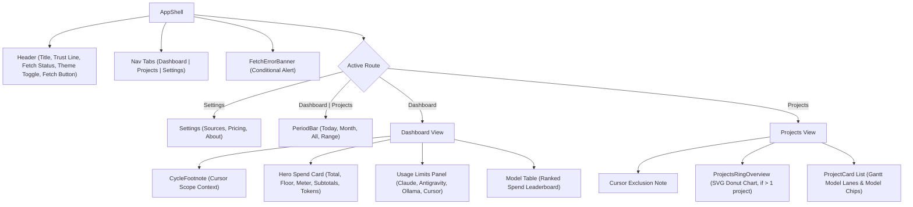

# UI components (packages/ui)

> **Plain English:** [The showroom](../plain-english/08-the-showroom.md)

## 1. Purpose

`@prompt-burn/ui` (`packages/ui`) is the shared, props-only, zero-I/O React 19 component package
for Prompt Burn. It supplies the presentation layer rendered verbatim by both host applications:
`apps/desktop` (Tauri v2 native window webview) and `apps/vscode` (VS Code webview editor tab).

The package is strictly presentational: it receives an immutable `DashboardSnapshot` (plus
optional settings and callback handlers) from `@prompt-burn/core`, rendering the application
chrome, hero spend overview, provider quota limit meters, ranked model leaderboard, working
directory project breakdowns, and local configuration panels. It emits user intents solely via
callback props (`onPeriodChange`, `onFetch`, `onSave`, `onAddPrice`), leaving all state
persistence, database queries, and collector sidecars to the hosts.

The package holds no I/O: no filesystem access, no HTTP calls, no database handles, and no child
process spawning. This boundary is enforced by an automated AST/regex boundary scan. The visual
styling implements the Paper design tokens (`prompt-burn` / `v0-designs`): light and dark themes
toggled via a single root `.theme-dark` class on `<html>`, distinct color identities per source
(OMP teal, Cursor violet, Claude terracotta, Antigravity rose, brand amber), tabular typography,
and accessible contrast pairings.

## 2. Inventory

| File                         | Kind      | Role                                             |
| ---------------------------- | --------- | ------------------------------------------------ |
| `packages/ui/package.json`   | Config    | Package manifest: exports, dependencies, scripts |
| `packages/ui/tsconfig.json` | Config    | TypeScript config (React JSX, lib DOM/ES2022)    |
| `packages/ui/vitest.config.ts` | Config  | Vitest test configuration (`environment: jsdom`) |
| `src/index.ts`               | Source    | Public barrel export for components and types    |
| `src/index.css`              | Style     | Tailwind v4 tokens, CSS variables, dark theme    |
| `src/AppShell.tsx`           | Component | App chrome: header, trust line, theme toggle     |
| `src/Dashboard.tsx`          | Component | Hero card, quota panel, subtotals, model table |
| `src/PeriodBar.tsx`          | Component | Period switcher: fixed buttons, calendar popover |
| `src/ModelTable.tsx`         | Component | Model spend leaderboard, Olympic medals, tokens  |
| `src/CursorCycle.tsx`        | Component | Cursor billing cycle context and mixed footnote  |
| `src/UsageLimits.tsx`        | Component | Quota meters: Claude, Antigravity, Ollama, Cursor |
| `src/Projects.tsx`           | Component | Spend by directory: SVG ring chart, Gantt lanes  |
| `src/Settings.tsx`           | Component | Source toggles, path inputs, rate form, db path  |
| `src/FetchBanner.tsx`        | Component | Error alert banner with synthesis & Retry button |
| `src/theme.ts`               | Helper    | `useTheme` hook: preferences, localStorage sync  |
| `src/format.ts`              | Helper    | Formatters for currency, tokens, spans, clocks   |
| `src/boundary.test.ts`       | Test      | Architectural scan for zero forbidden I/O imports|
| `src/AppShell.test.tsx`      | Test      | Tests chrome, relative status, route switching   |
| `src/Dashboard.test.tsx`     | Test      | Tests spend math, floor fallbacks, subtotals     |
| `src/PeriodBar.test.tsx`     | Test      | Tests fixed segments, range popover, dates       |
| `src/ModelTable.test.tsx`    | Test      | Tests row ranking, tie-breaks, pills, tokens     |
| `src/CursorCycle.test.tsx`   | Test      | Tests cycle dates, mixed footnotes, empty states |
| `src/UsageLimits.test.tsx`   | Test      | Tests relative clocks, near-cap warnings, lines  |
| `src/Projects.test.tsx`      | Test      | Tests path collisions, SVG ring chart, lanes     |
| `src/Settings.test.tsx`      | Test      | Tests source toggles, paths, custom price form   |
| `src/FetchBanner.test.tsx`   | Test      | Tests error synthesis, degraded states, retry    |

## 3. Public surface

Single package entry point `@prompt-burn/ui` exports components, types, domain calculations, and
formatting utilities. The stylesheet `@prompt-burn/ui/index.css` is exported separately for hosts.

### Components and Props

- `AppShell`: Root application shell.
  - `AppShellProps`: Props accepting `snapshot`, optional `period`, `onPeriodChange`, `onFetch`,
    `now`, and `settings`.
  - `Route`: `"Dashboard" | "Projects" | "Settings"`.
- `Dashboard`: Spend hero, provider quota panel, and model leaderboard.
  - `DashboardProps`: `{ snapshot: DashboardSnapshot }`.
- `PeriodBar`: Period switcher and date-range picker.
  - `PeriodBarProps`: Props accepting `period`, optional `onPeriodChange`, and optional `now`.
- `ModelTable`: Spend-ranked model leaderboard table.
  - `ModelTableProps`: `{ rows: DashboardSnapshot["models"] }`.
- `CycleFootnote`: Contextual footnote explaining Cursor billing cycle coverage.
- `UsageLimits`: Provider quota limit cards.
  - `UsageLimitsProps`: `{ snapshot: DashboardSnapshot; now?: () => Date }`.
- `Projects`: Working directory project spend breakdown.
  - `ProjectsProps`: `{ snapshot: DashboardSnapshot }`.
- `Settings`: Local settings and pricing management screen.
  - `SettingsProps`: Config props for source toggles, path overrides, health, unknown models,
    bundled prices, database path, `onSave`, and `onAddPrice`.
  - `SourceSettings`: Persistent toggles and paths for OMP, Claude Code, Antigravity (`agy` CLI),
    and Cursor.
  - `PriceRate`: Model pricing rate structure (input, output, cache read, cache write per 1M).
  - `NewPriceInput`: Hand-entered rate for an unknown model.
  - `SourceHealth`: Availability flag and detail message for a source.
- `FetchErrorBanner`: Error banner for failed fetch attempts.
  - `FetchErrorBannerProps`: `{ snapshot: DashboardSnapshot; onRetry?: () => void }`.
  - `FetchPass`: Per-source success flags (`omp`, `claudeCode`, `antigravityUsage`, `cursor`) and
    error detail string. `antigravityUsage` is the `agy` CLI's priced usage; the reader's separate
    `antigravity` key (the quota clock behind the Usage-limits card) is not a usage failure.

### Theme Control

- `useTheme()`: Hook managing user theme choice and synchronization with the OS and DOM.
  - Returns `ThemeControl`: `{ preference, theme, setPreference }`.
  - `THEME_PREFERENCES`: `["system", "light", "dark"] as const`.
  - `ThemePreference`: `"system" | "light" | "dark"`.
  - `Theme`: `"light" | "dark"`.

### Domain and Display Helpers

- `fetchStatusLabel(snapshot, now)`: Formats `"Not fetched yet"`, `"Fetching…"`, or
  `"Fetched N min ago"`.
- `fetchedAgoLabel(iso, now)`: Relative timestamp formatting (`"Fetched just now"`,
  `"Fetched N min ago"`).
- `emptyStateMessage(snapshot)`: Determines whether an empty period means `"No usage data yet"` or
  `"No OMP, Claude Code, Antigravity or Cursor usage for this period"`.
- `formatEstimatedTotal(snapshot)`: Returns exact total, approximate floor (`≈$X.XX`), or em
  dash (`—`).
- `heroSubtitle(snapshot)`: Constructs scoped subtitle, explicitly distinguishing mixed periods.
- `pricedSubtotal(rows, source?)`: Sums priced rows and tallies unpriced models (`PricedSubtotal`).
- `sourceShares(snapshot, omp, claudeCode, antigravity, cursor)`: Computes percentage widths for
  the split meter, returning `SourceShares`.
- `fetchErrorMessage(pass)`: Synthesizes user-facing error strings naming failed and OK sources.
- `formatCents(cents)`: Formats fractional cents as USD (`"$12.35"`).
- `formatCost(cents)`: Formats cents or returns `"—"` if null (`UNKNOWN_COST`).
- `formatTokens(count)`: Compact token count representation (`"1.2M"`, `"340K"`, `"89"`).
- `tokenLine(...parts)`: Formats summary line (`"Tokens: X in · Y out · Z cache"`).
- `formatDateSpan(from, to)`: Formats `"Aug 1 – Aug 15, 2026"` or single day `"Aug 1, 2026"`.
- `formatCycleWindow(start?, end?)`: Parses and formats ISO cycle range.
- `formatShortTime(iso, now)`: Contextual clock (`"14:20"`, `"Wed 08:00"`, `"Sep 26, 08:00"`).
- `rankRows(rows)`: Orders rows by spend descending, tie-breaking by token volume.
- `formatRangeLabel(start, end)`: Formats ISO date range for period chips.
- `periodLabel(period)`: Returns display name for a period kind.
- `projectLabel(path, all?)`: Resolves path basenames and resolves directory collisions.
- `UNATTRIBUTED`: Constant `"No project"`.
- `SOURCE_PILLS`: Shared source-identity map (label, pill, bar colors per `Source`); exported so
  the Projects route labels its model chips from the same colors and wording as `ModelTable`.
- `SourceShares`: The four-way split (`omp`, `claudeCode`, `antigravity`, `cursor`) returned by
  `sourceShares`, typed and exported from `Dashboard.tsx`.
- `CHART_PALETTE`: Palette colors for the Projects ring and progress lanes (module-local export in
  `Projects.tsx`, not re-exported by the barrel).

## 4. Flow

The component hierarchy and user interaction lifecycle are strictly decoupled from I/O:



Host interactions follow a unidirectional reactive cycle:

```mermaid
sequenceDiagram
    participant Host as Host (desktop or vscode)
    participant Shell as AppShell (@prompt-burn/ui)
    participant View as Active View

    Host->>Shell: render(snapshot, period, settings, now)
    Shell->>View: Pass immutable snapshot slice & callbacks

    alt User clicks "Fetch data" or "Retry"
        View->>Host: onFetch()
        Host->>Host: Update fetch.status to "fetching"
        Host->>Shell: render(snapshot with fetching status)
        Note over Shell: Spinner activates; previous numbers remain
    else User selects period
        View->>Host: onPeriodChange(newPeriod)
        Host->>Host: Query database and rebuild snapshot
        Host->>Shell: render(newSnapshot)
    else User saves source settings
        View->>Host: onSave(sourceSettings)
        Host->>Host: Persist configuration
    else User enters model price
        View->>Host: onAddPrice(newPriceInput)
        Host->>Host: Insert rate and re-aggregate
    end
```

## 5. Contracts and invariants

- **Props-only, zero-I/O boundary:** The package imports no Node platform modules (`fs`, `net`,
  `http`, `https`, `sqlite`, `child_process`) and no host packages (`db`, `collectors`, `desktop`,
  `tauri`). The host owns all I/O; the UI renders the data it is handed.
- **Honest representation of missing rates:** An unknown rate or cost is strictly formatted as the
  em dash `—` (`UNKNOWN_COST`), never as `$0.00`. `$0.00` is reserved exclusively for calculations
  where rates or token volumes are verified zeros.
- **Floor estimates for partial pricing (`≈$X.XX`):** If a snapshot contains unpriced models, the
  hero total falls back to summing only priced models, prefixed with `≈`, accompanied by a badge
  declaring `N models unpriced · total is a floor`.
- **Mixed-period Cursor isolation:** When `snapshot.mixedPeriod` is true (Cursor aggregates cover a
  full billing cycle while the filter is narrower, such as Today or This month), Cursor spend is
  excluded from the hero total and split progress bar. The Cursor subtotal explicitly states
  `Cursor (cycle to date · not in total)`, and the hero subtitle declares both scopes.
- **Source segregation (no cross-source merging):** If the same model identifier appears across
  multiple sources (e.g. `claude-opus-5` in OMP, Claude Code, and Cursor), it renders as separate
  rows in `ModelTable` and separate segments in `Projects`. Sources are never collapsed into one.
- **Accessible color pairing:** Colors (OMP teal, Cursor violet, Claude terracotta, Antigravity
  rose, warning amber) are never used in isolation to convey meaning. Source colors are
  accompanied by text labels, and near-cap warnings (fraction ≥ 0.8) display the explicit text
  `"near cap"`.
- **Two Antigravities, two identities:** The `agy` CLI's priced turns are a *source* and render
  with the rose `source-antigravity` tokens (dashboard subtotal row, model pills, Projects chips);
  Google's quota clock behind the Usage-limits card is a *provider* and renders with the blue
  `provider-antigravity` tokens. The two are never mixed, and the Settings toggle for the CLI
  does not touch the quota card.
- **Local wall-clock date alignment:** `PeriodBar` and `format.ts` format calendar days using the
  local device timezone (`YYYY-MM-DD` wall-clock), preventing day-shifting errors when converting
  between UTC ISO instants and local midnights.
- **Theme control via root CSS class:** Theming is executed by toggling `.theme-dark` on
  `document.documentElement`, rebinding CSS custom properties in `index.css`. Components do not use
  inline Tailwind `dark:` variants.
- **Data preservation during background fetch:** When `snapshot.fetch.status === "fetching"`, the
  existing numbers, tables, and charts remain rendered on screen. A fetch never wipes or zeroes
  active data.
- **Per-source fetch verdicts:** `fetchErrorMessage` derives the failed-source list by substring
  matching the reader's own `"<Source> failed: …"` lines in `FetchPass.error`; `OK` is claimed
  only for sources that reported success. A degraded source (Cursor not installed or signed out)
  is never named as failed.

## 6. Configuration

- `package.json`:
  - Name: `@prompt-burn/ui`.
  - Type: `"module"`.
  - Exports: `.` points to `./src/index.ts` (both types and default); `./index.css` points to
    `./src/index.css`.
  - Runtime dependencies: `@prompt-burn/core` (workspace:*), `react` (^19.0.0).
- `tsconfig.json`:
  - Extends `../../tsconfig.base.json`.
  - Configures `jsx: "react-jsx"`, `lib: ["ES2022", "DOM"]`, `types: ["node"]`.
- `vitest.config.ts`:
  - Sets `environment: "jsdom"` as the default for component testing.
- **Host Tailwind Configuration Requirement:** Because `@prompt-burn/ui` distributes uncompiled
  JSX with raw Tailwind utility classes rather than a pre-compiled CSS bundle, consumer apps
  (`apps/desktop`, `apps/vscode`) must import `@prompt-burn/ui/index.css` and declare
  `@source "../../../packages/ui/src";` in their own stylesheets.
- **Persistent Client State:** `theme.ts` reads and writes the theme preference to the browser's
  `localStorage` under the key `prompt-burn:theme`.

## 7. Boundaries and dependencies

- **Upstream runtime dependencies:**
  - `@prompt-burn/core`: Source of truth for domain types (`DashboardSnapshot`, `PeriodFilter`,
    `Source`, `TokenCounts`, `UsageEvent`, `ProviderLimits`, `UsageLimit`, `ProjectUsage`) and
    constants (`CURSOR_CYCLE_LABEL`).
  - `react`: Core React 19 primitives (`useState`, `useEffect`, `useCallback`).
- **Downstream consumers:**
  - `apps/desktop`: Tauri v2 webview embeds `AppShell` in `apps/desktop/web/App.tsx`.
  - `apps/vscode`: VS Code editor webview embeds `AppShell` in `apps/vscode/web/App.tsx`.
- **Prohibited dependencies:**
  - Verified by `boundary.test.ts`'s `BANNED_IMPORT` regex: `@prompt-burn/collectors`,
    `@prompt-burn/db`, `@prompt-burn/desktop`, `node:fs`, `node:net`, `node:http`, `node:https`,
    `node:sqlite`, `node:child_process`, and `@tauri-apps/*`. (The `@prompt-burn/reader` and
    sidecar packages are outside this package's reach by construction: `reader` is not a declared
    dependency, so it cannot be imported at all.)
- **Styling boundaries:**
  - Pure CSS / Tailwind v4. The package contains zero third-party chart libraries (SVG donut chart
    is custom-rendered) and zero third-party icon libraries.

## 8. Tests

The package includes 10 test files executed via Vitest:

1. `boundary.test.ts`: Node-environment static analysis scanning all source files for banned
   imports; verifies that runtime dependencies in `package.json` are strictly core and react;
   verifies that `index.css` imports Tailwind.
2. `AppShell.test.tsx`: Tests title, trust statement, fetch status label relative math, fetch
   button states and spinner, route switching between Dashboard and Settings, period change prop
   routing, and theme switching with `localStorage` persistence.
3. `Dashboard.test.tsx`: Tests currency formatting, compact token counts, mixed-scope subtitles
   (now naming OMP + Claude Code + Antigravity), hero totals and floor approximations, all four
   subtotal rows, source toggling, token line sums, the four-segment split meter whose widths sum
   to the whole bar, and that Google's quota card and the `agy` cost row remain two different
   things (different tokens, different testids).
4. `PeriodBar.test.tsx`: Tests fixed segment selection (Today, This month, All time), range label
   formatting, popover calendar opening, draft day picking, clear, apply, and inclusive end day.
5. `ModelTable.test.tsx`: Tests row ranking (spend first, unpriced by token volume), keying by
   `(source, model)`, Olympic medals (gold, silver, bronze), source pills — including that the
   Antigravity pill uses its own rose token and never the quota tile's blue — and empty headers.
6. `CursorCycle.test.tsx`: Tests `formatCycleWindow` date math and validation, footnote variations
   for mixed vs. windowed periods, and empty state messaging ("No usage data yet" vs. "No usage").
7. `UsageLimits.test.tsx`: Tests `formatShortTime` precision, provider card rendering for Claude,
   Antigravity, Ollama Cloud, Cursor, account labeling, "near cap" warning text, expired window
   suppression, stale data warnings, and card omissions.
8. `Projects.test.tsx`: Tests directory basename resolution (`projectLabel`), path collision
   widening, SVG donut chart rendering, Gantt-style horizontal model lanes, model detail chips,
   unattributed usage buckets, Antigravity conversations attributed to their workspace with the
   source pill, and empty state copy.
9. `Settings.test.tsx`: Tests OMP, Claude Code, Antigravity (`agy`), and Cursor source toggles,
   path overrides (including the Antigravity conversations directory default
   `~/.gemini/antigravity-cli/conversations/`), health status badges, Cursor Pro vs. Enterprise
   status, unknown models listing, Add Price form parsing (`NewPriceInput`), bundled rates table,
   database path display, and `onSave` callback triggering.
10. `FetchBanner.test.tsx`: Tests `fetchErrorMessage` synthesis for partial and complete failures
    (`Cursor failed · OMP OK — ...`, with Antigravity among the four labels it can name),
    degraded status handling, banner rendering in shell, Retry callback invocation, and banner
    suppression during in-flight fetches.

### What is Not Covered

- **Visual regression / pixel verification:** Tests run in `jsdom`; actual pixel layout, canvas
  rendering, text wrapping, and CSS animation rendering are not asserted.
- **CSS keyframe animations:** Keyframes (`bar-grow`, `glow`, `rise`) and reduced-motion media query
  overrides are defined in CSS but not evaluated in unit tests.
- **Platform-level IPC:** Host communication channels (Tauri commands, VS Code `postMessage`) are
  not tested here; they are tested in their respective host applications.

## 9. Debt and traps

- **Tailwind class extraction trap:** Because `@prompt-burn/ui` distributes unbundled source files,
  host applications must explicitly declare `@source` pointing to `packages/ui/src`. Omitting this
  directive in the host CSS produces a silent total failure of styling without build errors.
- **Dead UI surface (Enterprise API key):** The `Cursor Enterprise API key` input field in
  `Settings.tsx` is non-functional. It is stored in local React component state, is never passed to
  `onSave`, is not accepted by `SourceSettings`, and has no backend collector backing.
- **Hardcoded SVG geometry and singular project hiding:** In `Projects.tsx`, the ring overview chart
  uses a hardcoded radius of 50 and viewBox of 140×140. If a user has only 1 project, the entire
  overview component silently vanishes (`if (projects.length <= 1) return null`), creating an
  inconsistent layout between single-project and multi-project workspaces.
- **Duplicated token summation logic:** The `tokenWeight` helper function is copy-pasted across
  `Dashboard.tsx`, `ModelTable.tsx`, and `Projects.tsx` rather than being centralized in `format.ts`
  or `@prompt-burn/core`.
- **Unconditional 30-second interval in root shell:** `AppShell.tsx` mounts `useRoughlyMinuteClock`
  with a hardcoded 30,000ms `setInterval`, causing continuous re-renders of the root shell component
  regardless of whether the user is actively viewing a relative timestamp.
- **Lack of table virtualization:** Neither `ModelTable.tsx` nor `Projects.tsx` uses virtual
  scrolling. A large historical dataset with hundreds of distinct models or projects will mount
  hundreds of complex DOM nodes, potentially causing frame drops in low-memory webviews.
- **Incomplete popover keyboard navigation:** The date picker in `PeriodBar.tsx` lacks full
  ARIA-compliant keyboard grid navigation (arrow keys across days and weeks), requiring pointer
  clicks or manual input editing.
- **Silent failure on invalid rate entry:** In `Settings.tsx`, typing non-numeric characters into
  the price fields disables the "Save price" button without rendering any error explanation to the
  user.
- **`Dashboard` renders `UsageLimits` without a clock, so its limit fixtures read the wall time.**
  `UsageLimits` takes an injectable `now?: () => Date` and `UsageLimits.test.tsx` pins it, but
  `Dashboard.tsx` renders `<UsageLimits snapshot={snapshot} />` with no clock. A `Dashboard`-level
  test asserting a quota percentage therefore depends on the real date: `windowEnded` suppresses
  the percentage once `resetsAt` is past, and a fixed fixture instant silently turns the assertion
  into `window ended` after that instant. `Dashboard.test.tsx`'s `ANTIGRAVITY_LIMITS` keeps its
  window ahead of `Date.now()` for exactly this reason; pinning a literal there expires the suite.

## 10. Change guide

- **Adding a new data source:**
  1. Add color tokens in `src/index.css` (both `@theme` and `.theme-dark`).
  2. Add the source pill definition in `src/ModelTable.tsx` (`SOURCE_PILLS`).
  3. If the source produces timestamped events, append it to `TIMESTAMPED` in `src/Dashboard.tsx`.
  4. Add source controls, path overrides, and health status indicators in `src/Settings.tsx`,
     updating `SourceSettings`.
  5. Add the source name to `LABELS` in `src/FetchBanner.tsx`.
- **Modifying the Design System / Theming:**
  1. All design tokens reside in `src/index.css`.
  2. Always update both the root `@theme` block and the `.theme-dark` class so light and dark modes
     stay in sync.
  3. Do not add `dark:` variant classes to components; theming is managed exclusively through CSS
     variables.
- **Updating the Hero or Totals Calculation:**
  1. Modify display calculations in `src/format.ts` or pure helpers in `src/Dashboard.tsx`.
  2. Never replace unknown prices with `$0.00`; preserve the em dash `—` contract and floor
     estimates (`≈`).
- **Touching Component Boundaries:**
  1. Never introduce platform I/O or host package imports into `packages/ui`.
  2. Run `pnpm --filter @prompt-burn/ui test` to verify that `boundary.test.ts` passes.
