# Usage reader (`packages/reader`)

> **Plain English:** [The switchboard](../plain-english/09-the-switchboard.md)

## 1. Purpose

Commit `80e9d30` (`feat: extract shared UsageReader into @prompt-burn/reader package`) extracted
the shared host-side orchestrator out of the initial application spikes so that the desktop sidecar
(`apps/desktop/sidecar/index.ts`) and the VS Code extension host (`apps/vscode/src/reader.ts`) share
a single data-fetching, settings-management, and aggregation pipeline. Without this package, both
hosts would duplicate database queries, collector invocations, period-bounded network requests to
Cursor, cache invalidation rules, limit coalescing, and point-in-time pricing logic.

The package fulfills four core responsibilities:

- **Collection orchestration (`fetch()`):** runs a single coordinated pass across all enabled
  collectors (`@prompt-burn/collectors`), commits transcript events transactionally into SQLite,
  caches remote cycles and provider limits in memory, and handles partial source failures without
  aborting successful sources.
- **Snapshot assembly (`getSnapshot(period)`):** combines stored transcript events (OMP and Claude
  Code) from SQLite with Cursor's windowed or cycle numbers, resolves multi-source provider limits
  (deduplicating live Antigravity limits against OMP's cached rows), and injects a dynamic
  point-in-time pricing callback to produce a complete `DashboardSnapshot`.
- **Health discovery (`discover()`):** inspects local directory paths and credential availability
  for each source, reporting availability and safe diagnostic details without leaking access
  tokens.
- **Unified settings and pricing facade (`getSettings()`, `saveSettings()`, `addPrice()`):**
  provides the application shells with a single host-side interface over the shared database
  (`@prompt-burn/db`), guaranteeing that settings changes made in one shell immediately take
  effect across both.

This package is strictly host-side. The presentation layer (`@prompt-burn/ui`) never imports it.
Both application shells instantiate `UsageReader` on the host side and expose its methods across
IPC (stdio JSON RPC in the desktop sidecar, `postMessage` in VS Code).

## 2. Inventory

| File                        | Kind     | Role                                                 |
| --------------------------- | -------- | ---------------------------------------------------- |
| `package.json`              | Manifest | `@prompt-burn/reader`; deps on core, db, collectors  |
| `tsconfig.json`             | Config   | Extends `tsconfig.base.json`; Node types; includes src |
| `vitest.config.ts`          | Config   | Sets `TZ: "Asia/Kolkata"` for period tests           |
| `src/index.ts`              | Module   | `UsageReader` interface, `createUsageReader`, types  |
| `src/reader.test.ts`        | Tests    | Unit tests with mock DB, tokens, injected HTTP       |
| `src/golden.test.ts`        | Tests    | Hermetic snapshot regression tests on golden data    |

## 3. Public surface

Exports of `@prompt-burn/reader` (all exported directly from `packages/reader/src/index.ts`):

### Types and interfaces

- **`ReaderHealth`**: one source's health status reported by `discover()`:
  ```ts
  export interface ReaderHealth {
    source: "omp" | "cursor" | "claude-code" | "antigravity";
    available: boolean;
    detail?: string;
  }
  ```
- **`FetchResult`**: telemetry and counters returned by `fetch()`:
  ```ts
  export interface FetchResult {
    at: string;
    ok: boolean;
    error?: string;
    omp: {
      ok: boolean;
      error?: string;
      scannedFiles: number;
      skippedFiles: number;
      insertedEvents: number;
    };
    claudeCode: {
      ok: boolean;
      error?: string;
      scannedFiles: number;
      skippedFiles: number;
      insertedEvents: number;
    };
    cursor: { ok: boolean; reason?: string; error?: string; models: number };
    ollama: { ok: boolean; reason?: string; error?: string };
    antigravity?: { ok: boolean; reason?: string; error?: string };
  }
  ```
  *(Note: `antigravity` is present on the runtime return object from `fetch()`, though omitted from
  the interface definition in `src/index.ts`; see §9).*
- **`UsageReader`**: the frozen contract implemented by `createUsageReader`:
  ```ts
  export interface UsageReader {
    discover(): Promise<ReaderHealth[]>;
    fetch(): Promise<FetchResult>;
    getSnapshot(period: PeriodFilter): Promise<DashboardSnapshot>;
    getSettings(): Promise<AppSettings>;
    saveSettings(patch: Partial<AppSettings>): Promise<void>;
    addPrice(entry: NewPriceEntry): Promise<void>;
  }
  ```
- **Re-exported types**: `AppSettings`, `DashboardSnapshot`, `NewPriceEntry`, `PeriodFilter`.

### Factory function

- **`createUsageReader(db: DatabaseSync, options?: ReaderOptions): UsageReader`**:
  Initializes an orchestrator over an open database connection. Options:
  - `ompDirectory?: string`: override directory for OMP transcript files.
  - `claudeDirectory?: string`: override directory for Claude Code projects.
  - `cursorStatePath?: string`: override path to Cursor's `state.vscdb`.
  - `fetchImpl?: typeof fetch`: custom HTTP fetch implementation (used for offline tests).
  - `antigravitySecret?: () => string`: supplier of `agy` keychain secret for quota fetches.
  - `now?: () => Date`: custom clock injection (defaults to `() => new Date()`).

## 4. Flow

```mermaid
flowchart TD
    subgraph Initialization
        CR[createUsageReader db, options] --> CL[Initialize closure state]
        CL --> CC[cursorCycle = undefined]
        CL --> OL[ollamaLimits = undefined]
        CL --> AL[antigravityLimits = undefined]
        CL --> CW[cursorWindows = new Map]
    end

    subgraph fetch Pass
        F[reader.fetch] --> S1[sources: readSettings db + resolve path overrides]
        S1 --> CAS[collectAllSources options]
        CAS --> ST[Update cursorCycle, ollamaLimits, antigravityLimits]
        ST --> CLR[cursorWindows.clear: invalidate stale cached windows]
        CLR --> CHK{Critical sources succeeded?}
        CHK -- OMP or Claude or fatal Cursor failed --> F_ERR[ok = false, format error summary]
        CHK -- All ok or Cursor benignly degraded --> F_OK[ok = true]
        F_ERR & F_OK --> RET_F[Return FetchResult]
    end

    subgraph getSnapshot Pass
        GS[reader.getSnapshot period] --> S2[sources: readSettings db]
        S2 --> EV[loadUsageEvents db for enabled transcript sources]
        S2 --> CP[cursorForPeriod period]
        CP --> PB{periodBounds start, end?}
        PB -- null or start &gt;= end --> RET_CYC[Return cached cursorCycle]
        PB -- bounded window --> CWC{cursorWindows has key?}
        CWC -- hit --> RET_WIN[Use cached CursorWindowAggregate]
        CWC -- miss --> FCW[fetchCursorWindowAggregate start..now]
        FCW -- success --> SET_CW[cursorWindows.set key, windowed]
        FCW -- error 503/transport --> RET_CYC
        SET_CW --> RET_WIN
        RET_WIN & RET_CYC --> LIM[Resolve limits: OMP + Ollama + live Antigravity]
        LIM --> BDS[buildDashboardSnapshot: aggregate tokens, filter period]
        BDS --> PR[priceCents callback: resolvePrice db + estimateCents]
        PR --> RET_SNAP[Return complete DashboardSnapshot]
    end
```



## 5. Contracts and invariants

- **Path override precedence:** The path used for transcript parsing and SQLite checks follows a
  strict three-tiered priority:
  1. Stored override in the database `settings` table (`stored.ompPath` or `stored.claudePath`).
  2. Factory option passed to `createUsageReader` (`ompDirectory` or `claudeDirectory`).
  3. Default location from collectors (`defaultSessionsDirectory()` or `defaultClaudeDirectory()`).
- **Concurrent multi-shell settings awareness:** The internal `sources()` helper re-reads
  `readSettings(db)` on **every** invocation of `discover()`, `fetch()`, `getSnapshot()`, and
  `getSettings()`. Because the desktop sidecar and VS Code extension host share the same database
  file, toggling a source or changing a path in one shell is observed immediately by the other
  without requiring a process restart.
- **Partial failure tolerance in `fetch()`:** `fetch()` never throws an unhandled error. If a
  collector fails, the failure is recorded in `FetchResult`, but non-failing sources still write
  their events to SQLite, and memory-resident cycles from successful sources are preserved.
- **Benign degradation vs. actionable failure:**
  - Cursor outcomes in `CURSOR_DEGRADED` (`not_installed`, `signed_out`, `disabled`) do **not**
    mark `FetchResult.ok` as `false`. They represent normal machine states where Cursor is absent or
    dormant.
  - Cursor outcomes of `expired` or `unreadable` represent actionable errors and mark `ok: false`.
  - Ollama Cloud and Antigravity failures never mark `FetchResult.ok` as `false`; quota clocks are
    supplementary panels rather than primary usage records.
- **Switched-off source behavior:** A source disabled in settings (`ompEnabled = false`,
  `claudeEnabled = false`, or `cursorEnabled = false`) is suppressed across the entire pipeline:
  - `discover()` does not probe it (Cursor's `state.vscdb` is not even opened) and reports
    `detail: "Disabled in Settings"`.
  - `fetch()` passes the disabled flag to `collectAllSources`, skipping transcript walking and
    HTTP.
  - `getSnapshot()` passes empty arrays or empty cycles for that source (`ompEvents: []`,
    `claudeEvents: []`, `cursor: EMPTY_CURSOR_CYCLE`), omitting its subtotal row from the
    dashboard.
  - Stored SQLite rows remain in the database; turning the toggle back on restores them immediately.
- **Windowed Cursor fetching and caching:**
  - When querying a bounded period (e.g. `today`, `this_month`), `cursorForPeriod()` clamps the
    window end to `Math.min(end, now().getTime())` — Cursor is never asked for future midnight.
  - Window aggregates are cached in the closure `cursorWindows` map keyed by `${start}|${end}`.
    Re-rendering the dashboard for the same period incurs zero network round-trips.
  - Every call to `fetch()` executes `cursorWindows.clear()`, forcing a fresh window query on the
    next snapshot render because "today" has grown.
  - The `all_time` period returns `start: null`, bypassing window queries completely because
    Cursor's backend rejects requests spanning across historical billing cycles.
  - An idle Cursor day (Cursor returns `200 {}` without `aggregations`) is mapped to zero usage,
    not the full monthly cycle.
- **Cursor cycle fallback and `mixedPeriod` isolation:**
  - If a window query fails (e.g. HTTP 503 or network failure) or the period is unbounded,
    `cursorForPeriod()` falls back to `cursorCycle`.
  - When falling back to a cycle during a period-bounded view, `buildDashboardSnapshot` marks
    `mixedPeriod: true` and sets `cursor.estimatedCents: null`. This keeps a 30-day billing cycle
    out of a single day's hero total, while still displaying Cursor's cycle row with a
    `cycleLabel: "Cycle to date"` footnote.
- **Provider limit resolution and deduplication:**
  - Live Antigravity limit cards fetched over the network always supersede OMP's cached rows in
    `ompAgentDatabase(ompPath)`. If `antigravityLimits` is present, `readOmpLimits` rows for
    `provider === "google-antigravity"` are stripped to prevent showing duplicate cards for the
    same subscription.
  - When OMP is disabled, both OMP limits and Ollama Cloud limits are omitted; Antigravity limits
    remain if an active session was fetched.
- **Point-in-time pricing and retroactive rate updates:**
  - The database stores only token counts, never currency amounts.
  - `getSnapshot()` calculates cost via an injected `priceCents` callback:
    `estimateCents(resolvePrice(db, model, timestamp === "" ? at : timestamp), tokens)`.
  - Events with timestamps resolve against the rate effective at that exact moment. Cursor
    aggregates carry no per-event timestamp (`""`) and resolve against current rates (`at`).
  - An unknown model rate yields `null`, which intentionally poisons the total to `null` (rendered
    as an honest dash `—` in the UI).
  - Calling `addPrice(entry)` inserts a rate into `price_entries`. The very next `getSnapshot()`
    re-prices all historical events for that model without modifying any stored `usage_events` rows.
- **Secret sanitation:** `discover()` reports the path to Cursor's `state.vscdb` or failure reasons,
  never access tokens or JWT values. `saveSettings()` persists only schema-defined keys in
  `AppSettings` and never writes tokens or secrets into SQLite.

## 6. Configuration

`packages/reader` has no internal configuration files; configuration is supplied via constructor
options and the database `settings` table:

- **Factory options (`createUsageReader(db, options)`):**
  - `ompDirectory`: custom base directory for OMP sessions (used primarily in tests).
  - `claudeDirectory`: custom directory for Claude Code projects.
  - `cursorStatePath`: path to Cursor's SQLite database containing auth tokens.
  - `fetchImpl`: custom `fetch` function for network calls (Cursor and Antigravity APIs).
  - `antigravitySecret`: closure returning raw secret token for Antigravity API authentication.
  - `now`: clock function returning a `Date` instance (used for deterministic testing).
- **Persistent settings (`settings` table):**
  - Keys: `omp_enabled`, `omp_path`, `cursor_enabled`, `claude_enabled`, `claude_path`.
  - Stored as text (`1`/`0` for booleans, directory strings for paths). Unset keys fall back to
    collector defaults.
- **Environment variables:** The reader package reads no environment variables directly.
  Downstream collectors handle environment variables (e.g. `CLAUDE_CONFIG_DIR` in
  `@prompt-burn/collectors`).

## 7. Boundaries and dependencies

- **Runtime dependencies:**
  - `@prompt-burn/core`: domain types (`DashboardSnapshot`, `PeriodFilter`, `ProviderLimits`,
    `CursorSnapshot`), `buildDashboardSnapshot`, `periodBounds`.
  - `@prompt-burn/db`: database operations (`readSettings`, `writeSettings`, `loadUsageEvents`,
    `resolvePrice`, `estimateCents`, `insertPriceEntry`), types (`AppSettings`, `NewPriceEntry`).
  - `@prompt-burn/collectors`: collector runners (`collectAllSources`, `readCursorAuth`,
    `fetchCursorWindowAggregate`, `readOmpLimits`, `ompAgentDatabase`, default directory resolvers).
  - `node:fs`: `existsSync` for directory and file health checks in `discover()`.
  - `node:sqlite`: type imports only (`DatabaseSync`).
- **Downstream consumers:**
  - `apps/desktop`: `sidecar/index.ts` instantiates `createUsageReader(db)` in a Node child
    process, bridging requests from Tauri via newline-delimited JSON RPC on stdin/stdout.
  - `apps/vscode`: `src/reader.ts` exports `createHostReader()`, instantiating the reader inside
    the extension host process to serve the dashboard webview over `postMessage`.
- **Architectural boundary:** The presentation package (`packages/ui`) never imports
  `packages/reader`. Communication is mediated entirely through serialized JSON data shapes.

## 8. Tests

Tests are executed with Vitest (`pnpm --filter @prompt-burn/reader test`). Vitest configuration
(`vitest.config.ts`) explicitly pins `TZ: "Asia/Kolkata"` so that calendar period boundaries
(`today`, `this_month`) match across environments.

### What is covered

- **Unit tests (`packages/reader/src/reader.test.ts` - 14 tests):**
  - Multi-source aggregation across OMP, Claude Code, and Cursor into a unified snapshot.
  - Source disabling via `saveSettings`: verifying that toggling a source off hides its rows,
    subtotals, and limit cards without deleting stored database records, and that re-enabling it
    restores them.
  - Windowed Cursor fetching: verifying that bounded periods trigger `fetchCursorWindowAggregate`,
    clamp queries to the present timestamp, cache responses in memory, invalidate caches on
    `fetch()`, and bypass window fetching for `all_time`.
  - Cursor window failure fallback: verifying that HTTP 503 on a window query gracefully falls back
    to the cycle aggregate, marks `mixedPeriod: true`, and zeroes Cursor's contribution to the
    combined estimate.
  - Idle Cursor day handling: verifying that an empty response (`200 {}`) counts as zero tokens and
    zero cents rather than substituting the full cycle.
  - Fetch failure resilience: verifying that a failing Cursor fetch preserves previously cached
    cycle data while reporting per-source errors.
  - Benign degradation: verifying that absent Cursor state files degrade to `not_installed` with
    `ok: true`.
  - Credential protection: verifying that `discover()` reports paths rather than JWTs, and
    `saveSettings()` never persists auth tokens.
  - Dynamic path configuration: verifying that custom directories saved to settings are recognized
    by `discover()` and used by `fetch()`.
  - Point-in-time and retroactive pricing: verifying that stored events price at bundled rates,
    unpriced models poison totals to `null`, and calling `addPrice()` retroactively updates
    estimates on subsequent snapshots without modifying `usage_events`.
- **Golden snapshot tests (`packages/reader/src/golden.test.ts` - 3 tests):**
  - Offline regression tests locking entire `DashboardSnapshot` object graphs against frozen
    fixture literals (`ALL_TIME`, `TODAY`, `TODAY_CYCLE_ONLY`) using spike fixtures
    (`omp-session-line.json`, `omp-gemini-session-line.json`, `cursor-usage-summary.json`,
    `cursor-cycle-aggregates.json`, `cursor-window-aggregates.json`).

### What is NOT covered

- **Live successful Antigravity quota retrieval:** The reader tests only stub `antigravitySecret`
  with `NO_AGY` (throwing keychain error 44). There is no test in `packages/reader` verifying that
  an active Antigravity session populates `snapshot.limits` with `antigravityLimits` or filters out
  OMP's `google-antigravity` rows during an active session.
- **Live or fixture-backed Ollama Cloud limits:** Reader test suites only verify Ollama Cloud in
  the `signed_out` or `disabled` states; there is no test verifying that valid Ollama limits appear
  in `DashboardSnapshot.limits`.
- **Multi-process SQLite concurrency:** There are no tests verifying behavior when the desktop
  sidecar and VS Code extension host simultaneously invoke `fetch()` or `saveSettings()` against
  the same database file.
- **Large-scale pricing performance:** There is no benchmark or test verifying `getSnapshot()`
  performance when evaluating tens of thousands of stored events where `resolvePrice` executes
  repeatedly without an in-memory cache.
- **Timezone shifts and daylight saving boundaries:** Tests run exclusively under fixed IST
  (`Asia/Kolkata`); behavior during clock jumps or DST transitions is unexercised.

## 9. Debt and traps

- **TypeScript interface drift on `FetchResult`:** Commit `89ce384` wired the Antigravity quota
  collector into `fetch()` and added `antigravity: { ok, reason, error }` to the runtime returned
  object in `packages/reader/src/index.ts`. However, the author forgot to update the exported
  `FetchResult` interface definition in the same file. Consumers relying on strict TypeScript checks
  cannot access `result.antigravity` without type assertions or interface patching.
- **Volatile in-memory state:** `cursorCycle`, `ollamaLimits`, `antigravityLimits`, and
  `cursorWindows` live solely in closure variables inside `createUsageReader`. When a host process
  restarts (or when VS Code reloads an extension host), all cached remote state is lost. The
  dashboard starts with an empty Cursor section until the user triggers a new `fetch()`.
- **Uncached per-event pricing overhead:** In `getSnapshot()`, `priceCents` invokes
  `resolvePrice(db, model, timestamp)` and `estimateCents()` for every single stored row on every
  snapshot request. Marked with a `// ponytail: one prepared lookup per row` comment in the code,
  this will cause noticeable lag once local transcripts accumulate tens of thousands of events.
- **Silent degradation on Cursor window failure:** When `fetchCursorWindowAggregate` fails (e.g.
  network timeout or 503), `cursorForPeriod` silently catches the error and falls back to
  `cursorCycle`. No warning or diagnostic message is surfaced in the snapshot, leaving the user to
  wonder why the dashboard displays `mixedPeriod: true` and missing totals.
- **Unanchored Cursor pricing timestamps:** Because Cursor cycle and window aggregates do not
  provide per-turn timestamps, `getSnapshot()` prices them using `now().toISOString()` (`at`). If
  a vendor changes pricing rates midway through a billing cycle, Cursor usage will re-price
  retroactively against the newest rate rather than the rate in force when tokens were consumed.
- **Lack of inter-process notifications:** While `sources()` reads settings on every call, there is
  no file watcher or IPC notification between the desktop app and the VS Code extension. If one
  shell updates settings, the other shell only notices the change on its next user-driven action.

## 10. Change guide

- **Adding a new usage source (e.g. a fourth AI assistant):**
  1. Add the new source identifier to `ReaderHealth.source` union and `FetchResult`.
  2. In `packages/reader/src/index.ts`, update `sources()` to read any new settings keys (e.g.
     `newSourceEnabled`, `newSourcePath`).
  3. Wire the new source into `discover()`, ensuring paths are checked safely with `existsSync` and
     tokens are omitted from `detail`.
  4. In `fetch()`, pass toggles and paths to `collectAllSources` and map the result counters into
     `FetchResult`.
  5. In `getSnapshot()`, invoke `loadUsageEvents(db, "new-source")` if enabled and forward the
     events into `buildDashboardSnapshot`.
  6. Add unit tests in `reader.test.ts` verifying aggregation, settings toggling, and offline
     mocking.
- **Adding a new quota/limits provider:**
  1. Add a closure variable in `createUsageReader` to hold cached provider limits.
  2. In `fetch()`, extract limits from the collector result and update the closure variable.
  3. In `getSnapshot()`, merge the limits into the `limits` array passed to
     `buildDashboardSnapshot`, applying any necessary deduplication rules.
- **Optimizing snapshot pricing performance:**
  1. Introduce an in-memory cache map `Map<string, PriceRate | null>` keyed by
     `${model}|${timestamp}` or `${model}|${window}` within `getSnapshot()`.
  2. Memoize `resolvePrice` results across events that share identical models and validity windows.
