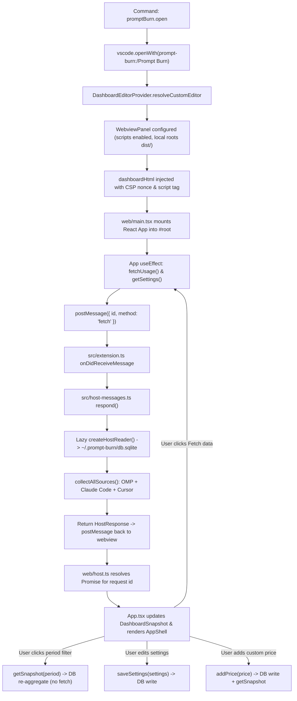

# VS Code extension (apps/vscode)

> **Plain English:** [The workbench](../plain-english/10-the-workbench.md)

## 1. Purpose

`apps/vscode` is the editor-tab shell for Prompt Burn. While `apps/desktop` hosts the dashboard in
a standalone Tauri window with a Node sidecar, `apps/vscode` embeds the exact same UI directly into
VS Code and Cursor as an editor tab.

The extension is designed around a custom editor over a virtual URI (`prompt-burn:/Prompt Burn`)
rather than a webview panel or a sidebar view. This provides standard editor tab semantics:
- The dashboard opens in the main editor area at full width alongside code files.
- The tab can be split side-by-side, dragged across editor groups, and restored across window
  reloads like any file tab.
- Invoking the command (`Prompt Burn: Open Dashboard`) reveals the existing tab instead of stacking
  duplicate tabs (`supportsMultipleEditorsPerDocument: false`).
- `retainContextWhenHidden: true` keeps the webview and its loaded snapshot in memory when switching
  between tabs, preventing redraws, flashes, or duplicate fetches.

The host runs inside the extension host process and connects directly to the shared local database
at `~/.prompt-burn/db.sqlite` via `@prompt-burn/db` and `@prompt-burn/reader`. Data synced from the
desktop shell or the editor extension is immediately accessible to both without duplicate storage,
competing schemas, or transcript reparsing.

## 2. Inventory

| File | Kind | Role |
| --- | --- | --- |
| `package.json` | Manifest | Extension manifest: commands, custom editor, engines, dependencies |
| `tsconfig.json` | Config | Host TypeScript configuration (targeting Node and VS Code types) |
| `tsconfig.web.json` | Config | Webview TypeScript configuration (targeting DOM, React JSX, Vite) |
| `vite.config.host.mts` | Config | Bundles host CJS (`out/extension.js`), inlines workspace pkgs |
| `vite.config.mts` | Config | Bundles webview SPA to `dist/webview.js` and `dist/webview.css` |
| `vitest.config.mts` | Config | Test configuration for host unit tests and webview DOM tests |
| `src/ids.ts` | TS Module | Manifest constants decoupled from the `vscode` module |
| `src/ids.test.ts` | Test | Asserts `package.json` manifest synchrony with `src/ids.ts` constants |
| `src/reader.ts` | TS Module | `createHostReader`: opens DB and creates `UsageReader` |
| `src/reader.test.ts` | Test | Host reader integration test against temporary directories |
| `src/host-messages.ts` | TS Module | `respond`: host postMessage dispatch without VS Code APIs |
| `src/host-messages.test.ts` | Test | Unit tests for `respond` protocol against a stubbed reader |
| `src/extension.ts` | TS Module | Entrypoint: activates editor provider, command, and CSP HTML |
| `web/host.ts` | TS Module | Webview postMessage bridge correlating request IDs to Promises |
| `web/App.tsx` | TSX Component | Shell state: snapshot, period filter, fetch flow, and settings |
| `web/App.test.tsx` | Test | Webview component tests with fake extension host in jsdom |
| `web/main.tsx` | TSX Entry | Webview DOM mount rendering `<App />` without `StrictMode` |
| `web/styles.css` | CSS Stylesheet | Tailwind CSS imports for `@prompt-burn/ui` styles |
| `README.md` | Doc | Architecture overview, data flow summary, and build/test commands |

## 3. Public surface

The extension exposes two external integration surfaces:

### VS Code Manifest Surface

- **Command:** `promptBurn.open` (`Prompt Burn: Open Dashboard`), categorized under `Prompt Burn`.
  Invoking this command runs `vscode.commands.executeCommand("vscode.openWith", ...)` with the
  dashboard URI and custom editor view type.
- **Custom Editor:** `promptBurn.dashboard` (`Prompt Burn`), priority `default`, selecting
  filenames matching `**/Prompt Burn`. Opened via virtual URI `prompt-burn:/Prompt Burn`. The
  scheme registers no filesystem provider; the URI acts purely as an editor document identity.

### Host-Webview PostMessage Protocol

Communication between the webview sandbox and the extension host uses `postMessage` over an
asynchronous, ID-correlated request/response protocol:

```ts
// src/host-messages.ts
export type HostRequest =
  | { id: number; method: "fetch" }
  | { id: number; method: "getSnapshot"; period: PeriodFilter }
  | { id: number; method: "getSettings" }
  | { id: number; method: "saveSettings"; settings: Partial<AppSettings> }
  | { id: number; method: "addPrice"; price: NewPriceEntry };

export type HostResponse =
  | { id: number; ok: true; result: unknown }
  | { id: number; ok: false; error: string };
```

- `fetch`: Runs collector passes across all configured sources (OMP, Claude Code, Cursor) and
  returns `FetchResult`. Errors are returned in the response payload; the handler never throws.
- `getSnapshot`: Re-aggregates stored database records for the requested `PeriodFilter`. Contacts
  no external APIs and performs no disk sweeps.
- `getSettings`: Retrieves effective `AppSettings` (source toggles and transcript path overrides).
- `saveSettings`: Persists updated settings to SQLite and returns the fresh configuration.
- `addPrice`: Inserts a `NewPriceEntry` into `price_entries` for retroactive pricing.

### Webview Security Surface

The webview HTML template (`dashboardHtml` in `src/extension.ts`) enforces a strict Content Security
Policy with a per-render 32-character random nonce:

```text
default-src 'none';
img-src ${webview.cspSource} data:;
style-src ${webview.cspSource} 'unsafe-inline';
font-src ${webview.cspSource};
script-src 'nonce-${nonce}';
```

Local assets are strictly restricted to the extension's `dist/` directory via `localResourceRoots`.

## 4. Flow



## 5. Contracts and invariants

- **Shared database location:** Both the desktop shell and the VS Code extension resolve
  `~/.prompt-burn/db.sqlite` via `databasePath()`. Whichever app runs first provisions the file,
  schema, and bundled prices.
- **Zero filesystem/network access in webview:** The webview bundle never imports `@prompt-burn/db`,
  `@prompt-burn/reader`, `@prompt-burn/collectors`, SQLite, or Node `fs`. All operations requiring
  disk, database, or network I/O must pass through `postMessage` to the host.
- **Snapshot persistence on fetch failure:** When a fetch fails (all collectors fail or throw), the
  existing snapshot total remains visible on screen. Only `fetch.status = "error"` and
  `fetch.error` are updated, triggering the error banner. The total never drops to $0 or blanks out.
- **No background polling or auto-refresh:** The extension runs a fetch pass once when the tab
  mounts, and subsequently only when the user manually clicks "Fetch data". Period changes and
  settings updates re-query existing records in SQLite without re-running collectors.
- **Single reader instance per session:** `DashboardEditorProvider` creates the `UsageReader`
  lazily on the first tab resolution and caches the instance for the lifetime of the extension.
- **Tab singleton per document:** `supportsMultipleEditorsPerDocument: false` guarantees that
  re-triggering the open command reveals the existing dashboard editor rather than creating
  duplicate editor instances.
- **No StrictMode in production webview:** `web/main.tsx` explicitly renders without
  `React.StrictMode` to prevent React 19 from double-firing mount effects and initiating redundant
  initial fetches.

## 6. Configuration

Configuration is managed across manifest definitions, build scripts, and local SQLite settings:

- **`package.json` Manifest:**
  - `engines.vscode`: `^1.90.0`.
  - `main`: `./out/extension.js`.
  - Contributed commands: `promptBurn.open`.
  - Contributed custom editors: `promptBurn.dashboard` with filename selector `**/Prompt Burn`.
- **Host Build Configuration (`vite.config.host.mts`):**
  - Targets `node20` with CommonJS output (`format: "cjs"`).
  - Externalizes `vscode` (injected by host) and Node builtins.
  - Sets `ssr.noExternal: true` to inline monorepo packages (`@prompt-burn/*`) so the resulting
    extension is self-contained.
- **Webview Build Configuration (`vite.config.mts`):**
  - Rooted in `web/`, emits to `dist/`.
  - Fixes output filenames to `webview.js` and `webview.css` for deterministic loading by
    `dashboardHtml`.
- **Runtime User Settings:**
  - Source toggles (`ompEnabled`, `claudeEnabled`, `cursorEnabled`) and custom path overrides
    (`ompPath`, `claudePath`) are stored in `~/.prompt-burn/db.sqlite` (`settings` table) and read
    on demand by `UsageReader`.

## 7. Boundaries and dependencies

- **Host Boundary:**
  - Inbound: Triggered by VS Code command execution or editor document resolution.
  - Outbound: Reads/writes `~/.prompt-burn/db.sqlite`; reads OMP sessions (`~/.omp/agent/sessions/`)
    and Claude Code projects (`~/.claude/projects/`); reads Cursor SQLite database (`state.vscdb`);
    calls Cursor HTTP API (`api2.cursor.sh` / Cursor backend).
- **Webview Boundary:**
  - Sandbox: Sandboxed iframe with strict CSP; communicates exclusively via `postMessage`.
  - Mount target: `#root` element inside `dashboardHtml`.
- **Workspace Dependencies:**
  - `@prompt-burn/core`: Domain types (`DashboardSnapshot`, `PeriodFilter`) and builder functions.
  - `@prompt-burn/db`: Database connection (`openDatabase`, `databasePath`).
  - `@prompt-burn/reader`: Orchestrator interface (`UsageReader`, `createUsageReader`, types).
  - `@prompt-burn/ui`: Component library (`AppShell`, `fetchErrorMessage`).
- **External Dependencies:**
  - Extension host: `vscode` (ambient peer API), Node 20 runtime.
  - Webview: `react` 19, `react-dom` 19, `@tailwindcss/vite` 4, `tailwindcss` 4.

## 8. Tests

Four test suites cover the package across Node and jsdom environments:

- **`src/ids.test.ts` (Node):** Validates manifest `package.json` against `src/ids.ts`. Ensures
  command names, view types, URI patterns, tab titles, and entrypoint paths match.
- **`src/reader.test.ts` (Node):** Tests `createHostReader` against isolated temporary directories
  with synthetic OMP transcripts and missing Cursor state. Verifies that SQLite initialization and
  collector execution function correctly without touching real user files.
- **`src/host-messages.test.ts` (Node):** Tests `respond()` dispatch logic against a stubbed
  `UsageReader`. Verifies all 5 request methods, arguments, and error trapping (`ok: false`).
- **`web/App.test.tsx` (jsdom):** Drives the React UI against a simulated `acquireVsCodeApi` mock:
  - Asserts fetch-on-open and initial total display.
  - Asserts manual "Fetch data" button triggers re-fetch.
  - Asserts in-flight spinner does not blank the existing total.
  - Asserts failed fetch leaves prior snapshot intact and renders error banner.
  - Asserts period filter changes re-query snapshot without re-fetching.
  - Asserts settings modifications write through to the host.

### What is NOT covered

- **Live VS Code runtime lifecycle:** `src/extension.ts` (`activate`, `deactivate`, editor panel
  creation, and command registration) is not run in CI. Automated tests do not spin up a headless
  VS Code instance (`@vscode/test-electron` is not configured).
- **VSIX packaging:** The packaging process (`vsce package --no-dependencies`) is executed in GitHub
  Actions release workflows, not in unit tests.
- **Concurrent multi-tab interactions:** Concurrent requests or tab splits sharing the single
  cached `UsageReader` are not tested under high load.
- **Cross-shell live updates:** No tests verify behavior when another process (e.g. `apps/desktop`)
  mutates `~/.prompt-burn/db.sqlite` while the tab is open.

## 9. Debt and traps

- **Duplicated shell state logic:** `web/App.tsx` duplicates the snapshot/fetch/period state machine
  from `apps/desktop/web/App.tsx` almost verbatim (noted in code: `ponytail: this policy is
  duplicated from apps/desktop/web/App.tsx because the two shells differ only in transport`). If a
  third shell is added, state handling must be extracted to a shared container.
- **Extension host activation untested in CI:** Because `vscode` is a runtime-injected module,
  `src/extension.ts` is omitted from automated Vitest suites. Verification relies on manual runs in
  an Extension Development Host (`code --extensionDevelopmentPath=apps/vscode`).
- **No live reload or external change detection:** The extension does not watch SQLite or file
  system paths for changes made by external tools (e.g., desktop app syncs). The dashboard updates
  only when the user manually clicks "Fetch data", switches periods, or reloads the tab.
- **Unbounded pending request map:** In `web/host.ts`, `pending` requests are stored in a `Map`
  without timeouts. If the host drops a message or unhandled error occurs, the Promise leaks.
- **Pseudo-random CSP nonce:** The CSP nonce in `dashboardHtml` is generated using
  `Math.random().toString(36)` rather than Node's `crypto.randomBytes`. While adequate for webview
  sandboxing, it is not cryptographically random.
- **Build order dependency:** Running `pnpm build` executes host and webview Vite builds. The host
  expects `dist/webview.js` and `dist/webview.css` to exist; packing or testing without running both
  builds leaves the webview blank.
- **Marketplace absence:** The extension is distributed exclusively as a `.vsix` attached to GitHub
  releases. It is not published to the Visual Studio Marketplace or Open VSX Registry.

## 10. Change guide

- **Adding a new host command:**
  1. Add the request signature to `HostRequest` in `src/host-messages.ts`.
  2. Implement handling in `respond()` in `src/host-messages.ts`, returning `HostResponse`.
  3. Add unit test cases in `src/host-messages.test.ts`.
  4. Expose the client method in `web/host.ts` calling `request<T>(method, payload)`.
  5. Consume the method in `web/App.tsx` and add UI test coverage in `web/App.test.tsx`.
- **Renaming commands, view types, or tab titles:**
  1. Modify constants in `src/ids.ts`.
  2. Update corresponding entries in `package.json` (`contributes.commands` and
     `contributes.customEditors`).
  3. Run `src/ids.test.ts` to ensure consistency.
- **Modifying extension bundling:**
  - If changing host dependencies or Node externals, edit `vite.config.host.mts`. Ensure monorepo
    packages remain inlined (`ssr.noExternal: true`).
  - If changing webview bundling or asset paths, edit `vite.config.mts` and update `BUNDLE` and
    `STYLES` constants in `src/extension.ts`.
- **Styling updates:**
  - Tailwind styles are defined in `web/styles.css`. Ensure new classes used in `@prompt-burn/ui`
    are captured by the `@source` directive pointing to `packages/ui/src`.
