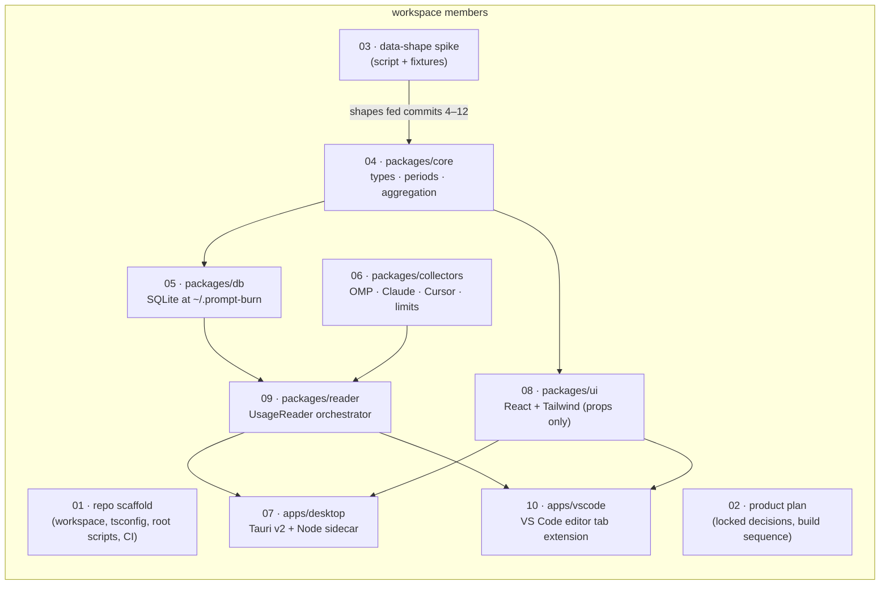

# Architecture

Technical documentation for Prompt Burn, one document per numbered area. Every document has the
same ten sections (Purpose, Inventory, Public surface, Flow, Contracts and invariants,
Configuration, Boundaries and dependencies, Tests, Debt and traps, Change guide), opens with a
pointer at its plain-English twin, and is deliberately blunt about debt in §9.

Prompt Burn is no longer only a scaffold. The workspace holds seven members: five packages
(`packages/core` for domain types, calendar period filtering, model-id normalization, and snapshot
aggregation; `packages/db` for the single SQLite file at `~/.prompt-burn/db.sqlite`;
`packages/collectors` for transcript parsing, incremental sync, Cursor token retrieval, and limits;
`packages/reader` for the shared UsageReader orchestrator; `packages/ui` for the props-only React +
Tailwind dashboard components) and two applications (`apps/desktop`, a Tauri v2 native shell with
a Node sidecar; `apps/vscode`, a VS Code editor-tab extension hosting the dashboard webview). The
data-shape spike that pinned the OMP and Cursor payload shapes stays as the record of that
investigation.

Reading paths:

- **What does the repo actually contain right now?** 01 → 02 → 04 → 05 → 09 → 07 / 10.
- **About to work on one area?** 02 (locked decisions) first, then that area's pair; 01 is the
  tooling baseline every package inherits.
- **Want the story without code?** Read the twins under `docs/plain-english/` instead; same
  numbers, same subjects.

## Documents

| #   | Document                                                             | Twin (plain English)                                        |
| --- | -------------------------------------------------------------------- | ----------------------------------------------------------- |
| 01  | [Repo scaffold and workspace tooling](01-repo-scaffold.md)           | [The workshop](../plain-english/01-the-workshop.md)         |
| 02  | [Product plan and locked decisions](02-product-plan.md)              | [The blueprint](../plain-english/02-the-blueprint.md)       |
| 03  | [Data-shape spike (OMP and Cursor)](03-data-shape-spike.md)          | [The probe](../plain-english/03-the-probe.md)               |
| 04  | [Core domain (types, period filter, aggregation)](04-core-domain.md) | [The ledger](../plain-english/04-the-ledger.md)             |
| 05  | [The database (packages/db)](05-database.md)                         | [The file cabinet](../plain-english/05-the-file-cabinet.md) |
| 06  | [OMP collector (packages/collectors)](06-omp-collector.md)           | [The harvester](../plain-english/06-the-harvester.md)       |
| 07  | [Desktop shell (Tauri v2 + Node sidecar)](07-desktop-shell.md)       | [The front door](../plain-english/07-the-front-door.md)     |
| 08  | [UI components (packages/ui)](08-ui-components.md)                   | [The showroom](../plain-english/08-the-showroom.md)         |
| 09  | [Usage reader (packages/reader)](09-usage-reader.md)                 | [The switchboard](../plain-english/09-the-switchboard.md)   |
| 10  | [VS Code extension (apps/vscode)](10-vscode-extension.md)           | [The workbench](../plain-english/10-the-workbench.md)       |

Standalone documents (not pairs): [product.md](../product.md) ·
[implementation-plan.md](../implementation-plan.md) · [spec.md](../spec.md) ·
[release.md](../release.md) · [data-shapes.md](../data-shapes.md).
