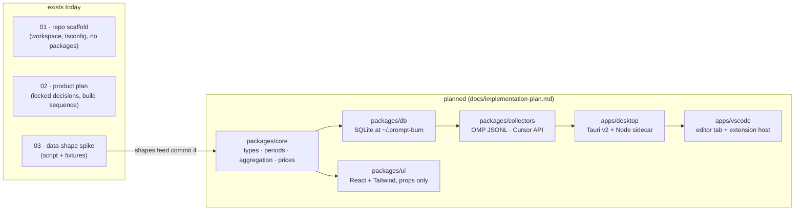

# Architecture

Technical documentation for Prompt Burn, one document per numbered area. Every document has the
same ten sections (Purpose, Inventory, Public surface, Flow, Contracts and invariants,
Configuration, Boundaries and dependencies, Tests, Debt and traps, Change guide), opens with a
pointer at its plain-English twin, and is deliberately blunt about debt in §9.

Prompt Burn today is a scaffold plus a spike: a pnpm workspace with strict shared TypeScript
config and no packages yet, a planning corpus of four documents that lock the product decisions,
and one zero-dependency spike script with redacted fixtures that verified the OMP and Cursor
payload shapes the dashboard will be built around. No packages or apps exist yet — the
implementation plan adds each package with its first real commit.

Reading paths:

- **What does the repo actually contain right now?** 01 → 03 → 02.
- **About to write the first package code?** 02 (locked decisions) → 03 (payload shapes) → 01
  (tooling baseline you inherit).
- **Want the story without code?** Read the twins under `docs/plain-english/` instead; same
  numbers, same subjects.

## Documents

| # | Document | Twin (plain English) |
|---|----------|----------------------|
| 01 | [Repo scaffold and workspace tooling](01-repo-scaffold.md) | [The workshop](../plain-english/01-the-workshop.md) |
| 02 | [Product plan and locked decisions](02-product-plan.md) | [The blueprint](../plain-english/02-the-blueprint.md) |
| 03 | [Data-shape spike (OMP and Cursor)](03-data-shape-spike.md) | [The probe](../plain-english/03-the-probe.md) |

Standalone documents (not pairs): [product.md](../product.md) ·
[implementation-plan.md](../implementation-plan.md) · [spec.md](../spec.md) ·
[data-shapes.md](../data-shapes.md).