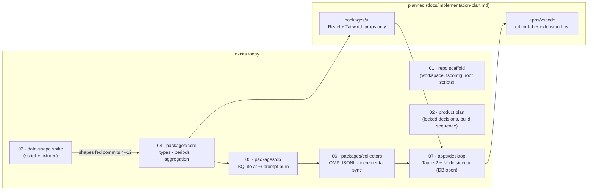

# Architecture

Technical documentation for Prompt Burn, one document per numbered area. Every document has the
same ten sections (Purpose, Inventory, Public surface, Flow, Contracts and invariants,
Configuration, Boundaries and dependencies, Tests, Debt and traps, Change guide), opens with a
pointer at its plain-English twin, and is deliberately blunt about debt in §9.

Prompt Burn is no longer only a scaffold. The workspace holds four real areas: `packages/core`
(domain types, calendar period filter, model-id normalizer, snapshot aggregation), `packages/db`
(the one SQLite file at `~/.prompt-burn/db.sqlite` — Node's built-in `node:sqlite`, bundled
prices, no migration runner), `packages/collectors` (OMP transcript parse plus incremental sync
into `usage_events`), and `apps/desktop` (a Tauri v2 window whose Node sidecar opens that
database — the shell only; fetching and the first number on screen are still ahead). The
data-shape spike that pinned the OMP and Cursor payload shapes stays as the record of that
investigation. `packages/ui` and `apps/vscode` do not exist yet — the implementation plan adds
each remaining package with its first real commit.

Reading paths:

- **What does the repo actually contain right now?** 01 → 02 → 05 → 07.
- **About to work on one area?** 02 (locked decisions) first, then that area's pair; 01 is the
  tooling baseline every package inherits.
- **Want the story without code?** Read the twins under `docs/plain-english/` instead; same
  numbers, same subjects.

## Documents

| #   | Document                                                             | Twin (plain English)                                        |
| --- | -------------------------------------------------------------------- | ----------------------------------------------------------- |
| 01  | [Repo scaffold and workspace tooling](01-repo-scaffold.md)           | [The workshop](../plain-english/01-the-workshop.md)         |
| 02  | [Product plan and locked decisions](02-product-plan.md)              | [The blueprint](../plain-english/02-the-blueprint.md)       |
| 03  | [Data-shape spike (OMP and Cursor)](03-data-shape-spike.md)          | [The probe](../plain-english/03-the-probe.md)               |
| 04  | [Core domain (types, period filter, aggregation)](04-core-domain.md) | [The ledger](../plain-english/04-the-ledger.md)             |
| 05  | [The database (packages/db)](05-database.md)                         | [The file cabinet](../plain-english/05-the-file-cabinet.md) |
| 06  | [OMP collector (packages/collectors)](06-omp-collector.md)           | [The harvester](../plain-english/06-the-harvester.md)       |
| 07  | [Desktop shell (Tauri v2 + Node sidecar)](07-desktop-shell.md)       | [The front door](../plain-english/07-the-front-door.md)     |

Standalone documents (not pairs): [product.md](../product.md) ·
[implementation-plan.md](../implementation-plan.md) · [spec.md](../spec.md) ·
[data-shapes.md](../data-shapes.md).
